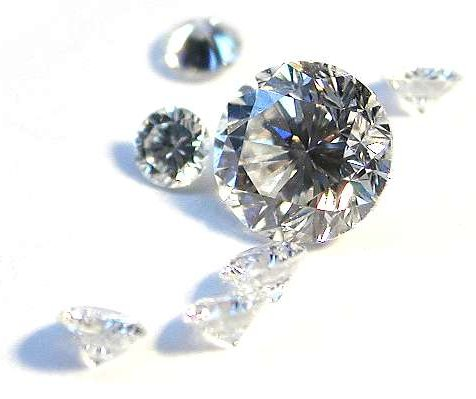

```{r setup, include=FALSE}
knitr::opts_chunk$set(echo = TRUE)
```

# Введение



Стоимость бриллианта зависит от многих факторов. Наиболее важными из них считаются 4 'C': **вес** (caratate), **цвет** (colour), **прозрачность** (clarity) и **огранка** (cut). В этом задании вам предстоит исследовать, как эти факторы влияют на цену и разработать модель для прогнозирования рыночной цены бриллианта. 

## Описание данных

Исходные данные для построения модели содержатся в файле `diamonds_train.txt`.

**Переменные:**

- **carat** - вес бриллианта, в каратах (карат = 0.2 г)

- **colour** - оттенок (обозначается латинскими буквами D - I). Наиболее ценными считаются идеально прозрачные камни (D). Наименее ценные - бриллианты категории I, имеющие желтоватый оттенок

- **clarity** - практически все бриллианты имеют небольшие дефекты на поверхности или внутри. Степень прозрачности бриллианта - это оценка того, насколько такие дефекты заметны. Наиболее ценными являются бриллианты категории IF (Internally Flawless), у них нет видимых включений, только небольшие царапины на поверхности, которые может различить только эксперт. Камни категорий VVS1 и VVS2 (Very Very Slightly Included) содержат малозаметные включения. Бриллианты категорий VS1 и VS2 содержат небольшие включения, легко различимые при 10-кратном увеличении. 

- **certification**  - перед выставлением на продажу бриллианты, как правило, проходят сертификацию независимой лабораторией. Сертификация дает покупателю уверенность в соответствии реальности заявленных продавцом характеристик бриллианта. Сертификацией занимаются 3 международные организации - GIA, IGI и HRD 

- **price** - цена бриллианта в сингапурских долларах (цены 2000 года)

Природные алмазы подвергают огранке, чтобы раскрыть красоту камня и скрыть дефекты. Оптимальная огранка не должна быть слишком глубокой или плоской, поскольку это  помешает игре света. Существует несколько видов огранки, однако в этом файле все бриллианты имеют классическую круглую форму.

Более подробно с характеристиками бриллиантов можно познакомиться здесь:
- [Lumera Diamonds Education](http://www.lumeradiamonds.com/diamond-education/index)  
- [Diamond Prices](https://www.diamonds.pro/diamond-prices/)  
- [James Allen Diamonds Gallery](http://www.jamesallen.com/loose-diamonds/all-diamonds/)  


## Постановка задачи

Вам необходимо исследовать предложенные данные и построить модель прогнозирования цены бриллианта на основе его веса и других характеристик. 

Построенную модель необходимо применить к тестовому набору данных: `diamonds_test.txt`, чтобы сделать прогноз цены этих бриллиантов.

## Как сдавать

Результатом вашей работы являются два файла: 

  - **Отчет в формате HTML**, полученный с помощью кнопки Knit из данного файла. В отчете необходимо описать шаги по анализу данных, построению и проверке адекватности модели. Все результаты обязательно должны сопровождаться выводами. Отредактируйте тег `author:` в начале этого документа, указав свою фамилию (фамилии). Удалите из файла разделы с заданием и все "черновые" расчеты и графики. Если нет вывода на основе какого-либо результата - такой результат лишний и его надо удалить.
  
  - **Файл с прогнозом** `prices.txt`, содержащий единственный столбец `price` с прогнозом цен для бриллиантов из тестового набора данных и больше ничего другого. Десятичным разделителем в файле должна быть точка. 
  
Прогнозы будут обрабатываться автоматическим скриптом, поэтому несоответствие требуемому формату означает невозможность учесть ваш результат и дисквалификацию работы. 
  

## Условия соревнования

- Ответы принимаются с 29 сентрября по 3 октября включительно, по электронной почте.  
- Можно участвовать единолично или в команде из не более чем 3 участников.  
- Все не дисквалифицированные участники соревнования получают одну активность.  
- Победители соревнования получают еще одну активность дополнительно.  
- В качестве победителей будут выбраны две работы - с наиболее точным прогнозом на тестовом множестве (по критерию MAPE) и с наиболее качественным отчетом по решению. Возможна ситуация, в которой несколько работ будут иметь один показатель ошибки. В этом случае победителем будет признана первая полученная работа.  
- Дисквалификация участников возможна по следующим причинам:   
      - плагиат,  
      - отсутствие предварительного анализа данных, построение моделей "не глядя",  
      - грубые нарушения методологии анализа (например, отсутствует проверка адекватности применения линейной модели к этим данным, или по результатам этой проверки видно, что модель не подходит, но авторы ничего не предприняли, чтобы исправить ситуацию),   
    - неспособность участников предоставить результаты в требуемом формате.  

## Решение

Рекомендуем придерживаться следущюих шагов:

 1. Загрузите обучающий набор данных, используя функцию `readr::read_tsv()`. Убедитесь в том, что данные загружены корректно. Исследуйте техническое качество данных (пропуски).
 
 2. Исследуйте распределения переменных в наборе данных: есть ли выбросы, асимметрия.
 
 3. Исследуйте зависимости между переменными в наборе данных. Учтите, что категориальные переменные (например, оттенок цвета) также сильно влияют на цену. Оцените степень выраженности и линейности этих зависимостей. Есть ли в данных выбросы, гетероскедастичность (рост дисперсии целевой переменной)?
 
 4. Постройте модель множественной регрессии для предсказания цены бриллианта. При необходимости, включите в модель взаимодействие различных факторов и нелинейные члены. Например, для разных категорий бриллиантов по цвету связь между весом и ценой будет отличаться. [Здесь](https://www.diamonds.pro/diamond-prices/) можно прочитать статью эксперта по оценке бриллиантов с исследованием взаимосвязи между их характеристиками.  
 
 5. Исследуйте адекватность построенной модели с помощью анализа остатков и сопоставления прогноза с фактом на обучающем наборе. При необходимости, скорректируйте модель, чтобы максимально устранить проблемы.  
 
 
 6. Получив модель удовлетворительного качества, загрузите тестовый набор данных и сделайте прогноз цены. Сохраните результаты в файл `prices.txt`, используя функцию `readr::write_tsv()`. В файле должен быть единственный столбец `price` с прогнозом цен для бриллиантов из тестового набора данных и больше ничего другого. Десятичным разделителем в файле должна быть точка. 
 

 
