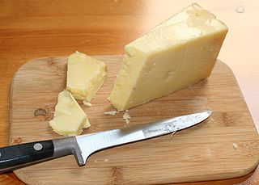
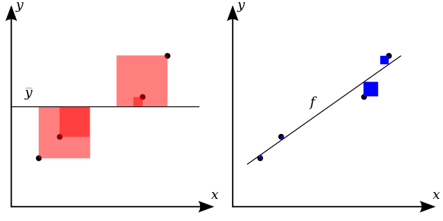

--- 
title: "Модель линейной регрессии" 
author: "Заходякин Г.В., postlogist@gmail.com" 
date: "06.02.2017" 
output: html_document 
---

```{r setup, include=FALSE} 
knitr::opts_chunk$set(echo = TRUE, warning = FALSE)
options(width = 100) # ширина текстового вывода
options(digits = 3) # число знаков после запятой в выводе 
```

# Введение

## Задача регрессии

**Задача регрессии** состоит в предсказании **непрерывной выходной переменной**
(*response, outcome, dependent variable*) на основе одной или нескольких
**объясняющих переменных** (*independent, explanatory, predictor variables*).


Для решения задачи регрессии применяются различные классы моделей. Наиболее
простым видом являются модели **линейной регрессии** (простой и множественной).
Несмотря на простую структуру, эти модели можно успешно применять во многих
ситуациях. Благодаря устойчивости к переобучению из-за своей простоты модели 
линейной регрессии являются хорошим базисом для оценки сравнительной эффективности
более сложных и гибких моделей.

Метод линейной регрессии позволяет:

- выявить, какие факторы влияют на выходную переменную, 
- количественно описать зависимость между объясняющими переменными и выходной переменной, 
- прогнозировать значения выходной переменной, 
- обнаруживать в данных нетипичные наблюдения, которые могут быть, например, результатом ошибок или мошеннических действий.

В этом блокноте рассматривается метод простой линейной регрессии и построение 
регрессионной модели на конкретном примере. Затронуты вопросы оценки значимости
регрессионной модели и статистического вывода на ее основе.

## Описание примера

Сыр Чеддер (Cheddar) - это довольно твердый бесцветный или оранжевый (при
добавлении специй и красителя Аннато) сорт сыра со слегка острым и кисловатым
вкусом.  Своим названием Чеддер обязан небольшому поселку в графстве Соммерсет
(Англия).  Сегодня Чеддер производится не только в своем  "родном" регионе, но и во
многих странах мира. Это самый популярный сорт сыра в Великобритании, занимающий
51% на рынке. В целом, оборот на сырном рынке в Великобритании составляет £1.9
млрд.



Особенно острые виды Чеддера длительное время (до нескольких лет) выдерживаются
в специальных условиях. Одним из требований является постоянство температуры,
которое обеспечивается либо с помощью холодильного оборудования, либо благодаря
использованию природных "термостатов" - пещер. В пещерах создаются идеальные
условия для вызревания сыра. До сих пор в некоторых регионах Чеддер выдерживают
в пещерах (Wookey Hole, Cheddar Gorge).


В процессе созревания чеддера протекают различные биохимические процессы. Вкус
сыра связан с концентрацией нескольких веществ в конечном продукте. Мы
располагаем данными лабораторных исследований чеддера (LaTrobe Valley,
Австралия, штат Виктория), в которых изучался химический состав образцов сыра, а
затем проводилась экспертная оценка вкусовых качеств. В наборе данных содержится
усредненная оценка вкуса различных образцов сыра несколькими экспертами и
химический состав каждого образца. Набор данных загружен из репозитория
[DASL](http://dasl.datadesk.com/story/view/21).

**Целями анализа** являются:

- Изучение зависимости между составом сыра и оценкой вкусовых качеств. 
- Выбор наилучшей однофакторной модели для предсказания оценки вкусовых качеств. 
- Прогнозирование оценки вкусовых качеств сыра на основе его состава.

# Анализ 
## Подготовка

Функция для построения линейных моделей входит в базовый пакет `stats`, однако
для загрузки, визуализации данных и облегчения работы с моделью необходимо
использовать дополнительные пакеты.

```{r Загрузка пакетов, message = F} 
library(readr) # считывание данных из текстовых файлов
library(tidyverse) # манипулирование данными 
library(ggplot2) # визуализация 
library(GGally) # построение матрицы диаграмм рассеяния 
library(ggfortify) # визуализация диагностических графиков
library(modelr) # вспомогательные функции для работы с моделями
library(broom) # преобразование результатов моделирования в табличный вид
```

Данные содержатся в файле `datasets/cheese.txt`. Первые 16 строк файла -
комментарий.

```{r Загрузка данных, message = F} 
cheese <- read_tsv('data/cheese.txt', skip = 16)

glimpse(cheese) # Структура данных 
summary(cheese) # Описательная статистика + проверка пропущенных значений 
```

Типы данных распознаны правильно. Пропущенных значений нет.

Переменные:

- **Case** - номер образца 
- **Taste** -  экспертная оценка вкуса (средний балл, выставленный экспертами) 
- **Acetic** - содержание уксусной кислоты (натуральный логарифм) 
- **H2S** - содержание сероводорода (натруальный логарифм) 
- **Lactic** - содержание молочной кислоты (натруальный логарифм)

## Исследование зависимостей в данных

Когда переменных немного, зависимости между каждым фактором и целевой переменной
можно искать с помощью обычных диаграмм рассеяния. Для быстрой оценки удобно
использовать **матрицу диаграмм рассеяния** (*scatterplot matrix, SPLOM*). В
базовой графике эту визуализацию можно получить с помощью функций `pairs()` или
`car::scatterplotMatrix()`.

Для визуализации с помощью `ggplot2` можно воспользоваться функцией
`GGally:ggpairs()`. В отличие от стандартной функции, `ggpairs()` позволяет
работать и с дискретными переменными.

Узнать о том, как настроить вид графика под свои нужды, можно в
[справке](http://ggobi.github.io/ggally/#ggallyggpairs).

```{r Матрица диаграмм рассеяния с помощью ggpairs}
ggpairs(cheese, columns = c("Acetic", "H2S", "Lactic", "Taste"), # исключили номер образца 
        lower = list(continuous = wrap("smooth_lm", color = 'blue'))) # добавили тренд и покрасили точки 
```

На главной диагонали содержатся плотности распределения соответствующих
переменных, над ней - коэффициенты корреляции Пирсона между парами переменных.
Под диагональю содержатся диаграммы рассеяния для каждой пары переменных.
Степень влияния содержания различных веществ на вкус можно визуально оценить на
основе нижней строчки матрицы.

Когда переменных много и надо показать только связь факторов и целевой
переменной, можно воспользоваться стандартными возможностями `ggplot()`, однако
придется изменить структуру данных. Данные надо перевести в "длинный" формат,
слив все столбцы в один. Для этого можно воспользоваться функцией
`tidyr::gather()` (см.
http://r4ds.had.co.nz/tidy-data.html#spreading-and-gathering)


```{r Перевод в длинный формат}

cheese_tall <- cheese %>% 
  gather(key = 'Substance', value = 'Content', Acetic:Lactic)

```


Теперь можно изучить влияние содержания отдельных веществ на вкус.


```{r Визуализация влияния отдельных веществ}

ggplot(data = cheese_tall, 
       mapping = aes(x = Content, y = Taste, color = Substance)) + 
  geom_point() + 
  geom_smooth(method = 'lm', se = F) + 
  facet_wrap(~ Substance, scales = "free_x") + 
labs(title = 'Влияние содержания отдельных веществ на вкус', 
     y = 'Оценка вкуса', 
     x = NULL)

```


## Корреляция: количественная оценка степени линейной связи

**Коэффициент корреляции Пирсона** $r$ (*The Pearson's product-moment
correlation*) позволяет количественно оценить степень выраженности (тесноту)
линейной связи между двумя непрерывными переменными:

$$ r = \frac{cov(x, y)}{S_x S_y} =
\frac{\sum_{i=1}^n(x_i-\bar{x})(y_i-\bar{y})}{n S_x S_y} $$

Для вычисления коэффициента корреляции в R можно использовать встроенную функцию
`cor()`. Функция позволяет вычислять корреляцию между парой числовых переменных
(векторов), или для всех переменных в наборе данных сразу.


```{r Коэффициенты корреляции} 
# Для двух столбцов: 
cor(cheese$Taste, cheese$Acetic)

# Для всех столбцов (кроме Case): 
options(digits = 3) # число знаков после запятой в выводе 

cheese %>% 
  select(-Case) %>%
  cor() 

```

## Почему нужна визуализация?

Во встроенном наборе данных `anscombe` содержится 4 примера данных - т.н.
[квартет Энскомба](http://tinyurl.com/anscombe-quartet).

```{r Исходная структура anscombe} 
head(anscombe, 3) 
```

Для удобства, преобразуем данные в "длинный" формат: *номер примера, x, y*.

```{r Преобразование структуры данных anscombe} 
anscombe_tall_x <- anscombe %>%
  select(x1:x4) %>% 
  gather(key = 'case', value = 'x') %>%
  mutate(case = stringr::str_sub(case, start = 2))

anscombe_tall_y <- anscombe %>% 
  select(y1:y4) %>% 
  gather(key = 'case', value = 'y') %>% 
  select(-case)

anscombe_tall <- bind_cols(anscombe_tall_x, anscombe_tall_y)

head(anscombe_tall, 3) 
```

Рассчитаем коэффициенты корреляции:

```{r Коэффициенты корреляции для примера anscombe}

anscombe_tall %>% group_by(case) %>% summarize(r = cor(x, y))

```

Во всех 4 примерах коэффициенты корреляции равны с точностью до двух десятичных
знаков. Однако визуализация данных показывает совершенно различный характер
зависимостей:

```{r Визуализация данных anscombe} 
ggplot(data = anscombe_tall, mapping = aes(x, y)) + 
  geom_point() + 
  facet_wrap(~ case, ncol = 2, scales = 'free_x') + 
  geom_smooth(method = 'lm', se = F, color = 'red') +
  labs(title = "Примеры зависимостей с одинаковым r = 0.82")

```

**Вывод**: хотя коэффициент корреляции позволяет количественно оценить выраженность связи,
есть ограничения в его применении:

- выявляются только линейные зависимости, 
- показатель чувствителен к выбросам в данным.

## Реальна ли обнаруженная зависимость?

Если образцы для лабораторных исследований отбирались случайным образом, то не
должно существовать никаких зависимостей показателей от номера образца.

```{r Коэффициенты корреляции между номером образца и остальными переменными}

# Количественная оценка выраженности связи 
cor(cheese)['Case', ] 

```

Тем не менее, коэффициенты корреляции для переменной `Case` не нулевые.

```{r Визуализация зависимостей для номера образца} 
# Зависимость оценки вкуса от номера образца 
ggplot(data = cheese, mapping = aes(x = Case, y = Taste)) + 
  geom_point() + 
  geom_smooth(method = 'lm', se = F)

# Зависимость содержания веществ от номера образца 
ggplot(data = cheese_tall, 
       mapping = aes(x = Case, y = Content)) + 
  geom_point() + 
  geom_smooth(method ='lm', se = F) + 
  facet_wrap(~ Substance, scales = 'free_y')

```


### Имитационный эксперимент

На практике из-за случайной вариации данных полученные на выборке коэффициенты
корреляции будут отличными от нуля даже для совершенно независимых переменных.
Покажем это с помощью имитационного эксперимента, в котором создадим 2
независимые равномерно распределенные случайные величины.

```{r Генерация двух случайных переменных} 
set.seed(3) 
independent <- tibble( x = runif(n = 30, min = -1, max = 1), 
                       y = runif(n = 30, min= -1, max = 1) )

cor_independent <- with(independent, cor(x, y))

ggplot(data = independent, mapping = aes(x, y)) + 
  geom_point() + 
  geom_smooth(method = 'lm', se = F) + 
  geom_text(x = -1, y = -1, color = 'blue',
            vjust = -1, hjust = -0.1, size = 8, 
            label = paste('r =', round(cor_independent,2))) 
```

Коэффициент корреляции Пирсона $r$ - это выборочная статистика, поэтому, как и у
каждой выборочной статистики, у него есть выборочное распределение. Вспомним,
что выборочное распределение - это распределение изучаемой выборочной
статистики, которое может быть получено путем многократного повторения
выборочного исследования при том же самом размере выборки.

На основе свойств выборочного распределения для $r$ можно проверить
статистическую гипотезу о равенстве нулю коэффициента корреляции для
совокупности:

$$ H_0: \rho_{xy} = 0 $$

$$ H_1: \rho_{xy} \ne 0 $$

В R для проверки значимости коэффициента корреляции используется функция
`cor.test()`:

```{r Проверка значимости коэффициента корреляции для случайных данных}

with(independent, cor.test(x, y))
```

Для проверки гипотезы: $$H_0: \rho = 0$$ 

против альтернативной: $$H_1: \rho \ne 0$$

используется одновыборочный t-критерий.

Статистика критерия:

$$ t = \frac{r - 0}{SE(r)}$$

В сгененрированной выборке с двумя случайными независимыми переменными
вероятность получить такое же, или большее по модулю, значение коэффициента
корреляции оказалась равна 20%. Таким образом, нет оснований отвергнуть нулевую гипотезу.
Рассчитанное по выборке значение $r$ статистически не значимо. То есть, оно не
говорит о наличии связи между $x$ и $y$ в генеральной совокупности.


### Статистическая значимость связей для вкусовых качеств сыра

В примере с данными о вкусовых качествах сыра, результаты проверки значимости
коэффициентов корреляции следующие:

```{r Проверка значимости коэффициентов корреляции для данных о сыре} 

# Для оценки вкуса и содержания химических веществ
with(cheese, cor.test(Taste, Acetic)) 
with(cheese, cor.test(Taste, H2S)) 
with(cheese, cor.test(Taste, Lactic)) 
```

Коэффициенты корреляции между содержанием химических веществ и вкусом сыра значимы.
Таким образом, можно сделать вывод о наличии линейной связи между содержанием
химических веществ и вкусом сыра. Эту связь можно промоделировать с помощью
линейной регрессии.

```{r Значимость корреляций с номером образца}
# Для номера образца
with(cheese, cor.test(Taste, Case)) 
with(cheese, cor.test(Acetic, Case))
with(cheese, cor.test(Lactic, Case))
with(cheese, cor.test(H2S, Case))
```

В результате проверки коэффициенты корреляции с номером образца для всех переменных в наборе данных оказались незначимы. 

Для удобства анализа значимости коэффициентов корреляции для больших наборов
данных, можно использовать функцию `HMisc::rcorr()`, которая возвращает
p-значения вместе с со значениями коэффициента корреляции.

```{r Анализ значимости коэффициентов} 
cheese_corr <- Hmisc::rcorr(as.matrix(cheese)) 
cheese_corr 
```

См. также примеры визуализации корреляционной матрицы с помощью пакета
`ggcorrplot`:
http://www.sthda.com/english/wiki/ggcorrplot-visualization-of-a-correlation-matrix-using-ggplot2


# Моделирование зависимостей

## Модель линейной регрессии

**Модель линейной регрессии** (*the simple linear regression  model*) позволяет
предсказывать значение зависимой переменной на основании только одной
объясняющей переменной. Между этими переменными предполагается линейная
зависимость в генеральной совокупности:

$$ y = \beta_0 + \beta_1 x + \varepsilon $$

Параметры модели $\beta_0$ и $\beta_1$ определяют **свободный член**
(*intercept*) и **угловой коэффициент** (*slope*)  прямой соответственно.

Свободный член $\beta_0$ определяет точку пересечения прямой с осью ординат,
т.е. ожидаемое значение $y$ при $x=0$. Угловой коэффициент $\beta_1$ определяет
величину изменения $y$ при единичном изменении $x$.

**Остаток** (*error term*) $\epsilon$ учитывает случайные отклонения фактических
наблюдений от прогноза по линейной модели.

Можно считать, что каждое наблюдение  $y_i$ включает два компонента -
систематический, $\beta_0 + \beta_1 x_i$ (объясняется моделью) и случайный,
$\epsilon_i$, - (ошибка модели. К случайному компоненту относится действие всех
прочих факторов, помимо $x$.

Как правило, истинные значения коэффициентов $\beta$ неизвестны, т.к. нельзя
исследовать всю совокупность. В этом случае необходимо оценивать их по выборке.
Уравнение регрессионной прямой для выборки имеет вид:

$$ y_i = b_0 + b_1 x_i + e_i $$

Это уравнение по структуре аналогично регрессионной прямой для совокупности,
отличие лишь в том, что коэффициенты и остаток оцениваются по выборке. Найденные
значения являются **оценками** соответствующих параметров совокупности: 
$$b_j =\hat{\beta_j},$$


$$e_i = \hat{\varepsilon_i}.$$

Символ `^` (*hat*) обозначает оценку параметра по данным выборки.

Пример линейной модели мы уже видели на диаграммах рассеяния, построенных с
помощью ggplot:

```{r Регрессионная прямая для вкуса и содержания молочной кислоты} 
ggplot(data = cheese, mapping = aes(Lactic, Taste)) + 
  geom_point() + 
  geom_smooth(method=lm, se=F, color='blue') + 
  labs(title = 'Регрессионная прямая для оценки вкуса\nвзависимости от содержания молочной кислоты')

```

Обратим внимание, что наблюдения не лежат на регрессионной прямой, а рассеяны
вокруг нее. Это означает, что модель линейной регрессии не может полностью
объяснить разброс экспертных оценок. Существует ошибка, обусловленная не
учтенными факторами. Разность между фактическим $y_i$ и прогнозным $\hat{y_i}$
значением для каждого наблюдения в выборке называется **остатком** (*residual*):

$$ e_i = y_i - \hat{y_i} = y_i - (b_0 + b_1 x_i) $$


### Связь корреляции и регрессии

Коэффициенты линейной модели оцениваются на основе выборки 
**методом наименьших квадратов, МНК** (англ *Ordinary Lest Squares, OLS*). 
Коэффициенты выбираются таким образом, чтобы сумма квадратов остатков 
(**остаточная сумма квадратов**, *Residual Sum of Squares*) была минимальной:

$$ \sum_{i=1} ^N e_i^2  \to min \Rightarrow b_0, b_1 $$

Из этого условия можно получить в явном виде формулы для расчета коэффициентов.
Поскольку коэффициенты всегда оцениваются с помощью компьютерных программ, сами по себе эти формулы не интересны. Однако для модели простой линейной регрессии их можно привести к следующему виду:

$$ b_1 = r \frac{S_y}{S_x} $$

$$ b_0 = \bar{y} - b_1 \bar {x} $$


Первая формула связывает угловой коэффициент $b_1$ и коэффициент корреляции Пирсона  $r$. Угловой коэффициент $b_1$ пропорционален $r$ и имеет тот же знак, т.к. стандартные отклонения $S_x$ и $S_y$ всегда положительны. Таким образом, знак коэффициента корреляции позволяет определить направление регрессионной прямой.

Вторая формула говорит о том, что регрессионная прямая всегда проходит через точку:
$(\bar{x}, \bar{y})$, т.е. через центр совместного распределения переменных $x$ и $y$.

## Линейная регрессия в R

### Оценка модели

Для оценки моделей линейной регрессии в R применяется встроенная функция `lm()` (linear model). Эта функция может работать с векторами данных, но обычно ее применяют к наборам данных. Для спецификации модели используется запись в виде формулы: `y ~ x`, что обозначает модель для `y` в зависимости от `x`. По умолчанию оценивается модель со свободным членом $b_0$. Если его необходимо исключить, то спецификацию модели следует изменить на: `y ~ x -1`.

Построим линейную регрессию для оценки вкуса в зависимости от содержания молочной кислоты:

```{r Модель для оценки в зависимости от содержания молочной кислоты} 
m_Lactic <- lm(Taste ~ Lactic, data=cheese) 
# Выделение коэффициентов
coef_Lactic <- coef(m_Lactic) 
coef_Lactic 
```

$$\widehat{Taste} = -29.9 + 37.7 Lactic$$

Таким образом, при увеличении содержания молочной кислоты на 1, оценка вкуса, в среднем, увеличивается на 37.7.

Свободный член равен -29.9. Это значение соответствует содержанию молочной кислоты 0. В данном случае свободный член не имеет содержательной интерпретации, т.к. минимальное значение оценки вкуса равно нулю, а содержание молочной кислоты не может быть нулевым на практике.

Функция `lm()` возвращает объект, из которого можно извлекать нужный компонент по имени или при помощи специальных функций.

```{r Структура объекта для lm}

names(m_Lactic) 

```

Наиболее часто используемые функции для работы с линейной моделью приведены в таблице:

Функция             | Возвращаемое значение
--------------------|---------------------------------------------------- 
`coef()`            | Вектор коэффициентов модели 
`confint()`         | Таблица с доверительными интервалами для коэффициентов
`fitted()`          | Вектор с прогнозами по модели на обучающей выборке
`residuals()`       | Вектор с остатками модели 
`anova()`           | Таблица дисперсионного анализа для модели

### Визуализация модели

Наиболее простой способ визуализации модели линейной регрессии - с помощью функции `geom_smooth()` пакета `ggplot`, которая автоматически строит модель по данным и добавляет ее на график. Однако этот способ позволяет визуализировать только однофакторные модели. Для моделей множественной регрессии этой возможности будет недостаточно. 

Другим способом является визуализация с помощью данных подгонки модели, возвращаемых функцией `lm()`. Можно вручную извлечь эти данные с помощью функции `fitted()` и добавить их в набор данных, либо воспользоваться функцией `modelr::add_predictions()`. Столбец с прогнозом называется `pred`.

```{r Визуализация модели по исходным данным}
pred_Lactic <- cheese %>% add_predictions(m_Lactic)

ggplot(data = pred_Lactic) +
  geom_point(aes(Lactic, Taste)) +
  geom_line(aes(Lactic, pred), color = 'red') +
  labs(title='Регрессионная прямая для оценки вкуса\nв зависимости от содержания молочной кислоты')

```

В этом примере мы использовали для построения линии те же данные, что и в исходном наборе. Вместо этого можно создать последовательность (сетку) значений предикторов в произвольном диапазоне, получить прогноз и использовать для построения линии новые данные. Воспользуемся функцией `modelr::data_grid()`, которая возвращает набор данных с уникальными сочетаниями всех указанных переменных исходного набора данных.

```{r Визуализация модели по сетке данных}

grid_Lactic <- cheese %>%
  data_grid(Lactic) %>%
  add_predictions(m_Lactic)

ggplot(data = pred_Lactic) +
  geom_point(aes(Lactic, Taste)) +
  geom_line(aes(Lactic, pred), data = grid_Lactic, color = 'red') +
  labs(title = 'Регрессионная прямая для оценки вкуса\nв зависимости от содержания молочной кислоты')

```

Также можно вместо функции `data_grid()` сгенерировать значения факторов вручную. При этом не следует задавать границы диапазона факторов, выходящие за границы исходных данных, т.к. для этих областей регрессионну прямую придется экстраполировать, а данных для проверки того, насколько адекватна эта модель в новой области, нет.

### Реальна ли полученная зависимость

Вернемся к примеру со случайными данными:

```{r Прямая регрессии для случайных данных}
ggplot(data = independent, mapping = aes(x, y)) + 
  geom_point() + 
  geom_smooth(method = 'lm', se = F) + 
  geom_text(x = -1, y = -1, color = 'blue',
            vjust = -1, hjust = -0.1, size = 8, 
            label = paste('r =', round(cor_independent,2))) 
```

Несмотря на то, что переменные независимы, они имеют не нулевую корреляцию. Как следствие, регрессионная прямая для выборки также имеет не нулевой наклон. При использовании функции `lm()` будут получены не нулевые коэффициенты.

```{r Fitting a linear model for two independent variables}

m_ind <- lm(y ~ x, data = independent) 
coef(m_ind) 

```


Как и в случае с $r$, в выборочных исследованиях необходимо проверять значимость найденных по выборке коэффициентов регрессии.  Для этого также используется одновыборочный t-критерий с нулевой гипотезой  о равенстве нулю соответствующего коэффициента для регрессионной прямой совокупности:

$$ H_0: \beta_j = 0 $$ 

$$ H_1: \beta_j \ne 0 $$

Проверка автоматически выполняется встроенной функцией `summary()`.

```{r Значимость коэффициентов регрессии для случайных данных}
summary(m_ind)
```

В столбце `Estimate` содержится оценка коэффициента, далее выводится его стандартная ошибка и статистика t-критерия:

$$ t_j = \frac{b_j - 0}{SE(b_j)}$$
Последний столбец содержит p-значение для критерия. 

В этом примере оба коэффициента модели не значимы, т.к. $p_j  > 0.05$ и нет оснований отвергнуть нулевую гипотезу.

Другим способом проверки значимости коэффициентов модели является использование функции `confint()`, возвращающей доверительные интервалы для коэффициентов.

```{r Доверительные интервалы для коэффициентов со случайными данными}
confint(m_ind)
```


Оба интервала включают 0, поэтому гипотезу о равенстве нулю соответствующего коэффициента для совокупности нельзя отвергнуть на 5% уровне значимости.

Теперь оценим значимость коэффициентов модели для вкусовых качеств сыра.

```{r Значимость коэффициентов модели для сыра, фактор - молочная кислота}
summary(m_Lactic)
confint(m_Lactic)

```

Оба коэффициента оказались значимы, поскольку соответствующие p-значения меньше порога 5%, а доверительные интервалы для них не включают 0.

Для визуализации доверительных интервалов можно получить данные о них в табличном виде при помощи функций `broom::tidy()` и `broom::confint_tidy()`.

```{r Преобразование сводки по модели в табличный вид}

Lactic_mtable <- tidy(m_Lactic)  %>%
  bind_cols(confint_tidy(m_Lactic))

Lactic_mtable
```


```{r Визуализация интервальных оценок коэффициентов регрессии для модели с Lactic }
ggplot(data = Lactic_mtable, mapping = aes(x = term, y = estimate)) +
  geom_errorbar(aes(ymin = conf.low, ymax = conf.high), color = 'red') +
  geom_point() +
  geom_hline(yintercept = 0, linetype = 'dashed', color = 'red') +
  labs(title = 'Интервальная оценка коэффициентов для модели с Lactic',
       x = 'Коэффициент',
       y = NULL) 

```

# Прогнозирование 

## Точечный прогноз

Мы выяснили, что зависимость между содержанием молочной кислоты и оценкой вкуса не случайна, поэтому полученную модель можно использовать для предсказания вкусовых качеств на основе данного предиктора.

Уравнение для прогнозирования может быть получено с помощью найденных коэффициентов:

$$ \widehat{Taste} = - 29.9 + 37.7 Lactic $$

Например, оценка вкусовых качеств сыра с содержанием молочной кислоты 1.5 составит:

```{r Применение уравнения регрессии вручную}
-29.9 + 37.7 * 1.5
```

Для получения прогноза сразу для нескольких значений объясняющей переменной, необходимо подготовить новый набор данных, включающий эти значения и применить встроенную функцию `predict()`. **Обязательным условием является наличие в новом наборе данных переменных с такими же именами, как у факторов, включенных в модель.**

В качестве примера, построим прогноз оценки вкусовых качеств для интервала содержания молочной кислоты от 1 до 2. 

```{r Применение модели регрессии к новому набору данных}
new_Lactic <- tibble(Lactic = seq(1, 2, by = 0.2))
new_Lactic_pred <- predict(m_Lactic, newdata = new_Lactic)

cbind(new_Lactic, Taste = new_Lactic_pred) # склеиваем результаты в одну таблицу
```


Полученные результаты - это ординаты точек на регрессионной прямой при заданных значениях $x$. Однако мы видели, что большинство точек не лежат на регрессионной прямой. Более того, положение самой регрессионной прямой определено неточно: коэффициенты выборочной регрессионной прямой отличаются от коэффициентов регрессионной прямой совокупности. Поэтому полезно оценить степень неопределенности, связанную с прогнозом. Это можно сделать при помощи интервального прогноза. 

## Интервальный прогноз

**Интервальный прогноз** - это область вокруг точечного прогноза, в которой с заданной **доверительной вероятностью** будут содержаться фактические значения (**доверительный интервал для прогноза**, или **интервал предсказания**), или условное математическое ожидание для $y$ при заданном $x$ для совокупности (**доверительный интервал для среднего**).

В R интервальный прогноз для среднего по модели линейной регрессии можно получить непосредственно с помощью `geom_smooth()`. В числовом виде - с помощью функции `predict()`.

```{r Доверительный интервал для среднего с помощью geom_smooth}

ggplot(data = pred_Lactic, mapping = aes(Lactic, Taste)) +
  geom_point() +
  geom_smooth(method = 'lm', 
              color = 'red') +
    geom_smooth(method = 'lm',
              level = .8,
              color = 'red') +
  labs(title = '80% и 90% доверительные интервалы для регрессионной прямой\nзависимости оценки вкуса от содержания молочной кислоты')

```

Интервальный прогноз для отдельных наблюдений можно получить с помощью встроенной функции `predict()`. Эта функция возвращает точечный прогноз `fit` и границы доверительного интервала выбранного типа при заданной доверительной вероятности - `lwr` и `upr`.

В этом примере мы используем для прогнозирования те же самые данные (`cheese`). Таким же образом можно применить модель и к новому набору данных, или к сетке данных, сгенерированной функцией `data_grid()`. 

Полученный из функции `predict()` объект надо преобразовать в набор данных с помощью функции `as.data.frame()`.

```{r Интервальный прогноз для отдельных наблюдений}

# 95% доверительный интервал для среднего

ci_Lactic <- predict(m_Lactic, 
                        newdata = cheese,
                        interval = 'confidence',
                        level = 0.95) %>%
  as.data.frame() %>%
  rename(lci = lwr, uci = upr)


# 95% доверительный интервал для отдельных наблюдений

pi_Lactic <- predict(m_Lactic, 
                        newdata = cheese,
                        interval = 'prediction',
                        level = 0.95) %>%
  as.data.frame() %>%
  select(-fit) %>% # точечный прогноз уже есть в наборе, удаляем этот столбец
  rename(lpi = lwr, upi = upr)

# Склеиваем все в одну таблицу
pred_Lactic2 <- bind_cols(cheese, ci_Lactic, pi_Lactic)

```

```{r Визуализация интервального прогноза}

p_Lactic <- ggplot(data = pred_Lactic2) +
  
  geom_ribbon(aes(Lactic, ymin = lpi, ymax = upi), 
              fill = 'lightskyblue', alpha = 0.5) + 
  
  geom_ribbon(aes(Lactic, ymin = lci, ymax = uci), 
              fill = 'darkgray', alpha = 0.5) +
  
  geom_line(aes(Lactic, fit), color = 'red') +

  geom_point(aes(Lactic, Taste)) +

  labs(title = paste('Интервальный прогноз (95% интервалы) оценки вкуса', 
                     'в зависимости  от содержания молочной кислоты', 
                     sep = '\n'),
       y = 'Оценка вкуса' )

p_Lactic
```

Интерпретация доверительных интервалов следующая:

- Можно с 95% уверенностью утверждать, что регрессионная прямая совокупности находится внутри доверительного интервала для среднего (серая область на графике) 

- С 95% вероятностью фактические значения будут находиться внутри доверительного интервала для отдельных наблюдений (синяя область на графике) 

Очевидно, что ширина доверительного интервала для отдельных наблюдений существенно больше, чем для среднего. Этот интервал определяется сочетанием двух источников ошибки: ошибки определения модельных коэффициентов и необъясненной ошибкой модели:
$$ e_i = y_i - \hat{y_i} $$
Доверительный интервал для средних определяется только ошибкой оценки модельных коэффициентов по выборке.

## Обнаружение выбросов

Выбросами называются нетипичные наблюдения, на которых модель дала большую ошибку, т.е. остаток $e_i$ для такого наблюдения большой. В качестве базы для сравнения можно использовать границы доверительного интервала для отдельных наблюдений. Поскольку мы сохранили данные о границах интервала в таблицу, теперь можно воспользоваться этой информацией, чтобы найти выбросы. При необходимости, величину ошибки можно вычислить с помощью функции `modelr::add_residuals()` или встроенной функции `resid()`. Также их можно вычислить как разность факта и прогноза (`fit`)

```{r Поиск нетипичных наблюдений}
outliers_Lactic <- pred_Lactic2 %>%
  filter(Taste < lpi | Taste > upi) %>%
  mutate(Error = Taste - fit)

outliers_Lactic

# Выделение выбросов на диаграмме рассеяния (предыдущий график)

p_Lactic +
  geom_point(aes(x = Lactic, y = Taste),
             data = outliers_Lactic,
             color = 'red', alpha = 0.5,
             size = 5) +
  geom_text(aes(x = Lactic, y = Taste, label = paste('Образец №', Case)),
            data = outliers_Lactic, 
            vjust = -0.8 )

```

# Оценка полезности модели

Из двух моделей более полезна та, которая дает более точные прогнозы, т.е. модель с наименьшей ошибкой прогноза. Существует несколько показателей, позволяющих оценить величину ошибки прогноза. Также ошибка может вычисляться на обучающей выборке (те же данные, которые использовались при моделировании) или на тестовой выборке. В классическом анализе используются показатели ошибки на обучающей выборке. Их вычисляют встроенные функции R.

## Лучший прогноз без использования объясняющих переменных

Можно показать, что если не используется никакой дополнительной информации, то лучшим прогнозом для выходной переменной будет ее среднее значение. В нашем примере:

$$ \widehat{taste} = \overline{taste} $$

```{r Визуализация прогноза по среднему}
ggplot(data = cheese, mapping = aes(Lactic, Taste)) +
  geom_point() +
  geom_hline(aes(yintercept = mean(Taste)), color = 'red', linetype = 'dashed') +
  geom_linerange(aes(ymin = mean(Taste), ymax = Taste))
```


Ошибки для данного прогноза - это вертикальные расстояния от точек наблюдений до линии среднего. Поскольку разброс оценок вкусовых качеств большой и ни одна из них не лежит на линии среднего значения, ошибка данного прогноза будет большой. Тем не менее, использование в качестве прогноза любого другого числа, кроме среднего, даст еще большую ошибку.

Для количественной оценки ошибки используется стандартное отклонение выходной переменной:

$$ S_y = \sqrt{ \frac{1}{N-1} \sum_{i=1}^N (y_i - \bar{y})^2 } $$


## Лучший проноз при использовании объясняющей переменной Lactic

Если включить в модель информацию о содержании в образце молочной кислоты, то прогнозом будет линия регрессии, уровень которой пропорционален значению переменной `Lactic`. Коэффициенты этой прямой найдены по критерию минимизации суммы квадратов остатков для модели. 

При использовании линейной модели остатки модели - это вертикальные расстояния от точек наблюдений до регрессионной прямой.

```{r Визуализация прогноза по регрессионной прямой}
ggplot(data = pred_Lactic, mapping = aes(Lactic, Taste)) +
  geom_point() +
  geom_line(aes(y = pred), color = 'red' ) +
  geom_hline(aes(yintercept = mean(Taste)), color = 'red', linetype = 'dashed') +
  geom_linerange(aes(ymin = mean(Taste), ymax = Taste), 
                 color = 'darkgray', linetype = 'dashed') +
  geom_linerange(aes(ymin = pred, ymax = Taste))
```

По графику видно, что ошибки второй модели меньше. Количественной мерой ошибки этой модели является **стандартная ошибка оценки** (*residual standard error*):

$$ S_e = \sqrt{\frac{1}{N-2} \sum_{i=1}^N {e_i^2}} $$

Формула напоминает формулу для стандартного отклонения, но в ней используются отклонения не от среднего, а от прогноза, а также уменьшено число степеней свободы при усреднении. В отличие от среднего, здесь два параметра модели (коэффициенты) определялись по той же самой выборке.


Сравним стандартное отклонение и стандартную ошибку оценки численно:

```{r Сравнение ошибок нулевой модели и модели с одним фактором}

# Стандартное отклонение: 
paste('Стандартное отклонение:', round(sd(cheese$Taste), 1))

RSE_Lactic = summary(m_Lactic)$'sigma'
paste('Стандартная ошибка оценки:', round(RSE_Lactic, 1))

```

Модель с объясняющей переменной имеет меньшую ошибку, поэтому она лучше чем базовая модель без предикторов (прогнозирование по среднему).

## Коэффициент детерминации $R^2$

Другим общепринятым средством оценки эффективности моделей является показатель $R^2$ - коэффициент детерминации (англ. *coefficient of determination*,  R-squared). Этот показатель характеризует, несколько хорошо линейная модель объясняет дисперсию (разброс) в исходных данных.

Показатель равен доле объясненной дисперсии исходных данных:

$$ R^2 = 1 - \frac{RSS}{TSS}, $$

где: 

$$RSS=\sum{e_i^2} = \sum{(y_i - \hat{y_i})^2}$$ -  **Остаточная сумма квадратов** 
(*Residual Sum of Squares*), вычисляемая на основе остатков регрессионной модели.
Эта сумма зависит от дисперсии целевой переменной, не объясненной моделью;


$$ TSS = \sum{(y_i - \bar{y})^2} $$ - **Полная сумма квадратов** (*Total Sum of Squares*), вычисляемая на основев остатков нуль-модели без предикторов (т.е. относительно среднего). Эта сумма зависит от дисперсии целевой переменной.


Отношение $RSS/TSS$ характеризует **долю необъясненной дисперсии** целевой переменной. 
Поэтому  $1 - RSS/TSS$ - это **доля объясненной дисперсии* целевой переменной.




Для простой линейной регрессии с одной переменной коэффициент детерминации может быть вычислен через коэффициент корреляции Пирсона:

$$ R^2 = r^2 $$

Т.к  $ |r| \le 1 $, диапазон возможных значений коэффициента детерминации для линейной модели:
$$0 \le R^2 \le 1.$$

Если объясняющая и целевая переменная некоррелированы, то модель не сможет объяснить разброс значений целевой переменной. При идеальной линейной связи оба коэффициента равны 1.

В R значение коэффициента детерминации можно извлечь из сводки по линейной модели.

```{r Получение коэффициента детерминации модели с Lactic} 
Rsq_Lactic <- summary(m_Lactic)$r.squared 
Rsq_Lactic

with(cheese, cor(Lactic, Taste)^2) 
```

Все статистики по модели можно получить в табличном виде с помощью функции `tidyr::glance()`.

```{r Сводка по модели в табличном виде с помощью glance}
glance(m_Lactic)
```


## Таблица дисперсионного анализа и оценка значимости модели в целом

Таблица дисперсионного анализа содержит полную, объясненную и остаточные суммы квадратов, а также средние квадраты полученные из этих сумм и числа степеней свободы.

Можно показать, что для любой модели линейной регрессии справедливо соотношение:

$$ TSS = RSS + ESS, $$ 

где ESS (*Explained Sum of Squares*) - объясненная сумма квадратов:

$$ ESS= \sum{(\bar{y} - \hat{y_i})^2}$$

Это соотношение называется **формулой разложения дисперсии** (*Partition of Sum of Squares*).

Аналогичное соотношение справедливо и для числа степеней свободы при подсчете этих сумм:

$$ df_{TSS} = df_{RSS} + df_{ESS} $$

или:

$$ (N-1) = (k - 1) + (N - k) $$

Для простой линейной регрессии $k=2$, т.к. по выборке оценивается 2 коэффициента.


На основе этих соотношений могут быть вычислены средние квадраты (дисперсии):

- Полная дисперсия (Total Mean Square): 

$$ MST = TSS/df_{TSS} = TSS/(N-1)$$ 
- Объясненная дисперсия (Explained Mean Square): 
$$ MSE = ESS/df_{ESS} = ESS/(k-1)$$ 

- Необъясненная дисперсия (Residual Mean Square): 
$$ MSR = RSS/df_{RSS} = RSS/(N-k)$$


В R эти показатели можно вычислить с помощью функции `anova()`.

```{r Таблица дисперсионного анализа для линейной модели в R} 

anova(m_Lactic)

```

Отношение объясненной и необъясненной дисперсий называется F-соотношением:

$$ F = \frac{MSE}{MSR} $$

Это соотношение является выборочной статистикой, которая применяется для проверки гипотезы об отсутствии в модели полезных предикторов. 
Для линейной регрессии:

$$ H_0 \colon \beta_1 = 0 $$ 

$$ H_1 \colon \beta_1 \ne 0 $$


Если верна нулевая гипотеза, то включение объясняющей переменной в модель не помогает снизить дисперсию выходной переменной. Поэтому $MSE$ и F-соотношение должны быть равны нулю. 

Для проверки гипотезы используется F-распределение Фишера. Как и в случае с другими критериями, наиболее важным компонентом таблицы является p-значение, которое позволяет судить о степени правдоподобия нулевой гипотезы - столбец  `Pr(>F)`. 

В случае с моделью на основе переменной `Lactic` модель значима, т.к. p-value < .05. 

Как следствие, нулевая гипотеза отвергается и принимается альтернативная гипотеза о том, что в модели есть по крайней мере один полезный предиктор.

Для простой линейной регрессии этот тест не дает дополнительной информации по сравнению с проверкой значимости коэффициентов. Однако для моделей с несколькими факторами, F-критерий должен проверяться вначале, до проверки отдельных коэффициентов. Если по F-Критерию модель не значима, то и проверку значимости коэффициентов делать нельзя.


# Задания

1. Постройте две модели простой линейной регрессии для зависимостей оценки вкуса от содержанию двух других веществ. Запишите для каждой модели формулу для прогнозирования оценки (на основе вывода lm).

2. Проверьте значимость модели с помощью F-критерия. Напишите вывод о результатах проверки значимости с указанием нулевой и альтернативной гипотезы, интерпретацией вывода функции R.

3. Проверьте значимость коэффициентов модели с помощью t-критериев. Напишите вывод о результатах проверки значимости с указанием нулевой и альтернативной гипотезы, интерпретацией вывода функции R.

4. Постройте доверительные интервалы для среднего значения и отдельных наблюдений.

5. На основе  сравнения ширины доверительных интервалов, а также показателей качества модели, сделайте вывод о том, какая модель наиболее точная.
