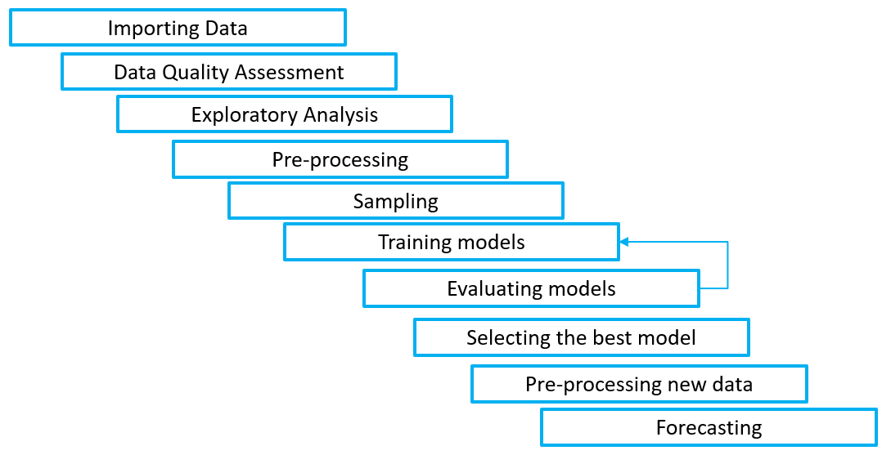
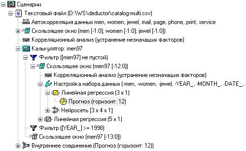
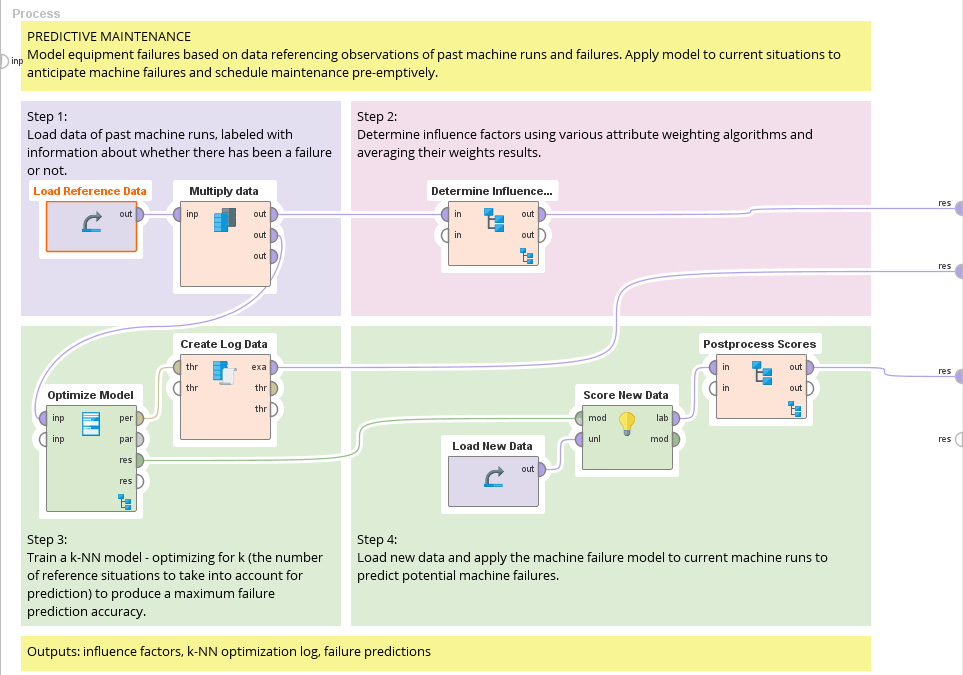
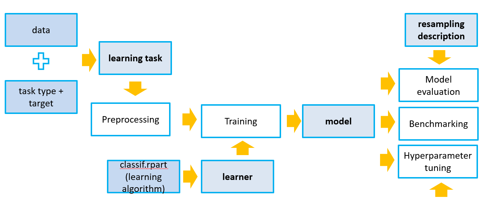
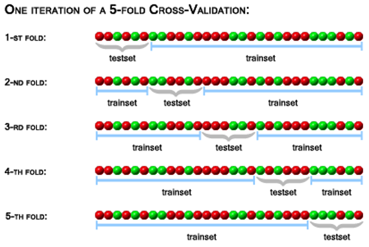

```{r setup, include=FALSE}
knitr::opts_chunk$set(echo = TRUE)
```

```{r Загрузка пакетов, message=FALSE, warning=FALSE}
library(tidyverse) # трансформация и визуализация данных
library(mlr) # фреймворк для машинного обучения
library(stringr) # работа со строками
library(forcats) # работа с факторами
library(parallelMap) # распараллеливание задач
library(rpart.plot) # визуализация деревьев rpart
```


# Введение

При разработке модели для прогнозирования аналитик проходит через несколько этапов, показанных на рисунке.



Хотя каждая задача уникальна, последовательность этих этапов повторяется от задачи к задаче. В R можно найти многочисленные инструменты, полезные для реализации каждого этапа построения модели. Однако сложность состоит в большом разнообразии пакетов (на сегодня их свыше 10 000), которые разрабатывались независимо друг от друга, работают с разными объектами, имеют различный синтаксис и иногда концептуальную основу.

**Пример**: предсказание меток классов с использованием rpart и ctree

```{r, eval=FALSE}
# rpart:
predict(m_rpart, newdata = gr, type = "class") 

# ctree:
predict(m_ctree, newdata = gr, type = "response")
```

Разнообразие подходов и необходимость чередования моделирования и рутинных операций (замена пропущенных значений, сэмплинг, оценка качества модели, сравнение моделей) замедляют работу аналитика и увеличивают риск ошибок. Кроме того, процесс обучения моделей часто является ресурсоемким и можно получить значительный выигрыш за счет использования параллельных вычислений.

В некоторых инструментах для разработки аналитических решений применяется "подход LEGO", когда аналитику предлагается унифицированный набор блоков, реализующих операции трансформации набора данных, построения, оценки и применения модели.





Чтобы облегчить работу аналитика за счет унификации процесса подготовки данных, разработки, тестирования, сравнения и применения моделей, для R созданы специализированные пакеты-фреймворки, которые создают унифицированный интерфейс для работы с инструментами, реализованными в различных пакетах.

Наиболее известным пакетом, создающим среду для разработки моделей, является [caret](http://topepo.github.io/caret/index.html), разработанный Max Kuhn.

Более современной разработкой является пакет [mlr](http://mlr-org.github.io/) - Machine Learning in R, разработанный Bernd Bischl. В отличие от caret, этот пакет использует для визуализации результатов графическую систему ggplot2.

На рисунке показаны основные операции и объекты в процессе моделирования с помощью пакета mlr.



За счет унификации операций и автоматизации рутинных процедур, применение пакета mlr позволяет аналитику сконцентрироваться на решении прикладной задачи. 

В этом блокноте будут показаны приемы подготовки данных, построения, оценки и оптимизации параметров моделей с помощью mlr.

# Пример решения задачи регрессии: прогнозирование цены подержанного автомобиля

## Загрузка данных и разведочный анализ

```{r, message=FALSE, warning=FALSE}
car_ad <- read_csv("car_ad.csv")
glimpse(car_ad)
```

Пропущенные значения

```{r}
car_ad %>% 
  gather(key = "variable") %>%
  filter(is.na(value) | str_length(value) == 0) %>%
  group_by(variable) %>%
  summarize(missing = n())
  
```

В двух переменных имеются пропущенные значения, порядка 5% от общего количества наблюдений.

Переменные `car` (марка автомобиля) и `model` (модель автомобиля) содержат большое число категорий.

Наиболее популярные (более 100 объявлений о продаже) марки автомобилей:

```{r Популярность марок}
car_ad %>% 
  group_by(car) %>%
  summarize(count = n()) %>%
  arrange(count) %>%
  filter(count >= 100) %>%

  ggplot(aes(x = fct_inorder(car), y = count)) +
    geom_bar(stat = "identity") + coord_flip() +
  labs(x = NULL, y = "Количество предложений",
       title = "Наиболее популярные марки автомобилей")

```


```{r Наиболее популярные модели}
car_ad1 <- car_ad %>% 
  mutate(model = paste(car, model)) # объединяем производителя и модель для подписей
  
  
car_ad1 %>% 
  group_by(model) %>%
  summarize(count = n()) %>%
  arrange(count) %>%
  filter(count > 60) %>%

  ggplot(aes(x = fct_inorder(model), y = count)) +
    geom_bar(stat = "identity") + coord_flip() +
    labs(x = NULL, y = "Количество предложений",
       title = "Наиболее популярные модели автомобилей")
  

```


Для моделирования необходимо преобразовать текстовые переменные в факторные. Уровни фактора будут определяться по частоте упоминания значений в наборе данных. Таким образом, в базовую категорию попадут наиболее типичные (частые) значения.

```{r}
# Преобразование текстовых переменных в факторные: mlr не работает с текстом
car_ad1 <- car_ad1 %>% 
  mutate_if(is_character, fct_infreq)

glimpse(car_ad1)
  
```

После преобразования текста в факторы становится доступна описательная статистика по всем переменным.

```{r}
summary(car_ad1)
```

Распределения количественных переменных скошенные. В данных по объему двигателя содержатся странные значения - порядка 100 литров.

```{r Гистограмма объема двигателя}
ggplot(car_ad1, aes(x = engV)) +
  geom_histogram() +
  xlim(c(0, 10)) +
  labs(title = "Гистограмма по объему двигателя")
```


```{r}
car_ad1 %>%
  filter(engV > 10) %>%
  arrange(engV) %>%
  head(10)
```

Двигатель объемом 17 литров на легковом автомобиле - очевидно некорректные данные - следствие ошибок ввода или преобразования единиц измерения. Заменим все неправдоподобные значения на пропущенные. Кроме того, отфильтруем предложения с нулевой ценой. Поскольку зависимость пробег - цена - нелинейна (цена обратно пропорциональна пробегу), добавим переменную: 1/пробег.

```{r Замена некорректных значений объема двигателя и фильтрация нулевых цен}
car_ad1 <-  car_ad1 %>%
  filter(price > 0) %>%
  mutate(inv_mileage = 1000 / (mileage + 1),
         engV = if_else(engV > 8, as.numeric(NA), engV))
```


## Моделирование с помощью MLR

### Шаг 1. Создание задачи для обучения (learning task)

Задача для обучения (**learning task**) в mlr - это "обертка" над таблицей данных, включающая дополнительные атрибуты, например - указание целевой переменной (**target**), типа задачи обучения - регрессия, классификация, метку для набора данных, которая используется в отчетах по сравнению моделей и на визуализациях.

Для создания задач регрессии используется функция `makeRegrTask()`.

```{r Создание задачи для предсказания цены автомобиля}
car_task <- makeRegrTask(id = "Цены автомобилей", 
                         data = car_ad1, target = "price",
                         fixup.data = "warn")
print(car_task)
```

Полученный объект содержит таблицу данных и необходимую для других функций пакета информацию о задаче. В mlr есть большое количество функций, позволяющих работать с задачей моделирования - получать о ней информацию, или модифицировать.

Например, можно получить размер таблицы данных:

```{r}
getTaskSize(car_task)
```

### Шаг 2. Создание ученика (learner)

В mlr встроены несколько десятков алгоритмов для решения задач классификации и регрессии. Список этих алгоритмов можно получить с помощью функции `listLearners()` или в документации пакета -[Available Learners]https://mlr-org.github.io/mlr-tutorial/release/html/integrated_learners/index.html

```{r Список алгоритмов для решения задач регрессии}
listLearners(obj = "regr") %>%
  select(name, class) %>% 
  arrange(str_length(name)) %>%
  head(10) %>%
  arrange(name)

```

В столбце `class` содержится класс-обертка для алгоритма, который необходимо указать в функции для создания ученика - `makeLearner()`. Помимо названия, в таблице содержатся и атрибуты алгоритмов - например, можно ли с помощью данного алгоритма оценивать вероятность или стандартную ошибку для прогноза. Эти атрибуты можно использовать для автоматического отбора алгоритмов с нужными свойствами.

Общее количество алгоритмов регрессии в mlr:

```{r}
listLearners(obj = "regr") %>% count()
```

Создадим алгоритм обучения на основе множественной линейной регрессии


```{r}
lrn_lm <- makeLearner("regr.lm", id = "Линейная регрессия")
lrn_lm

```

В метаданных полученного объекта содержатся сведения о типе алгоритма, свойствах, типе прогноза по умолчанию и гипер-параметрах. Гипер-параметры - это настройки алгоритма построения модели. Например, параметры в модели линейной регрессии - это коэффициенты для переменных. А гипер-параметром может быть величина штрафа для регуляризации коэффициентов в модели ридж-или лассо-регрессии.

### Шаг 3. Предобработка

Предобработка - это приведение набора данных к виду, пригодному и оптимальному для моделирования.

Примерами операций предобработки являются:

- удаление переменных
- обработка пропущенных значений
- фильтрация выборосов
- удаление переменных, содержащих одинаковые значения


Лишние столбцы можно удалить с помощью функции `dropFeatures()`.

На этапе разведочного анализа мы выяснили, что марка и модель машины содержат большое число категорий. Эти переменные безусловно влияют на цену, однако включение их в модель вызовет ряд проблем:

 - модель получится слишком сложной (каждая категория будет учитываться как dummy-переменная)  
 - при разбиении на обучающее/тестовое множества малочисленные категории могут не попасть в обучающее множество, тогда при попытке прогнозирования будет выдаваться сообщение об ошибке  
 
  В связи с этим, мы объединим все малочисленные категории в одну - ".other"

```{r}
car_task <- car_task %>%
  mergeSmallFactorLevels(min.perc = 0.015, new.level = ".other")
```


Более подробно о проблеме новых значений факторов при прогнозировании написано здесь:
https://github.com/mlr-org/mlr/issues/811


Выбросы (некорректные значения объема двигателя и цены) мы уже удалили стандартными средствами до создания задачи. Однако в mlr также имеются функции, облегчающие борьбу с выбросами (см. http://mlr-org.github.io/mlr-tutorial/release/html/preproc/index.html)

Многие модели не могут работать с пропущенными значениями. Например, попытка обучить модель регрессии на данных с NA приведет к ошибке.

```{r}
#m_lm <- train(lrn_lm, car_task) # не работает из-за NA
```

Пропущенные значения можно отфильтровать или заменить на "типичные" или специальные значения. В mlr для автоматической замены пропусков используется функция `impute()`.

Для категориальных признаков заменим пропущенные значения на константу "Unknown", для количественных признаков - на среднее значение:

```{r Замена пропущенных значений drive и engV}
car_imputation <- car_task %>%
  impute(classes = list(numeric = imputeMean(), factor = imputeConstant("Unknown"))) 

car_imputation
```

В объекте, полученном от `impute()` содержится набор данных (`task`) с замененными значениями, а также описание стратегии обработки пропущенных значений (`desc`), которое можно применить к новому набору данных при прогнозировании.

Для удобства, извлечем в отдельную переменную набор данных с замененными пропусками.

```{r}
car_imputed <- car_imputation$task
```

### Шаг 4. Обучение модели

Для обучения любых моделей используется функция `train()`. При необходимости, можно задать дополнительные параметры алгоритма, или тип прогноза (например, для моделей классификации - метки классов, или вероятности)

```{r Обучение модели линейной регрессии}
m_lm <- train(lrn_lm, car_imputed)
m_lm
```

Из полученного объекта можно извлечь метаданные и саму модель. После этого можно работать с моделью стандартными средствами, например посмотреть коэффициенты с помощью функции summary()

```{r Извлечение модели}
m_lm %>% 
  getLearnerModel() %>%
  summary()
```

### Шаг 5. Оценка качества модели

#### Разбиение на подвыборки "вручную"

Оценку качества моделей необходимо проводить на новых данных. В связи с этим, при обучении необходимо разделять набор данных на обучающую и тестовую подвыборки.

Можно сделать это вручную, используя функцию `subsetTask()` для отбора строк из задачи, или же можно указать, какое подмножество строк использовать для обучения модели непосредственно в функции `train()`

Воспользуемся вторым подходом

```{r Разделение на обучающую и тестовую выборки}
# Получаем номера строк для обучающей и тестовой выборки
set.seed(123) # для воспроизводимости
car_n <- getTaskSize(car_task)
car_train <- sample(car_n, size = car_n * 0.7)
car_test <- base::setdiff(1:car_n, car_train)

# Строим модель только на тестовой выборке
car_mod_lm <- train(lrn_lm, task = car_imputed, 
                    subset = car_train)

```


Теперь можно построить прогноз на тестовой выборке:

```{r Прогнозирование с помощью регрессионной модели}
car_pred_lm <- predict(car_mod_lm, 
                       task = car_imputed, 
                       subset = car_test)

car_pred_lm
```

Рассчитать показатели ошибки можно с помощью функции `performance()`. Чтобы не перечислять их каждый раз, создадим список нужных показателей - `reg_ms`

```{r Расчет ошибки регрессионной модели}
reg_ms <- list(rmse, mape, mae)

performance(car_pred_lm,
            measures = reg_ms) %>%
  round(2)
```

Модель получилась довольно плохой: MAPE = 118%.

#### Автоматизация оценки качества модели

Поскольку оценка качства модели на тестовом множестве - востребованная операция, mlr позволяет автоматизировать ее.
Вначале надо указать стратегию сэмплинга (разделения на подвыборки), используя функцию `makeResampleDesc()`.

```{r Создание описания стратегии сэмплинга}
car_rdesc <- makeResampleDesc(method = "Holdout", 
                              split = 0.8, 
                              stratify.cols = "car")
car_rdesc
```

Стратификация - это подвыборка внутри заданных групп, обеспечивающая одинаковое соотношение групп в обучающей и тестовой подвыборках. В данном случае мы обеспечиваем одинаковые доли производителей в обучающей и тестовой выборках.


После этого можно проверить качество модели автоматически, с помощью функции `resample()`:

```{r Автоматическая проверка на тестовом множестве}
set.seed(123)
resample(learner = lrn_lm, 
         resampling = car_rdesc, 
         task = car_imputed,
         measures = reg_ms)
```

Еще одной популярной стратегией сэмплинга является кросс-валидация (или скользящий контроль), при которой набор данных разбивается на $k$ блоков, а затем каждый из блоков выбирается в качестве тестовой выборки, а остальные блоки - в качестве обучающей выборки. Таким образом, модель обучается и проверятеся $k$ раз. Затем проводится усреднение показателей в каждом из повторов.



Применим 10-блочную кросс-валидацию для оценки качества модели

```{r}
car_rdesc_cv <- makeResampleDesc(method = "CV",
                                 iters = 10,
                                 stratify.cols = "car")
set.seed(123)

resample(learner = lrn_lm, 
         resampling = car_rdesc_cv, 
         task = car_imputed,
         measures = reg_ms,
         show.info = TRUE)

```

### Шаг 6. Прогнозирование

Применить модель к новым данным можно с помощью функции `predict()`.

Если к исходным данным для построения модели применялась предобработка, то такая же предобработка должна применяться и к новым данным. Это обеспечивается функцией `reimpute()`, которая применяет к данным описание предобработки, созданное функцией `impute()`. 

Кроме того нужно убедиться, что кодирование уровней фактора такое же, как и в исходных данных.

```{r Применение модели к новым данным}

# Новый автомобиль
new_car2 <- tibble(car = "Ford", body = "crossover",
              mileage = 10L, engV = 2.7,
              inv_mileage = 1000 / (10 + 1),
              engType = "Gas", registration = "yes",
              year = 2012L, drive = "full", model = ".other"
              )

# Применение стратегии предобработки
new_car2_imp <- new_car2 %>%
  mutate_if(is.character, as.factor) %>%
  reimpute(desc = car_imputation$desc)

# В данном случае, разницы нет, т.к. пропущенных значений в новых данных нет
predict(car_mod_lm, newdata = new_car2)
predict(car_mod_lm, newdata = new_car2_imp)

```

### Визуализация прогнозов

Для оценки адекватности модели полезно анализировать прогнозы визуально. В пакете mlr есть возможность проверить, как работает выбранный алгоритм в текущей задаче. При этом производится построение и оценка модели на основе 1 или 2 выбранных атрибутов.

```{r Визуализация модели для одного предиктора}
plotLearnerPrediction(lrn_lm, task = car_imputed,
                      features = "inv_mileage",
                      measures = mape)
```

```{r Визуализация модели для двух предикторов}
plotLearnerPrediction(lrn_lm, task = car_imputed,
                      features = c("inv_mileage", "engV"),
                      measures = mape)
```


### Сравнение моделей

Сравним несколько алгоритмов для решения задач регрессии - линейную регрессию (lm), ридж-регрессию (glmnet), и два вида деревьев - rpart и ctree.

Функция `makeLearners()` позволяет создать сразу несколько алгоритмов прогнозирования и сохранить их в один список. Такой список можно в дальнейшем дополнять другими моделями.

```{r}
car_learners <- makeLearners(
  c("lm", "glmnet", "rpart", "ctree"),
  ids = c("lm", "glmnet", "rpart", "ctree"),
  type = "regr")
```


Одним из вариантов сравнения моделей является обработка полученного списка алгоритмов с помощью функции `lapply()`. Эта функция позволяет применить к каждому элементу списка заданную функцию. В нашем случае - это функция обучения модели `train()`. Результаты сохраняются в новый список.

```{r, eval=FALSE}
car_models <- car_learners %>%
  lapply(train, task = car_imputed)
```


Сравним графически работу разных моделей, использующих пару предикторов - 1/пробег и объем двигателя:

```{r}
car_learners %>%
  lapply(plotLearnerPrediction, 
         task = car_imputed,
         features = c("inv_mileage", "engV"),
         measures = mape)

```

Наилучшие результаты получены при использовании дерева ctree.

Количественно оценить ошибку моделей можно с помощью функции `resample()`. Чтобы обработать сразу весь список, можно воспользоваться функцией `lapply()`:

```{r, eval=FALSE}
set.seed(123)
car_learners %>%
  lapply(resample, task = car_imputed,
         resampling = car_rdesc_cv,
         measures = reg_ms,
         show.info = FALSE)

```

Однако существует более удобный и эффективный метод сравнения моделей - применение функции `benchmark()`. Данная функция позволяет применить несколько алгоритмов обучения к нескольким наборам данных (по списку), при этом автоматически выполняется ресемплинг. Для ускорения расчетов можно распараллелить вычисления на несколько ядер процессора.


```{r Сравнение моделей в задаче прогнозирования цены автомобиля}
set.seed(123, "L'Ecuyer") # При использовании параллельных вычислений необходимо выбирать алгоритм генерации СЧ "L'Ecuyer"

# Определение количества доступных ядер процессора
num_cores <- parallel::detectCores()

# Запуск параллельных вычислений
parallelStartSocket(num_cores) # для Windows

car_bench <- car_learners %>%
  benchmark(tasks = car_imputed,
         resampling = car_rdesc_cv,
         measures = append(list(timetrain), reg_ms),
         show.info = FALSE)

# Остановка параллельных вычислений
parallelStop()

```

Результаты сравнения моделий (benchmarking results) сохранены в объект `car_bench`. Их можно преобразовать в табличный вид и визуализировать:


```{r}
car_bench %>%
  getBMRAggrPerformances(as.df = TRUE) %>%
  arrange(mape.test.mean) %>%
  select(learner.id, mape.test.mean, timetrain.test.mean)

```

Визуализация результатов:

```{r Визуализация времени обучения и средней ошибки моделей прогнозирования цены автомобиля}
car_bench %>%
  getBMRAggrPerformances(as.df = TRUE) %>%
  arrange(mape.test.mean) %>%
  ggplot(aes(x = fct_inorder(learner.id),
             y = mape.test.mean)) +
  geom_bar(stat = "identity") +
  geom_line(aes(y = timetrain.test.mean, group = 1),
            color = "red") +
  scale_y_continuous(labels = scales::percent,
                     sec.axis = sec_axis(~ . * 1000,
                                         name = "Время обучения, мс")) +
  labs(title = "Сравнение моделей прогнозирования цены автомобиля",
       x = "Тип модели", y = "MAPE")
```

Самым точным алгоритмом оказался ctree, а самым быстрым - rpart.

См. также https://mlr-org.github.io/mlr-tutorial/release/html/benchmark_experiments/index.html


# Задача классификации

## Загрузка данных и разведочный анализ

В этом разделе мы применим пакет mlr для обучения моделей классификации. В качестве примера используем уже рассмотренную ранее задачу предсказания оттока сотрудников (../decision-trees/decision-trees.Rmd).


Загрузка исходных данных

```{r}
turnover <- readRDS("turnover.RDS")
head(turnover)

```

Визуализация зависимости целевой переменной от уровня удовлетворенности, загруженности и уровня компетентности сотрудника 

```{r, fig.width=10}
turnover %>%
  ggplot(aes(x = satisfaction_level, 
             y = average_monthly_hours,
             color = left,
             size = last_evaluation >= 8)) +
  geom_jitter(alpha = 0.1) +
  labs(title = "Факторы оттока сотрудников")
```

Распределения переменных и техническое качество данных

```{r}
summary(turnover)
```

Пропущенных значений нет


## Создание задачи обучения

```{r}
turnover_task <- makeClassifTask(id = "Отток",
                                 data = turnover,
                                 target = "left",
                                 positive = "left")
turnover_task
```


## Создание ученика

Количество алгоритмов классификации в пакете mlr:


```{r}
listLearners("classif") %>%
  count()
```

Список алгоритмов классификации:

```{r}
listLearners("classif") %>%
  select(name, package) %>%
  filter(str_length(name) < 25) %>%
  head()

```

См. также список алгоритмов в документации mlr [Available Learners]https://mlr-org.github.io/mlr-tutorial/release/html/integrated_learners/index.html


Создадим сразу несколько алгоритмов классификации и поместим их в один список:

```{r}
turnover_learners <- 
  makeLearners(cls = c("logreg", "rpart", "ctree", "C50"),
               ids = c("Лог.регрессия", "rpart", "ctree", "C5.0"),
               type = "classif", predict.type = "prob")
```

Благодаря указанию типа алгоритма с помощью параметра `type`, можно не указывать префикс `classif.` в имени алгоритма из таблицы.


## Сравнение моделей

Создадим описание стратегии ресемплинга для задачи классификации:

```{r}
turnover_rdesc <- makeResampleDesc(method = "CV", 
                                   stratify = TRUE,
                                   iter = 10)
```

Здесь мы также используем стратификацию, однако теперь обеспечиваем равные доли классов в обучающей и тестовой подвыборках. То есть, в обучающей и тестовой выборке будет одинаковый процент покинувших компанию сотрудников.


Проведем сравнение моделей с помощью функции `benchmark()`:

```{r}
# Список показателей качества модели
clas_ms = list(auc, kappa, mmce, tpr, tnr, fpr)

# Инициализация генератора СЧ
set.seed(123, "L'Ecuyer")

# Сравнение моделей с распараллеливанием на разные ядра процессора
parallelStartSocket(num_cores)

turnover_bench <- turnover_learners %>%
  benchmark(tasks = turnover_task,
         resampling = turnover_rdesc,
         measures = append(list(timetrain), clas_ms),
         show.info = FALSE)

parallelStop()

```

Извлечение и анализ результатов сравнения моделей

```{r}
turnover_bench %>%
  getBMRAggrPerformances(as.df = TRUE) %>%
  arrange(desc(auc.test.mean)) %>%
  select(-task.id) %>%
  mutate_if(is.numeric, round, digits = 3)
```

```{r}
turnover_bench %>%
  getBMRAggrPerformances(as.df = TRUE) %>%
  arrange(desc(auc.test.mean)) %>%
  ggplot(aes(x = fct_inorder(learner.id))) +
           geom_bar(aes(y = auc.test.mean), stat = "identity") +
           geom_line(aes(y = timetrain.test.mean * 5, group = 1),
                     colour = "red") +
  scale_y_continuous(sec.axis = sec_axis(~ . * 1000 / 5, 
                                         name = "Время обучения, мс"),
                     labels = scales::percent) +
    labs(title = "Сравнение моделей предсказания оттока",
       x = "Тип модели", y = "AUC")

```

Самый точный алгоритм - rpart, он же - самый быстрый.


Сравним поведение алгоритмов (разделяющие поверхности) в пространстве двух предикторов - уровень удовлетворенности и загруженность сотрудников:

```{r}
turnover_learners %>%
  lapply(plotLearnerPrediction, task = turnover_task,
         features = c("satisfaction_level",
                      "average_monthly_hours"))
```

## Исследование модели классификации

Извлечем из списка обученный классификатор rpart, показавший наибольшую точность

```{r}
turnover_rpart <- turnover_learners$rpart
turnover_rpart
```


Для построения ROC-кривых потребуется сделать прогноз по модели на тестовых данных. Для этого разобъем задачу `turnover_task` на обучающую и тестовую подвыборки.


```{r}
set.seed(123)
# Количество наблюдений в задаче
turnover_n <- getTaskSize(turnover_task)

# Индексы строк в обучающей и тестовой подвыборках
turnover_train <- sample(turnover_n, size = 0.7 * turnover_n)
turnover_test <- setdiff(1:turnover_n, turnover_train)
```

Обучаем модель и строим прогноз на тестовой выборке:

```{r}
turnover_m_rpart <- train(learner = turnover_rpart,
                          task = turnover_task,
                          subset = turnover_train)

turnover_pr_rpart <- predict(turnover_m_rpart,
                             task = turnover_task,
                             subset = turnover_test)
```

Посмотрим на полученное дерево решений:

```{r}
rpart.plot(getLearnerModel(turnover_m_rpart))
```


Оценка ошибки классификатора на тестовой выборке:

```{r}
performance(turnover_pr_rpart,
            measures = clas_ms) %>%
  round(4)
```

В зависимости от выбранного порога отсечения, будет меняться чувствительность и специфичность классификатора.

Текущий порог равен 50%:

```{r}
turnover_pr_rpart$threshold
```

При необходимости, можно изменить порог классификации при помощи функции `setThreshold()`. 

Для построения ROC-кривой, необходимо сгенерировать зависимость показателей ошибки от порога - при помощи функции `generateThreshVsPerfData()`. Первыми в списке показателей должны следовать FPR и TPR, т.к. именно по ним строится ROC-кривая.

После этого можно визуализировать полученный объект с помощью функции `plotThreshVsPerf()`:


```{r}
turnover_roc <- generateThreshVsPerfData(turnover_pr_rpart, 
                         measures = list(fpr, tpr, tnr, kappa))
plotThreshVsPerf(turnover_roc)
```

По этим же данным строится ROC-кривая:

```{r}
plotROCCurves(turnover_roc)
```

Матрицу ошибок классификации можно получить с помощью функции `calculateConfusionMatrix()`:

```{r}
calculateConfusionMatrix(turnover_pr_rpart)
```

При необходимости, можно вычислить относительные частоты ошибок разного вида:

```{r}
calculateConfusionMatrix(turnover_pr_rpart, relative = T)
```


Чтобы сравнить сразу несколько моделей, можно воспользоваться функцией для обработки списков `lapply()`:

```{r}
turnover_models <- 
  turnover_learners %>%
  lapply(train, task = turnover_task, subset = turnover_train)

turnover_predictions <- 
  turnover_models %>%
  lapply(predict, task = turnover_task, subset = turnover_test)
```

Функция для подготовки данных для ROC-кривой может обрабатывать списки самостоятельно:

```{r}
turnover_roc2 <- 
  generateThreshVsPerfData(turnover_predictions,
                           measures = list(fpr, tpr))

plotROCCurves(turnover_roc2)

```

Как правило, удобнее сравнивать ROC-кривые, наложив их на один график. Для получения такой визуализации можно применить `ggplot()` к таблице данных, которая хранится внутри объекта, созданного на предыдущем шаге:

```{r Сравнение ROC-кривых для нескольких моделей на одном графике}
turnover_roc2$data %>%
  ggplot(aes(fpr, tpr, colour = learner)) +
  geom_path() +
  geom_abline(slope = 1, linetype = "dashed") +
  labs(title = "Сравнение ROC-кривых для моделей оттока",
       colour = "Модель")
```

Лучший результат - у моделей rpart и C5.0.

См. также
https://mlr-org.github.io/mlr-tutorial/release/html/roc_analysis/index.html

## Оптимизация гиперпараметров модели

Большинство алгоритмов машинного обучения содержат **гиперпараметры** - настройки, влияющие на процесс обучения модели. Например, для дерева решений rpart, доступны гиперпараметры: 
  - `minsplit` - минимальное число наблюдений в узле для дальнейшего разбиения,  
  - `cp` - параметр сложности дерева - минимальное улучшение меры чистоты при разбиении, при котором оно осуществляется; чем меньше `cp`, тем сильнее "разрастается" дерево

Получить список гиперпараметров алгоритма обучения (ученика) можно при помощи функции `getParamSet()`:

```{r}
getParamSet(turnover_rpart)
```

Для каждого гиперпараметра указан тип, значение по умолчанию, диапазон изменения и возможность настройки.


Чтобы оптимизировать гиперпараметры, необходимо создать описание набора параметров для при помощи функции `makeParamSet()`, указав для каждого гиперпараметра тип и диапазон изменения.

Создадим набор из двух гиперпараметров - `cp` (диапазон изменения от $10^{-4}$ до $10^{-2}$) и `minsplit` (диапазон изменения от 4 до 40)

```{r Описание набора гиперпараметров для оптмизации}
ps_rpart = makeParamSet(
  makeNumericParam("cp", lower = -4, upper = -2,
                   trafo = function(x) 10^x),
  makeIntegerParam("minsplit", lower = 4, upper = 50))
```

Параметр `trafo` функции makeNumericParam() позволяет задать функцию преобразования (transform) для гиперпараметра. В этом примере мы задали для гиперпараметра `cp` диапазон изменения от -4 до -2 в линейной шкале, однако в алгоритме обучения будут использоваться значения от $10^{-4}$ до $10^{-2}$, т.к. мы используем функцию преобразования: $10^x$.

Чем больше гиперпараметров в наборе и число возможных значений каждого параметра, тем дольше будет проводиться поиск оптимального сочетания.

Доступны несколько алгоритмов оптимизации параметров (см. http://mlr-org.github.io/mlr-tutorial/release/html/tune/index.html).

Наиболее простым (и долгим) является перебор всех сочетаний `makeTuneControlGrid()`. Быстрее, но без гарантий, работает алгоритм случайного перебора `makeTuneControlRandom()`. В этом примере мы используем алгоритм имитации отжига, который сочетает направленный перебор и случайный поиск - `makeTuneControlGenSA()`.


```{r Оптимизация гиперпараметров, message=FALSE}

# Инициализация генератора СЧ
set.seed(123, "L'Ecuyer")

# Выбор алгоритма оптимизации
control_rpart = makeTuneControlGenSA(budget = 200)

# Выбор стратегии ресэмплинга
cv_rdesc = makeResampleDesc("CV", iters = 5) # 10 блоков - точнее, но дольше

# Оптимизация гиперпараметров
parallelStartSocket(num_cores)

res_rpart = tuneParams(turnover_rpart,
                       measures = auc,
                       task = turnover_task,
                       control = control_rpart,
                       resampling = cv_rdesc,
                       par.set = ps_rpart,
                       show.info = FALSE)

parallelStop()

```

Оптимальное сочетание гиперпараметров:

```{r}
print(res_rpart)
```


Зависимость AUC от значений гиперпараметров можно визуализировать:

```{r}
generateHyperParsEffectData(res_rpart) %>%
  plotHyperParsEffect(x = "cp", y = "auc.test.mean",
                      plot.type = "line",
                      #z = "minsplit",
                      facet = "minsplit")
```

По графикам видно, что при большем минимальном размере узла для разбиения зависимость AUC от параметра сложности cp слабо выражена. Если разрешить маленькие узлы, то зависимость становится более выраженной, т.к. при малом значении `cp` модель переобучается и ее качество на тестовой выборке падает.

Также можно получить тепловую карту для значения целевого показателя в зависимости от двух гиперпараметров:

```{r}
generateHyperParsEffectData(res_rpart) %>%
  plotHyperParsEffect(x = "cp", y = "minsplit",
                      z = "auc.test.mean",
                      plot.type = "heatmap",
                      interpolate = "regr.earth",
                      show.experiments = TRUE)
```

На тепловой карте точки обозначают проверенные в процессе перебора сочетания гиперапараметров, а сплошная цветовая заливка получена в результате интерполяции значений целевого показателя в этих точках. Видно, что наибольшие значения AUC получаются при $cp \approx 10^{-2.5}$ и $20 < minsplit < 35$.

См. также http://mlr-org.github.io/Exploring-and-Understanding-Hyperparameter-Tuning/


Построим модель с оптимизированными гиперпараметрами:

```{r}
# Описание ученика
turnover_rpart_opt <-  makeLearner("classif.rpart", 
                                   predict.type = "prob",
                                   par.vals = 
                                     list(cp = 10^(-2.75),
                                          minsplit = 25))
# Обучение модели
m_rpart_opt <- train(turnover_rpart_opt,
                     task = turnover_task,
                     subset = turnover_train)

# Прогнозирование (на тестовой выборке)
pr_rpart_opt <- predict(m_rpart_opt, task = turnover_task,
                        subset = turnover_test)

```

Сравним оптимизированную модель с первоначальной

```{r}
# Получение данных для ROC-кривых
turnover_rpart_compare <- 
  generateThreshVsPerfData(
    list("rpart" = turnover_predictions$rpart,
         "rpart, оптимизированная" = pr_rpart_opt),
    measures = list(fpr, tpr))

# Сравнение ROC-кривых
turnover_rpart_compare$data %>%
  ggplot(aes(x = fpr, y = tpr, color = learner)) +
  geom_path() + 
  geom_abline(slope = 1, linetype = "dashed",
              color = "darkgray") +
  labs(title = "Сравнение ROC-кривых для исходной и оптимизированной модели",
       colour = "Модель")
```

Улучшение есть, но минимальное.

Сравним также вид полученного после оптимизации параметров дерева решений

```{r, fig.height=7}

# Исходная модель
getLearnerModel(turnover_m_rpart) %>%
  rpart.plot(main = "Исходное дерево решений")

# Оптимизированная модель
getLearnerModel(model = m_rpart_opt) %>%
  rpart.plot(main = "Дерево решений после оптимизации гиперпараметров")

```

После оптимизации параметров дерево решений немного выросло.

Сравним работу моделей, построенных с использованием только двух предикторов

```{r}

list(rpart = turnover_rpart, 
     rpart_opt = turnover_rpart_opt) %>%
  lapply(plotLearnerPrediction,
         task = turnover_task,
         features = c("satisfaction_level",
                      "average_monthly_hours"),
         measures = list(tpr, fpr))
```

При использовании двух предикторов предсказания моделей не отличаются.


# Рекомендованные ресурсы

 - Видео мастер-класса Bernd Bischl OpenML + R + mlr https://www.youtube.com/watch?v=rzjkT1uLNi4&t=672s
 - MLR Tutorial, online http://mlr-org.github.io/mlr-tutorial/release/html/
 - MLR Tutorial, pdf https://arxiv.org/abs/1609.06146
 - Что делать, если выдается ошибка о новых уровнях фактора в тестовых данных https://github.com/mlr-org/mlr/issues/811
 - Таблица доступных в mlr моделей https://mlr-org.github.io/mlr-tutorial/release/html/integrated_learners/index.html
 - Оптимизация гиперпараметров алгоритма обучения http://mlr-org.github.io/Exploring-and-Understanding-Hyperparameter-Tuning/
 
 
 
