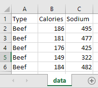
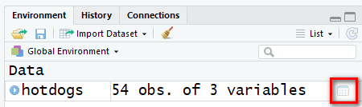

# Введение


В этом блокноте показаны самые необходимые приемы обработки данных в R. Поясняется работа с базовыми типами данных R - векторами, списками и таблицами данных, а также загрузка данных из Excel. 


```{r Подключение пакетов, message=FALSE, warning=FALSE}
library(tidyverse)
library(readxl) # считывание данных в формате Excel
library(stringr) # операции со строками

# Раскомментируйте и запустите следующие команды, 
# если у вас не ставится tidyverse

#library(dplyr)
#library(ggplot2)
#library(tidyr)

```

Если у вас не ставится пакет `tidyverse`, то для работы с этим блокнотом потребуется установить и загрузить пакеты: `ggplot2`, `dplyr`, `readxl`, `stringr`.


# Как загрузить данные из Excel

Для загрузки данных в форматах `xlsx` и `xls` в R используется пакет функция `read_excel()` из пакета `readxl`.  Поскольку в Excel поддерживается разделение данных по типам, обычно возникает меньше проблем при загрузке, чем с текстовыми файлами. 

Желательно, чтобы в Excel на листе, откуда предполагается читать данные, содержалась только таблица данных, начиная с первой строки. 




При необходимости вы можете выбрать нужный лист и диапазон для чтения - см `?read_excel`

```{r Чтение данных из Excel}
# Загрузить лист с именем 'data' из книги:
hotdogs <- read_excel('data/hotdogs.xlsx', sheet = 'data') 
```

Обратите внимание, что мы используем **относительный путь** к файлу данных. Текущей директорией для блокнота является та, где он находится. Файл `hotdogs.xlsx` находится на уровень ниже - в подпапке `data`.

Загруженные данные помещены в переменную `hotdogs`. Данные - это результаты лабораторного анализа хот-догов с разным типом начинки: содержание натрия (`Sodium`) и пищевая ценность (`Calories`).

# Предварительное знакомство с данными

## Просмотр таблицы

Мы можем проконтролировать результат загрузки, выведя небольшую часть данных в начале таблицы с помощью функции `head()`. При необходимости можно посмотреть также конец таблицы с помощью `tail()`, или всю таблицу целиком в отдельном окне - с помощью `View()`. 

В RStudio проще всего вместо открыть таблицу для просмотра, нажав на иконку таблицы в панели Environment.



Посмотрим, какие данные загрузились:

```{r Предварительный просмотр данных таблицы}
head(hotdogs, n = 5) # посмотрим первые 5 строк
```

## Структура таблицы

Также можно изучить структуру таблицы с помощью функции `str()`. Эта функция позволяет видеть структуру любого объекта в R.

```{r Структура таблицы}
str(hotdogs)
```

При работе с данными полезно знать их размерность. Для этого можно использовать функцию `dim()`, которая выводит количество строк и столбцов таблицы:

```{r Количество строк и столбцов в таблице}
dim(hotdogs)
```

Отдельно получить количество строк и столбцов таблицы можно с помощью функций: `nrow()` и `ncol()`.

```{r Количество строк таблицы отдельно}
nrow(hotdogs)
```


## Просмотр и изменение имен столбцов таблицы

Еще одна полезная функция - `names()`. Эта функция позволяет вывести имена столбцов таблицы.

```{r Просмотр имен столбцов}
names(hotdogs)
```

С помощью функции `names()` можно не только посмотреть, но и изменить имена столбцов таблицы. Например, мы можем преобразовать сразу все имена столбцов к нижнему регистру:

```{r Переименование столбцов}
names(hotdogs) <- str_to_lower(names(hotdogs))
head(hotdogs)
```


## Распределение значений в столбцах 

После загрузки данных необходимо изучить распределение значений в каждом из них. Целью этой операции является выявление проблем в данных - выбросов, некорректных значений и пропусков. Кроме того, можно оценить форму распределения, степень его асимметричности.

Для просмотра статистической сводки по всем столбцам таблицы можно воспользоваться функцией `summary()`.

```{r Просмотр статистической сводки по данным}
summary(hotdogs)
```

В этом наборе данных мы видим, что имеются по 2 пропущенных значения в каждом числовом столбце. 

К сожалению, `summary()` не выводит информацию о пропущенных значениях в текстовых переменных.

Размах переменной `sodium` (содержание натрия) в 4 раза выше, чем размах переменной `calories`. Распределение этой переменной имеет небольшую асимметрию, т.к. среднее смещено вправо относительно медианы. 

# Работа с таблицами

Наиболее востребованными операциями с таблицей данных доступ к столбцу, вычисление новых столбцов и отбор данных.

## Доступ к столбцу таблицы и векторизованные операции

Если для анализа необходимы данные одного из столбцов таблицы - можно обратиться к столбцу, указав его после имени таблицы через `$`:

```{r Извлечение одного столбца}

# Калорийность в исходных единицах (ккал):
hotdogs$calories

```

В результате извлечения одного столбца таблицы получается **вектор** - еще один базовый тип данных R. Вектор содержит элементы одного типа данных. Все операции с вектором выполняются одновременно для всех его элементов (такие операции называются **векторизованными**). 

В качестве примера пересчитаем пищевую ценность из ккал в кДж:

```{r Пример операции с вектором}
# Калорийность в кДж
round(hotdogs$calories * 4.184)
```

### Недопустимые символы в именах столбцов

Рекомендуем использовать в именах столбцов только латинские буквы, подчеркивания и цифры. Не стоит использовать пробелы, русские буквы и служебные символы. Если вам все же необходимо работать с таблицей, имена которые содержат эти символы, то такие имена нужно заключать между знаками апострофа.

Например, если бы потребовалось обратиться к полю таблицы с именем: `неудачное имя`, то пришлось бы обращаться к нему так: 

```
table$`неудачное имя`

```

## Вычисление нового столбца

В предыдущем примере мы вывели результаты расчета на экран, но ими не получится пользоваться в дальнейшем, т.к. результаты нигде не сохранены.

При вычислениях на основе табличных данных в большинстве случаев необходимо сохранить результаты в ту же таблицу, в виде новых столбцов. 

Рассмотрим два способа вычисления новых столбцов

### Вычисление столбца в базовом R

Запись с `$` позволяет не только извлекать, но и добавлять новые столбцы в таблицу. В качестве примера вычислим относительное содержание натрия в хот-догах. К сожалению, в таблице нет массы, поэтому мы не сможем вычислить процентное содержание. Однако в качестве показателя размера хот-дога можем воспользоваться калорийностью. Можно предположить, что более калорийные хот-доги должны быть более тяжелыми.

```{r Вычисление нового столбца в базовом R}
# Соотношение Na и калорийности:
hotdogs$sodium_ratio = hotdogs$sodium / hotdogs$calories

head(hotdogs)
```

### Вычисление столбца с помощью dplyr

Недостатком записи с `$` является необходимость каждый раз указывать в качестве префикса имя таблицы. Это загромождает формулы и делает расчет менее понятным. Поэтому мы рассмотрим более удобный подход, основанный на использовании функции `mutate()` пакета `dplyr`. Преимущества - возможность писать имена столбцов без префикса и возможность рассчитать сразу несколько столбцов.

```{r Расчет столбцов с помощью mutate}
hotdogs <- mutate(hotdogs,
                  sodium_ratio = sodium / calories,
                  kilojoules = calories * 4.184)
head(hotdogs)
```

Рекомендуем всегда использовать этот способ, если у вас есть такая возможность (установлен пакет `dplyr`).


## Отбор столбцов таблицы

Часто в процессе анализа требуется отобрать из большой таблицы лишь несколько необходимых столбцов. Это можно сделать с помощью функции `select()` пакета `dplyr`. Предположим, что нам необходимо вывести лишь столбцы `type`, `sodium_ratio` и `kilojoules`, а исходные столбцы данных не нужны.

Это можно сделать несколькими способами:

```{r Отбор столбцов с помощью select}

# Перечисление нужных столбцов
head(
  select(hotdogs, type, sodium_ratio, kilojoules)
)

# Перечисление столбцов, которые нужно убрать:
head(
  select(hotdogs, -calories, -sodium)
)

# Указание последовательности смежных столбцов:
head(
  select(hotdogs, type, sodium_ratio:kilojoules)
)

# Исключение последовательности смежных столбцов:
head(
  select(hotdogs, -(calories:sodium))
)
```

Все способы дают один и тот же результат. Здесь мы только вывели сокращенную таблицу на экран, но при необходимости ее можно сохранить в новую переменную для дальнейшего использования.

Функция `select()` поддерживает и другие способы отбора столбцов. Вы можете познакомиться с ними в книге [R for Data Science](http://r4ds.had.co.nz/transform.html#select-columns-with-select).

Полезно также знать, как отбирать столбцы таблицы с помощью базового R. Вы найдете такой пример в **Приложении 3**.


## Отбор строк таблицы

Для отбора строк можно воспользоваться функцией `filter()` из пакета `dplyr()`. В качестве аргументов функции надо задать исходную таблицу данных и условие, по которому отбираются строки. В результирующую таблицу попадут только те строки, для которых условие будет истинным. 

В качестве примера, отберем и сохраним в новую переменную очень соленые хот-доги с курицей и высоким соотношением Na/калорийность.

```{r Отбор строк с помощью filter}
high_sodium <- filter(hotdogs, sodium_ratio > 4 & type == 'Poultry')
high_sodium
```

Про доступные условия отбора можно почитать в книге [R for Data Science](http://r4ds.had.co.nz/transform.html#comparisons).

Обратите, пожалуйста, внимание, что проверка на равенство записывается так: `x == y` (двойной знак равенства).

Если вам необходимо отбирать по равенству действительные числа, используйте функцию: `near(x, y)` вместо `x == y`.

Несколько условий отбора можно комбинировать с помощью логических союзов И, ИЛИ, НЕ и т.п. На рисунке показаны доступные в R логические операции. 


Если необходимо задать несколько условий, которые должны выполняться одновременно, то можно вместо объединения этих условий союзом `&` просто перечислить их через запятую. Например, предыдущий пример можно было бы записать так:

```{r Перечисление условий в filter}
# Было: 
#filter(hotdogs, sodium_ratio > 4 & type == 'Poultry')

# Стало:
filter(hotdogs, sodium_ratio > 4, type == 'Poultry')

```

Если вам необходимо обойтись средствами базового R, то вместо `filter()` можно использовать встроенную функцию `subset()`, синтаксис которой аналогичен. При использовании `subset()` все условия надо объединять в одно логическое выражение. Перечисление через запятую не поддерживается.

```{r Отбор с помощью subset}
subset(hotdogs, sodium_ratio > 4 & type == 'Poultry')
```


# Очистка данных

Данные часто содержат проблемы - пропуски, некорректные или аномальные значения. В этом разделе мы рассмотрим некоторые способы борьбы с ними.

## Пропущенные значения

### В чем проблема с NA?

**Пропущенные значения** (NA = Not Available) вызывают массу проблем при анализе. Любая операция с пропущенным (неизвестным) значением имеет неизвестный результат. Пропущенные значения приходится либо отфильтровывать, теряя данные, либо заполнять на основе известных данных.

Например, в данных столбца с содержанием натрия имеется 2 пропуска:

```{r Есть ли пропуски в столбце}
summary(hotdogs$sodium)
```

При попытке расчета среднего содержания натрия возникает проблема:

```{r Пробуем посчитать среднее содержание натрия}
mean(hotdogs$sodium)
```

R требует от аналитика явно указать свое решение относительно обработки NA. Для этого во многих статистических функциях доступен аргумент `na.rm = ...`, позволяющий отбросить пропущенные значения.

```{r Считаем среднее без учета пропущенных значений}
mean(hotdogs$sodium, na.rm = TRUE)
```

### Как найти пропущенные значения

Поскольку результат любой операции с `NA` - это `NA`, нельзя искать пропущенные значения с помощью сравнения по `==`. Функции для фильтрации данных выводят только те строки таблицы, где результат проверки условия - `TRUE`. А сравнение `x == NA` - это всегда `NA`. Поэтому для поиска пропущенных значений нужно использовать функцию: `is.na()`.

Найдем пропуски в данных:

```{r Поиск пропущенных значений}

filter(hotdogs, is.na(sodium) | is.na(calories)) # можно не указывать sodium_ratio, т.к. он будет пустым если в любом из этих столбцов было NA
```

### Удаление строк с пропущенными значениями

Создадим новую таблицу с очищенными от пропусков данными:

```{r Очистка от пропущенных значений}

hotdogs_complete <- 
  filter(hotdogs, !is.na(sodium), !is.na(calories))

# Размер исходной таблицы
nrow(hotdogs)

# Размер очищенной таблицы
nrow(hotdogs_complete)

```

Аналогичного эффекта можно быстрее добиться с помощью встроенной функции `complete.cases()`, которая определяет, какие  строки таблицы полностью заполнены.

```{r Что выдает complete.cases}
complete.cases(hotdogs)
```

Результат функции можно использовать для фильтрации нужных строк таблицы c помощью `filter()`.

```{r Очистка от пропусков с помощью complete.cases}
nrow(
  filter(hotdogs, complete.cases(hotdogs))
)
```

**Замечание:** Нужно с осторожностью использовать автоматическую фильтрацию пропусков, поскольку эта операция может привести к большой потере данных и исказить результаты анализа. Другими возможными стратегиями обработки пропусков являются:

 - замена их на "типичные" - среднее или медиану для количественных переменных, моду - для категориальных переменных,
 
 - замена их на специальное значение, обозначающее пропуск (например, `неизвестно`) - подходит для категориальных переменных,
 
 - прогнозирование их на основе других, известных значений.

## Выбросы

В данных часто встречаются выбросы - аномальные значения, вызванные ошибками ввода и другими причинами. Чтобы найти аномальные значения, необходимо исследовать распределение данных в столбцах таблицы. Выбросы - это, как правило, редкие и сильно отличающиеся от других значения.

### Визуализация распределения с помощью гистограммы и ящичной диаграммы

Для визуализации распределений можно использовать гистограммы и ящичные диаграммы. В этом блокноте мы воспользуемся для визуализации функцией `qplot()` пакета `ggplot2`.

Посмотрим на распределение содержания натрия.

```{r Визуализация распределения на гистограмме}
qplot(sodium, data = hotdogs_complete, 
      binwidth = 50, # ширина интервала
      main = 'Распределение содержания натрия в образцах',
      xlab = 'мг',
      ylab = 'частота')
```

Видно, что распределение асимметричное и содержит редкие (по 1 наблюдению) очень большие и очень маленькие значения, которые, возможно, являются выбросами.

Распределение также можно визуализировать и с помощью ящичной диаграммы, специально предназначенной для обнаружения аномальных значений.

Для выбора типа графика в `qplot()` используется аргумент `geom = ...`.

```{r Визуализация распределения на ящичной диаграмме}
qplot(x = "", y = sodium, data = hotdogs_complete, 
      geom = 'boxplot',
      main = 'Распределение содержания натрия в образцах',
      ylab = 'мг',
      xlab = NULL)
```

На ящичной диаграмме хорошо видны два выброса - значения, удаленных от ящика (квартилей) более чем на 1.5 межквартильных размаха.

**Замечание:** обычно ящичные диаграммы используются для сравнения распределений в различных группах.  Поэтому в ggplot2 в качестве аргумента `x` для `qplot()` надо обязательно указывать имя столбца, содержащего название группы.

Например, мы могли бы сравнить содержание натрия в хот-догах с разной начинкой.

```{r Сравнение групп на ящичной диаграмме}
qplot(x = type, y = sodium, data = hotdogs_complete, 
      geom = 'boxplot',
      main = 'Распределение содержания натрия в образцах',
      ylab = 'мг',
      xlab = 'тип начинки')
```

В предыдущем примере такое разделение не требовалось, поэтому мы создали фиктивную, безымянную группу: `""`.

Преимуществом использования `qplot()` является возможность строить графики на основе отдельных векторов данных и компактность синтаксиса для получения типовых графиков. Примеры использования функции `qplot()` для построения различных типов графиков можно найти в [руководстве по пакету ggplot2](http://ggplot2.org/book/qplot.pdf). 


### Очистка от выбросов

Выбросы в данных могут искажать результаты анализа, т.к. смещают средние значения и коэффициенты моделей. При очистке от выбросов можно применять различные стратегии:  

 - **удаление** (фильтрация) строк, содержащих выбросы (может привести к большой потере данных)  
 - **замена на типичные значения** - среднее, медиану 
 - **винзоризация** (winsorization, по имени изобретателя метода - Чарльза Винзора) - замена аномальных значений, выходящих за некоторый выбранный предел, на ближайшую границу этого предела.
 
 


Здесь в качестве примера мы заменим по 2.5% наибольших и наименьших значений содержания натрия на соответствующую границу (квантиль).

Рассчитаем границы интервала допустимых значений:

```{r Расчет границ для содержания натрия}
# Нижняя граница - квантиль 2.5%
min_sodium <- 
  quantile(hotdogs_complete$sodium, probs = 0.025, na.rm = TRUE)

# Верхняя граница - квантиль 97.5%
max_sodium <-
  quantile(hotdogs_complete$sodium, probs = 0.975, na.rm = TRUE)

min_sodium
max_sodium

```

Создадим новую таблицу данных с очищенными значениями переменной `sodium`:


```{r Винзоризация данных о содержании натрия}
hotdogs_cleaned <- 
  mutate(hotdogs_complete,
         sodium = 
           ifelse(sodium > max_sodium, max_sodium,
                  ifelse(sodium < min_sodium, min_sodium, sodium)))  
```


Сравним исходную и очищенную переменные:

```{r Распределение исходной переменной}
# Сводка
summary(hotdogs_complete$sodium)

# Ящичная диаграмма
qplot(x = "", y = sodium, data = hotdogs_complete, 
      geom = 'boxplot',
      main = 'Распределение содержания натрия в образцах',
      ylab = 'мг',
      xlab = NULL)
```

```{r Распределение очищенной переменной}
# Сводка
summary(hotdogs_cleaned$sodium)

# Ящичная диаграмма
qplot(x = "", y = sodium, data = hotdogs_cleaned, 
      geom = 'boxplot',
      main = 'Распределение содержания натрия в образцах',
      ylab = 'мг',
      xlab = NULL)
```

Поскольку мы ранее вычисляли на основе содержания натрия производный столбец - `sodium_ratio`, необходимо пересчитать этот столбец с учетом корректировки значений в столбце `sodium`.

```{r Корректировка sodium_ratio}
hotdogs_cleaned <- 
  mutate(hotdogs_cleaned,
         sodium_ratio = sodium / calories)
```

**Совет:** Проводите очистку данных от пропущенных значений и выбросов как можно раньше, чтобы не переделывать последующие этапы анализа, основанные на затронутых переменных.


## Задание: очистка от выбросов

Постройте ящичную диаграмму и гистограмму для переменной `calories` в наборе данных `hotdogs_cleaned`. Какой из графиков лучше отображает выбросы?

```{r Визуализация распределения переменной calories}
# Гистограмма распределения calories
# qplot(x = ..., data = ..., 
#       main = '...',
#       xlab = '...',
#       ylab = '...')

# Гистограмма распределения calories

# qplot(x = "", y = ..., 
#       data = ...,
#       geom = '...',
#       ...)

```

Выберите границы  диапазона допустимых значений калорийности.

**Замечание:** часто в качестве границ допустимого диапазона значений переменной используют квантили, как мы сделали это в предыдущем примере. Но также возможно задать эти границы вручную, на основе анализа графиков распределения или других соображений.

Напишите код, заменяющий выбросы на **медианное** значение переменной `calories`. 

```{r Очистка от выбросов переменной calories}

# Рассчитайте медианное значение калорийности:
#med_cal <- ...

# Замените выбросы, выходящие за допустимые границы, на медиану калорийности:
# hotdogs_cleaned <- 
#   mutate(...,
#          calories = ...)

```

**Подсказка:** для расчета медианы необходимо воспользоваться функцией `median()`.

**Замечание:** вы можете использовать функцию для расчета медианы прямо в формуле для очищенной переменной. В этом случае создавать временную переменную `med_cal` не придется.


## Задание: заполнение пропущенных значений

Попробуйте восстановить пропущенные значения в таблице `hotdogs`, заменив их на наиболее типичные (средние или медиану) по соответствующей переменной. Результат сохраните в столбцы `<имя переменной>_fixed` в таблице `hotdogs_replaced`.

Выведите на экран только те строки таблицы `hotdogs_replaced`, в которых есть пропуски.

```{r Восстановление пропусков}

```


# Приложение 1. Работа с векторами

## Создание вектора вручную

В некоторых случаях векторы приходится вводить вручную. Например, некоторые функции требуют вектор в качестве значения аргумента. Чтобы создать вектор, используйте функцию `c()`:

```{r Создание вектора вручную}
my_probs <- c(0.1, 0.5, 0.9)
my_probs
```

Мы сохранили вектор в переменную `my_probs` и теперь можем использовать ее в расчетах. Например, в качестве аргумента для функции расчета квантилей:

```{r Расчет нескольких квантилей сразу}
quantile(hotdogs_complete$sodium_ratio, 
         probs = my_probs, 
         na.rm = TRUE)
```

В данном случае, конечно, можно было и сразу перечислить нужные вероятности при вызове функции `quantile()`:

```{r Можно создавать вектор по месту использования}
quantile(hotdogs_complete$sodium_ratio, 
         probs = c(0.1, 0.5, 0.9), 
         na.rm = TRUE)

```

## Извлечение элемента вектора

Извлечь нужные элементы вектора можно по их индексу. R нумерует элементы начиная с 1.

```{r Извлечение элемента вектора по индексу}
my_probs
my_probs[1] # 1-й элемент
my_probs[c(1, 3)] # 1-й и 3-й элементы
```

Кроме того, можно извлекать элементы по условию. Условие применяется к каждому элементу, и те, элементы для которых оно истинно, выводятся в результат:

```{r Извлечение элемента вектора по условию}
my_probs
my_probs > 0.2
my_probs[my_probs > 0.2]
```


## Использование последовательностей

В некоторых случаях требуется создать вектор, представляющий собой последовательность значений с одинаковым шагом. Для этого можно воспользоваться функцией `seq()`.

```{r Последовательность}
x_breaks <- seq(0, 900, by = 50)
x_breaks
```

Одним из применений последовательностей является настройка делений на осях графиков.

Сравним гистограмму, которую строили до этого с автоподбором цены деления на оси x, и гистограмму с явно заданными делениями.

```{r Настройка делений для координатной оси}

# Автоподбор
qplot(sodium, data = hotdogs_complete, 
      binwidth = 50, # ширина интервала
      main = 'Распределение содержания натрия в образцах',
      xlab = 'мг',
      ylab = 'частота')

# Указание вручную
qplot(sodium, data = hotdogs_complete, 
      binwidth = 50, # ширина интервала
      main = 'Распределение содержания натрия в образцах',
      xlab = 'мг',
      ylab = 'частота') +
  scale_x_continuous(breaks = x_breaks)

```

Для последовательностей с единичным шагом можно использовать краткую запись:

```{r Последовательность с единичным шагом}
5:10
```


## Объединение векторов в таблицу данных

В некоторых случаях требуется объединить несколько векторов и создать из них таблицу данных. Например, функция `ggplot()` может работать только с табличными данными.

В качестве примера создадим два случайных вектора и сделаем из них таблицу данных. Мы будем использовать современный тип таблиц - `tibble`. Классический `data.frame` создается аналогичным образом.

```{r Создание таблицы из векторов}

set.seed(12345) # инициализируем генератор случайных чисел для воспроизводимости
rx <- rnorm(n = 10000, mean = 100, sd = 20)
ry <- rnorm(n = 10000, mean = 100, sd = 20)

my_table <- tibble(x = rx, y = ry) # <имя столбца> = <имя вектора>

head(my_table)

ggplot(data = my_table, aes(x, y)) +
  geom_point(alpha = 0.1, color = 'lightskyblue') +
  coord_fixed() # одинаковый масштаб по x и y

```


# Приложение 2. Работа со списками

Векторы в R могут содержать значения любого типа, однако этот тип должен быть одинаковым у всех элементов вектора. Для обработки разнотипных элементов используются **списки** (list). Элементами списка могут быть любые объекты, в т.ч. векторы и другие списки. Векторизованные операции со списками напрямую не поддерживаются, однако их можно обрабатывать с помощью функций базового R: `*apply()` и функций из пакета `purrr`.

## Создание списка

Для создания списков используется функция `list()`.

```{r Создание списка}
inner_list <- list(11, 'A', TRUE)
inner_list
```

## Извлечение элементов из списка

При извлечении элемента списка `[]` возвращает единичный список, содержащий элемент по указанному индексу, а `[[]]` - сам этот элемент.

```{r Извлечение элемента списка}
inner_list[2]

inner_list[[2]]
```


## Именованные списки

В R у элементов векторов и списков могут быть имена. Эти имена можно вместо индексов использовать для извлечения элементов.

```{r Именованный список}
named_list <- list(first = inner_list, second = 1:5, third = pi)
named_list
```

Структуру списка можно изучить при помощи функций `names()` и `str()`.

Какие элементы есть в списке? 

```{r Просмотр имен элементов}
names(named_list)
```

Развернутая структура списка.

```{r Развернутая структура}
str(named_list)
```


```{r Извлечение элемента списка по имени}
named_list[['third']]
named_list$third
```

С помощью именованных списков можно передавать аргументы для функций.

```{r Аргументы функции в виде списка}
my_args <- list(from = 1, to = 10, by = 2)
seq(my_args)
```


## Объекты R - это списки

Умение работать со списками важно, поскольку объекты в R - например, модели, графики ggplot2, таблицы данных - хранятся в виде списков.

В качестве примера построим модель зависимости содержания натрия от калорийности и исследуем ее тип и структуру.

```{r Построение линейной модели}

# Полученная модель сохраняется в виде списка
m_sodium <- lm(sodium ~ calories, data = hotdogs_complete)

# Какие имена доступны
names(m_sodium)

```

Зная имена элементов объекта, можно их извлечь и использовать в расчетах.

```{r Извлечение коэффициентов модели}
# Получим вектор коэффициентов модели
m_sodium$coefficients

```

Добавим на диаграмму рассеяния линию тренда с использованием полученных коэффициентов.

```{r Добавление тренда с найденными коэффициентами}
qplot(x = calories, y = sodium, data = hotdogs_complete) +
  geom_abline(intercept = m_sodium$coefficients['(Intercept)'],
              slope = m_sodium$coefficients['calories'],
              color = 'red')

```

Подробно изучить структуру объекта можно с  помощью функции `str()` или панели `Global Environment` в RStudio.


# Приложение 3. Отбор столбцов таблицы с помощью индексов

Полезно знать, как работать с таблицами стандартными средствами R.

Таблица в R - это двухмерный объект, состоящий из строк и столбцов. Чтобы извлечь часть таблицы, достаточно указать нужные индексы или имена строк и столбцов в `[]`. Первый индекс соответствует строкам, второй - столбцам. Если индекс не пропущен, то выводятся все строки/столбцы. Нумерация в R начинается с 1.

```{r Отбор столбцов по номеру}

high_sodium[ , c(1, 4)]

```

Здесь `c()` - функция для создания вектора с номерами нужных столбцов.

Добавив `-`, можно извлечь все кроме указанных столбцов.

```{r Исключение столбцов}

high_sodium[ , -c(2, 3)]

```


Поскольку структура данных может со временем меняться, очень опасно отбирать элементы таблицы по номерам. Если нумерация поменяется, то ваш скрипт будет обрабатывать неправильные данные. Это может незаметно исказить результаты анализа. Лучше всегда использовать имена.

```{r Отбор столбцов по имени}

high_sodium[ , c('type', 'sodium_ratio')]

```
