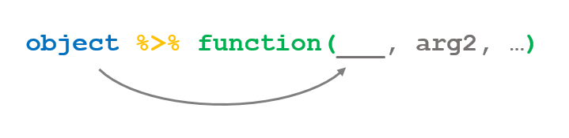

```{r Загрузка библиотек, warning=FALSE, message=FALSE}
library(tidyverse)
library(stringr) # работа со строками
library(nycflights13) # учебный набор данных

# Раскомментируйте и запустите следующие команды, 
# если у вас не ставится tidyverse

#library(dplyr)
#library(tidyr)

```


# Введение


**Трансформация данных** - это выполнение различных преобразований данных с целью их подготовки к анализу. Среди наиболее часто используемых операций - отбор строк или столбцов таблицы данных, вычисление новых столбцов, подсчет итогов, группировка и ранжирование. Также часто востребованы слияние данных из разных таблиц и изменение формы данных (реструктурирование таблиц). 

В этом блокноте показаны наиболее полезные приемы трансформации данных в R. Мы будем использовать пакеты `dplyr` и `tidyr`.

Также будет рассмотрено создание "конвейеров" по обработке данных с помощью оператора `%>%`.

Более подробно познакомиться с трансформацией данных вы можете в следующих главах книги R for Data Science:

 - [5. Data Transformation](http://r4ds.had.co.nz/transform.html)  
 - [12. Tidy data](http://r4ds.had.co.nz/tidy-data.html)
 - [13. Relational data](http://r4ds.had.co.nz/relational-data.html)
 - [18. Pipes](http://r4ds.had.co.nz/pipes.html)
 
Также полезно знать, как работать с [факторами](http://r4ds.had.co.nz/factors.html), [строками](http://r4ds.had.co.nz/strings.html) и [датами](http://r4ds.had.co.nz/dates-and-times.html).
 
В RStudio всегда под рукой "шпаргалки" по трансформации данных - см. `Help>Cheatsheets`.


# Грамматика трансформации данных

Пакет `dplyr` реализует концепцию грамматики трансформации данных, согласно которой любое преобразование данных можно описать как последовательность шагов, обозначающих определенное действие с данными. В терминологии `dplyr` эти действия называются **глаголами** (`verbs`). Каждое действие реализовано как функция пакета, которая принимает на вход таблицу данных и возвращает преобразованную таблицу. Например, глагол `select()` позволяет отобрать из таблицы нужные столбцы:

```
select(my_table, important_column1, important_column2)

```

Все функции используют один и тот же порядок аргументов: первый аргумент - входная таблица данных, последующие агрументы - параметры, описывающие детали преобразования данных. В предыдущем примере это был список необходимых столбцов.


```{r Загрузка данных о топливной эффективности}
data(mpg) #загрузка набора данных о топливной эффективности автомобилей
head(mpg)
```


```{r Пример глагола}
head(
  select(mpg, manufacturer, model, displ, trans, cty) #отбор 5 столбцов
)
```


Благодаря тому, что на входе и выходе каждой функции используются таблицы, "глаголы", преобразующие данные, можно выстраивать в своеобразные "предложения" - цепочки, описывающие, как получить желаемый результат.


Мы рассмотрим самые важные глаголы:

 - `filter()` - отобрать строки,
 - `mutate()` - вычислить новые столбцы,
 - `select()` - отобрать столбцы,  
 - `arrange()` - упорядочить строки,
 - `group_by()` и `summarize()` - посчитать итоги по группам
 
В разработке:

 - `gather()` - "свернуть" столбцы в строки, перейти к "длинному" формату,  
 - `spread()` - "развернуть" строки в столбцы, перейти к "широкому" формату,  
 - `inner_join()` - соединить таблицы.
 
 Большинство функций реализованы в пакете `dplyr`. Функции для преобразования структуры данных `gather()` и `spread()` реализованы в пакете `tidyr`. Оба пакета автоматически подключаются при загрузке `tidyverse`.


# Отбор строк с помощью `filter()`

Функция `filter()` позволяет отобрать нужные строки таблицы по условию.


**Совет** в RStudio открыть картинку в большем размере можно щелкнув по ней или по ссылке с зажатой клавишей `Shift`. Если выдается сообщение об ошибке (не найден файл) - установите рабочий каталог на папку, в которой находится этот блокнот (`Session>Set Working Directory>To Source File Location`).

Поддерживаются следующие условия:

- сравнения: `< <= > >=`  
- равенство: `==`, неравенство: `!=`  
- сравнение для действительных чисел: `near(pi, 3.14, tol = 0.01)` (с указанием точности)  
- пропущенные значения: `is.na(), !is.na()`
- вхождение в список: `%in%`
- отбор по части строки - см. книгу [R4DS](http://r4ds.had.co.nz/strings.html)

Несколько условий можно комбинировать с помощью логических союзов:


## Примеры `filter()`

### Пример 1. Отбор по сочетанию условий

Отобрать все машины с задним приводом и 6-цилиндровым двигателем.

```{r Отбор по сочетанию двух условий }

filter(mpg, drv == 'r' & cyl == 6)

# или так:
filter(mpg, drv == 'r', cyl == 6)

```


### Пример  2. Отбор по вхождению в множество и сравнение действительных чисел

Действительные числа хранятся с ограниченной точностью. Это может вызывать проблемы при сравнении таких чисел на строгое равенство:

```{r Неправильное сравнение}
# Нельзя использовать для действительных чисел:
sqrt(2)^2 == 2

```

Безопаснее пользоваться функцией `near()`:

```{r Безопасное сравнение}
# Правильно сравнивать действительные числа так:
near(sqrt(2)^2, 2)

```

Отобрать автомобили марок Honda и Toyota с автоматической коробкой передач и объемом двигателя 1.8 литра.

```{r Отбор по вхождению в множество, вхождению подстроки и равенству для действительных чисел}

filter(mpg, 
       manufacturer %in% c('honda', 'toyota'),
       str_detect(trans, 'auto'),
       near(displ, 1.8))

```

### Пример  3. Отбор по вычисляемому условию

Отобрать автомобили, в которых средневзвешенный пробег на 1 галлоне топлива (город - 50%, шоссе - 50%) свыше 30 миль.

```{r Отбор по вычисляемому столбцу}

filter(mpg,
       0.5 * cty + 0.5 * hwy > 30)

```

**Замечание:** в качестве условия отбора можно использовать любое выражение, которое возвращает `TRUE` или `FALSE` для каждой строки обрабатываемой таблицы.


## Упражнения `filter()`

Для выполнения упражнений понадобится набор данных `flights`, который устанавливается вместе с пакетом `nycflights13`.

```{r Загрузка данных об авиарейсах}
data(flights)
head(flights)
```

Посмотреть описание столбцов можно командой: `?flights`.


### Упражнение 1. Отбор по сочетанию условий

Найдите все рейсы компаний 'Delta Airlines', 'American Airlines' и 'United Airlines', которые вылетели в Хьюстон (`IAH` или `HOU`) летом 2013 года. При этом рейс должен был вылететь без опоздания, но совершить посадку с задержкой более 1 часа.

Коды авиакомпаний можно посмотреть в таблице: `nycflights13::airlines`.


```{r filter, упражнение 1}
#filter(flights,
#       ...
#       )
```

Должно получиться 7 строк.

**Подсказки:**

  - Вместо объединения нескольких условий союзом `&` их можно перечислить через запятую в списке аргументов `filter()`.  
  - В пакете `dplyr` имеется функция `between()`, которая может использоваться для отбора по условию вхождения в интервал значений. Обратите внимание, что границы интервала входят в него.


### Упражнение 2. Отбор по вхождению в интервал значений

Найдите рейсы, вылетевшие в ночное время (с 00:00 до 5:59) с задержкой не менее 1 часа и наверставшие в пути более 50 минут.

```{r filter, упражнение 2}
# Напишите свой код здесь
```

Должно получиться 7 строк.


### Упражнение 3. Поиск пропущенных значений

Сколько рейсов в Питтсбург отменили в сентябре 2013 года?

```{r filter, упражнение 3}
# Напишите свой код здесь

```

Должно получиться 5 строк.


# Отбор столбцов с помощью `select()`


Глагол `select()` позволяет отобрать нужные столбцы таблицы.


Указать, какие столбцы нужны, можно следующими способами:

 - перечислить их в списке аргументов `select()`  
 
 - указать последовательность для включения `начало:конец` или исключения: `-(начало:конец)`  
 
 - использовать вспомогательные функции для выбора столбцов:
 
     - `starts_with('abc')` - имя начинается с `abc`  
     - `ends_with('xyz')` - имя заканчивается на `abc`  
     - `contains('ijk')` - имя содержит `ijk`  
     - `matches('\d')` - имя соответствует регулярному выражению (см. [книгу R4DS](http://r4ds.had.co.nz/strings.html)), в даном случае - содержит любую цифру
     - `num_range('x', 1:3)` - имя входит в последовательность: `x1, x2, x3`  
     - `one_of(c('a', 'b', 'c'))` - имя входит в список: `a, b, c`  
     - `everything()` - все остальные столбцы.

## Примеры `select()`

```{r Структура таблицы}
names(mpg)
head(mpg)

```


### Пример 1. Перечисление столбцов и смежные столбцы

```{r Явное перечисление столбцов}

head(
  select(mpg, manufacturer:displ, trans, cty)
)

```

### Пример 2. Исключение столбцов

```{r Исключение столбцов}

head(
  select(mpg, -(displ:cty), -fl, -class)
)
```

### Пример 3. Отбор столбцов по условию

Отобрать столбцы, которые начинаются на 'm' или содержат 'y'.

```{r Отбор столбцов по условию}
head(
  select(mpg, starts_with('m'), contains('y'))
)

```


### Пример 4. Перемещение столбцов в начало таблицы

```{r Перемещение столбцов в начало таблицы}
head(
  select(mpg, cty, hwy, everything())
)

```

## Упражнение `select()`

Для выполнения задания вам потребуется набор данных `flights`.

```{r}
head(flights)
```

Придумайте как можно больше способов, которыми можно извлечь из таблицы все переменные, относящиеся ко времени или задержке вылета.


```{r Упражнение select}
# Напишите свой код здесь
```


# Сортировка таблицы с помощью `arrange()`


Глагол `arrange()` позволяет упорядочить таблицу по одному или нескольким столбцам. По умолчанию сортировка производится по возрастанию. Используйте функцию `desc()` для сортировки по убыванию.

## Примеры `arrange()`

### Пример 1. Сортировка по одному столбцу

Выведите рейтинг из 10 наиболее экономичных автомобилей (при поездках по городу)?

```{r Сортировка по одному столбцу}

head(
  arrange(mpg, desc(cty)),
  n = 10)

```

### Пример 2. Сортировка по нескольким столбцам

Выведите рейтинг автомобилей по экономичности в городе для каждого производителя.

```{r Сортировка по двум столбцам}

head(
  arrange(mpg, manufacturer, desc(cty)),
  n = 30)

```

## Упражнения `arrange()`

Для выполнения задания вам потребуется набор данных `flights`.

```{r}
head(flights)
```


### Упражнение 1. Сортировка по одному столбцу

Вылет каких рейсов был больше всего задержан?

```{r arrange, упражнение 1}

```


### Упражнение 2. Сортировка по вычисляемому условию

Какие рейсы самые быстрые (по скорости движения в воздухе)?

```{r arrange, упражнение 2}

```


# Вычисление новых столбцов с помощью `mutate()`.

Для вычисления новых столбцов в таблице на основе уже существующих удобно применять функцию `mutate()`. Можно вычислить сразу несколько новых столбцов. Для каждого нового столбца необходимо задать расчетную формулу с использованием имен существующих столбцов, арифметических операций и различных функций R.

Функция `mutate()` всегда добавляет столбцы в конце таблицы. Если исходные столбцы не нужны, то можно использовать функцию `transmute()`, которая оставляет только вычисленные столбцы.

## Примеры `mutate()`

### Пример 1. Вычислить несколько новых столбцов

Пусть требуется рассчитать средневзвешенную топливную эффективность для условий, когда доля поездок по городу составляет 50% и 80%.


```{r Пример вычисления двух новых столбцов}

head(
  mutate(mpg,
         mpg_city50 = 0.5 * cty + 0.5 * hwy,
         mpg_city80 = 0.8 * cty + 0.2 * hwy)
)

```

### Пример 2. Использование `ifelse()`

Формула для расчета нового столбца применяется сразу ко всей таблице. Если необходимо проводить расчет по разным формулам для отдельных записей, то можно использовать функцию `ifelse()`.

Предположим, что доли поездок по городу для разных автомобилей в таблице отличаются. Для наглядности, будем считать, что автомобили классов `minivan` и `2seater` используются только в городе, а остальные - по 50% времени в городе и для поездок по автомагистралям. Требуется рассчитать средневзвешенную топливную эффективность.

```{r Вычисление по условию}

head(
  filter(

        mutate(mpg, 
           weighted_mpg = 
             ifelse(class %in% c('pickup', '2seater'),
                    cty, 0.5 * cty + 0.5 * hwy)),
        class %in% c('2seater', 'suv')))

```


## Упражнения `mutate()`

Для выполнения задания вам потребуется набор данных `flights`.

```{r}
head(flights)
``` 

### Упражнение 1. Вычисляемые столбцы

В наборе данных время вылета находится в неудобном формате: часы и минуты собраны в одно целое число. Поэтому, например, после значения 1359 будет идти значение 1400. Ваша задача - вычислить три новых поля: `dep_hour`, `dep_minute` и `dep_minutes_since_midnight`.  Поля должны содержать, соответственно, час вылета, минуту вылета и количество минут с полуночи до вылета.

```{r Преобразование времени вылета}
# Напишите свой код здесь
```


**Подсказки:**  
 
 - Воспользуйтесь операциями целочисленного деления `%/%` и взятия остатка от деления `%%`. Например, `1359 %/% 100 = 13`, а `1359 %% 100 = 59`.  
 
 - Добавив формулу для расчета столбца, вы можете использовать имя этого столбца в этом же вызове функции `mutate()` для расчета новых столбцов. Т.е. можно сделать так: `mutate(mpg, cty2 = cty, cty3 = cty2)`.  


### Упражнение 2. Условные выражения

Некоторые рейсы были отменены. Для таких рейсов в столбце `dep_time` содержится пропущенное значение. Вычислите новый столбец: `status`, который, в зависимости от времени задержки вылета, должен содержать одно из следующих значений: `вылетел вовремя`, `задержан`, `отменен`. Для упрощения расчета, примите, что те рейсы, которые вылетели раньше назначенного времени, также относятся к категории: `вылетел вовремя`.

```{r Статус рейса}
# Напишите свой код здесь
```


# Конвейеры `%>%`


В большинстве случаев преобразование данных к нужной структуре требует несколько последовательных операций с таблицей данных. В примере про условные вычисления потребовалось выполнить следующие шаги:

 1. Вычислить новый столбец `weighted_mpg` с помощью `mutate()`
 2. Отфильтровать данные только по двум классам автомобилей с помощью `filter()`
 3. Ограничить количество выводимых строк таблицы с помощью `head()`
 
 Однако записывать эти действия приходится в обратном порядке, вкладывая функцию предыдущего шага внутрь функции, использующейся на следующем шаге преобразования:
 
```
head(
  filter(
    mutate(...)
  )
)
```

Такой код сложно понять.

Мы могли бы улучшить наглядность кода, используя дополнительные переменные для сохранения промежуточных результатов:

```
step1 <- mutate(mpg, ...)
step2 <- filter(step1, ...)
head(step2)
```

Здесь действия по преобразованию данных расположены в естественном порядке. Однако при реальной работе этот подход также неудобно использовать, поскольку для различных действий пришлось бы создавать временные переменные, которые расходуют память и могут привести к путанице и ошибкам в расчетах.

Чтобы обеспечить "последовательную" логику выполнения шагов преобразования данных, для R был создан пакет `magrittr`, который позволяет использовать новый оператор - %>% (`pipe`) для записи цепочек преобразования данных.

Оператор подставляет любой объект в своей левой части в качестве первого аргумента функции, указанной в правой части.



Предыдущая запись эквивалентна: `function(object, arg2, ...)`

Поскольку функции в R возвращают новые объекты, цепочку операций можно продолжать сколько угодно. Результат предыдущей операции используется в качестве первого аргумента второй операции.


Эквивалентная запись: `function2(function1(object))`

## Пример использования `%>%`

Применим конвейер, чтобы более наглядно записать процесс обработки данных в предыдущем примере:

Было:
```r
head(
  filter(

        mutate(mpg, 
           weighted_mpg = 
             ifelse(class %in% c('pickup', '2seater'),
                    cty, 0.5 * cty + 0.5 * hwy)),
        class %in% c('2seater', 'suv')))

```

Стало:

```{r Пример конвейера}

mpg %>% 
  mutate(weighted_mpg = 
           ifelse(class %in% c('pickup', '2seater'),
                  cty, 0.5 * cty + 0.5 * hwy)) %>%
  filter(class %in% c('2seater', 'suv')) %>%
  select(model, cty, hwy, class, weighted_mpg) %>%
  head()

```

Для удобства, мы добавили дополнительный шаг, оставив в таблице только нужные столбцы.

**Замечание:** обратите внимание, что при включении функции в конвейер аргументы в списке надо указывать начиная со второго. Первый аргумент автоматически заполняется оператором `%>%`.

Результаты обработки данных можно сохранить в переменную. В этом случае туда запишется результат последней операции конвейера:

```r
final_result <- initial_data %>% step1() %>% step2() %>% last_step()

```

В `dplyr` И многих других функциях R принято, что первый аргумент функции - это обрабатываемые ей данные, поэтому `%>%` удобно использовать не только для преобразования табличных данных, но и в других ситуациях, требующих нескольких последовательных шагов.


## Подстановка в произвольный аргумент

Некоторые функции все же ожидают, что данные будут переданы им не в первом, а в одном из следующих аргументов. Например, функция `lm()` для построения линейных моделей ждет данные во втором аргументе. См. справку: `?lm`.

В этой ситуации можно указать место куда оператор `%>%` должен подставлять данные с предыдущего шага, с помощью точки: `.`

В качестве примера, построим модель зависимости топливной эффективности только для автомобилей класса `compact`, отобрав их с помощью фильтрации.

```{r Пример подстановки в произвольный аргумент}

mpg %>%
  filter(class == 'compact') %>%
  lm(cty ~ hwy, data = .) %>%
  summary()

```


# Группировка и подсчет итогов


Функция `summarise()` позволяет агрегировать данные, вычисляя итоги для множества записей.

Некоторые востребованные функции для подсчета итогов приведены ниже:

 - `mean()` - среднее
 - `sum()` - сумма
 - `n()` - количество записей
 - `sd()` - стандартное отклонение
 - `first()`/`last()` - первый/последний по порядку элемент
 - `min()`/`max()` - наименьший и наибольший элемент
 - `quantile(x, p)` - квантиль уровня p
 

## Пример подсчета итогов для всей таблицы - `summarise()`

```{r Пример summarise}

mpg %>% summarise(avg_cty = mean(cty), 
                  median_cty = median(cty),
                  iqr_cty = IQR(cty),
                  n_obs = n(),
                  percent_mising = 100 * mean(is.na(cty)))

```


## Подсчет итогов по группам - `group_by()`
Подсчет итогов для всей таблицы может использоваться на этапе контроля качества загруженных данных, в дополнение к стандартным возможностям, предоставляемым функцией `summary()`. 

В большинстве же случаев подсчет итогов проводится по группам. Для этого необходимо задать условие группировки набора данных с помощью функции `group_by()`.

Сама по себе функция `group_by()` никак не изменяет данные, однако она добавляет информацию о группировке в свойства таблицы данных.

```{r Что делает group_by, paged.print=FALSE, warning=FALSE}
mpg %>% group_by(manufacturer) %>% head()
```

Информация о группировке используется в дальнейшем при выполнении функции `summarise()`. Если задана группировка, то итоги считаются по группам.

Составим рейтинг автопроизводителей по средней топливной эффективности их автомобилей.


```{r Подсчет итогов по группам, warning=FALSE, paged.print=FALSE}
mpg %>% 
  group_by(manufacturer) %>%
  summarise(average_cty = mean(cty)) %>%
  arrange(desc(average_cty)) %>%
  top_n(5, wt = average_cty)

```

**Замечание:** обратите внимание, что после выполнения агрегирующей функции статус группировки снимается. 

## Группировка по нескольким полям

Группировать можно по нескольким столбцам, в этом случае будет выполнена многоуровневая группировка. А при последующем подсчете итогов функцию `summarise()` можно применить несколько раз, причем каждый последующий вызов этой функции будет обрабатывать все более высокий уровень группировки.

В качестве примера, определим лучшего производителя в каждом классе автомобилей на основе средней топливной эффективности.


```{r Пример двухуровневой группировки - нижний уровень, warning=FALSE, paged.print=FALSE}

# Средний расход по типу машины и производителю
mpg_class_manuf <- mpg %>% 
  group_by(class, manufacturer) %>%
  summarise(average_cty = mean(cty)) %>%
  arrange(desc(average_cty))

head(mpg_class_manuf)

```

Применив на нижнем уровне группировку функцию для подсчета средней эффективности автомобиля, мы получили сгруппированную таблицу данных, в которой остался верхний уровень группировки - класс автомобиля.


Теперь мы можем "снять" еще один уровень группировки - по классу автомобиля - чтобы выбрать лучшего производителя в каждом классе.

```{r Пример двухуровневой группировки - верхний уровень, warning=FALSE, paged.print=FALSE}

mpg_class_manuf %>% 
  top_n(1, wt = average_cty)

```

При необходимости снять группировку с таблицы, можно воспользоваться функцией `ungroup()`.

## Вспомогательные агрегирующие функции

Для часто используемых операций в `dplyr` есть вспомогательные функции, которые можно использовать без `summarise()`.

```{r Примеры вспомогательных агрегирующих функций - count}

# Подсчет частот по группам
mpg %>% count(manufacturer)
```


```{r Примеры вспомогательных агрегирующих функций - top_n}
# Top-n анализ - самые объемные двигатели
mpg %>% top_n(n = 3, wt = displ)
```


## Упражнения - группировка и подсчет итогов

### Упражнение 1. Доля задержанных рейсов

На основе набора данных `flights` рассчитайте долю задержанных рейсов по всей таблице.

**Подсказка:** R рассматривает логические значения `TRUE` и `FALSE` как 1 и 0. Поэтому выполнив команду: `mean(x > 0)` мы можем найти долю положительных значений в векторе `x`.

```{r summarise - доля задержанных рейсов}
# Напишите свой код здесь
```


### Упражнение 2. Надежность авиакомпаний

Составьте рейтинг авиакомпаний по вероятности отмены рейса. Самые надежные авиакомпании должны быть первыми в списке.

```{r summarise - рейтинг надежности авиакомпаний}
# Напишите свой код здесь
```

### Упражнение 3. Тяжелые месяцы

Определите, какой месяц оказался самым тяжелым для каждой авиакомпании (по доле рейсов, задержанных более чем на 15 минут).

```{r summarise - тяжелые месяцы}
# Напишите свой код здесь
```


