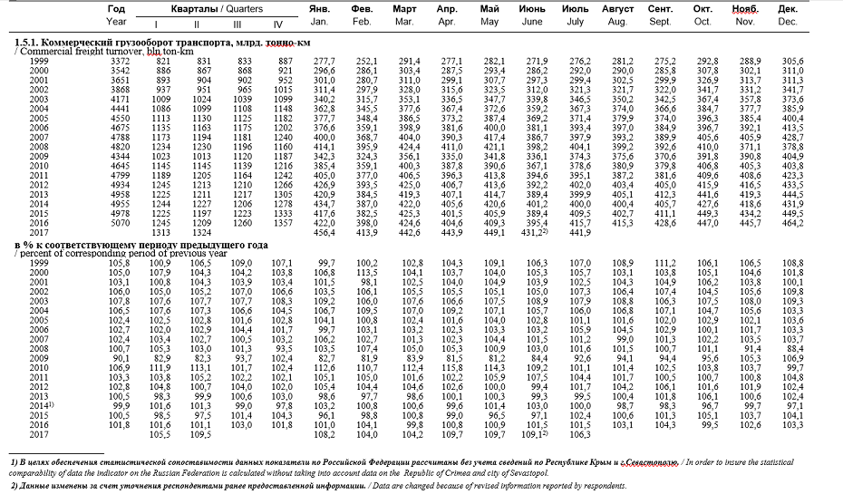

# Введение

Иногда необходимые нам данные хранятся в файлах MS Word. В частности, на сайте российской статистической службы часто можно встретить данные в формате doc. Посмотрим, как с ними можно работать.

Для примера будем разбирать файл, находящийся по этой ссылке: http://www.gks.ru/bgd/regl/b17_02/IssWWW.exe/Stg/d010/1-05.doc

Это данные о грузообороте транспорта с 1999 по 2017 год. Они представлены в виде 9 таблиц. Но по существу эти данные включают 3 основные таблицы, а именно данные об общем грузообороте, о коммерческом грузообороте и о погрузке на железнодорожный транспорт. Каждой из основных таблиц соответствуют по 2 производные - те же показатели в процентах к соответствующему периоду предыдущего года и в процентах к предыдущему периоду. Ниже можно увидеть фрагмент данных.



#Чтение файла в формате doc

Для того чтобы правильно считать таблицы из файла, нам очень важна его структура. Из файла doc трудно выделить структуру файла. Поэтому первым делом нужно открыть этот файл в MS Word и выбрать "Сохранить как" -> "Документ в строгом формате Open XML (.docx)".

Для чтения файлов MS Word есть специальная библиотека `docxtractr`. Документацию по ней можно найти [здесь](https://cran.r-project.org/web/packages/docxtractr/docxtractr.pdf).

```{r Загрузка библиотек, warning=FALSE, message=FALSE}
library(tidyverse)
library(stringr)
library(lubridate)
#Для установки пакета docxtractr раскомментируйте следующую строку
#install.packages("docxtractr") 
library(docxtractr)
```

Читаем файл. На выходе будет список датафреймов.

```{r Чтение файла docx}
doc <- read_docx("data/1-05.docx")
```

Выделим все таблицы из файла с помощью функции `docx_extract_all_tbls()`.

```{r Извлечение таблиц из файла docx}
tbl_lst <- docx_extract_all_tbls(doc)
length(tbl_lst)
```

В `tbl_lst` мы получили список из 6 таблиц - каждая соответствует одному листу документа. Но в исходном документе у нас было 9 таблиц.

На примере 1-й таблицы посмотрим, как выглядят наши таблицы. Из-за сложной шапки у нас смещена строка с названием столбцов и много пропусков. Всю структуру таблиц можно посмотреть с помощью `tbl_lst`.

```{r Просмотр 1-ой таблицы}
head(tbl_lst[[1]])
```

#Приведение данных в порядок

Приведение в порядок значит, что все наблюдения должны располагаться по строкам, а переменные по столбцам.

##Выборка данных из таблиц документа MS Word

Выделим все таблицы документа и уберем у них шапки, годовые и квартальные данные.

```{r Выборка из таблиц}
df1 <- as_tibble(tbl_lst[[1]][-(1:3),-(2:6)])
df2 <- as_tibble(tbl_lst[[2]][4:22,-(2:6)])
df3 <- as_tibble(tbl_lst[[2]][24:nrow(tbl_lst[[2]]),-(2:6)])
df4 <- as_tibble(tbl_lst[[3]][4:22,-(2:6)])
df5 <- as_tibble(tbl_lst[[3]][24:nrow(tbl_lst[[3]]),-(2:6)])
df6 <- as_tibble(tbl_lst[[4]][-(1:3),-(2:6)])
df7 <- as_tibble(tbl_lst[[5]][5:23,-(2:6)])
df8 <- as_tibble(tbl_lst[[5]][25:nrow(tbl_lst[[5]]),-(2:6)])
df9 <- as_tibble(tbl_lst[[6]][-(1:3),-(2:6)])
```

Поместим таблицы в список, чтобы обрабатывать их вместе.

```{r Создание списка таблиц}
lst_tibbles <- list(df1,df2,df3,df4,df5,df6,df7,df8,df9)
```

##Изменение структуры таблиц

В каждой из 9 таблиц первом столбце содержится год, в остальных 12 - данные каждого показателя грузооборота за каждый месяц. Переименуем названия столбцов.

```{r Переменование названий столбцов}
for (i in seq_along(lst_tibbles)){
  colnames(lst_tibbles[[i]]) <- c("year", seq(1,12))
}
lst_tibbles[[1]]
```

Теперь в каждой из 9 таблиц в названиях столбцов 2-13 содержатся номера месяцев. Соберем с помощью функции `gather()` номера месяцев в переменную `month`, а значения грузооборота в переменную `var`.

```{r Изменение структуры таблиц с помощью gather()}

for (i in seq_along(lst_tibbles)){ #функция gather выполняется для каждой таблицы из списка lst_tibbles
lst_tibbles[[i]] <- lst_tibbles[[i]] %>% 
    gather(`1`:`12`, key = 'month', value = 'var')
}
lst_tibbles[[1]] #просмотр первой таблицы
```

Соединим теперь 9 таблиц в одну по ключевым столбцам `year` и `month` с помощью функции `full_join()`.

```{r Соединение таблиц с помощью full_join()}
turnover <- lst_tibbles[[1]]
for (i in (2:length(lst_tibbles))) {
  turnover <- turnover %>%
    full_join(lst_tibbles[[i]], by = c("year", "month"))
}

```

Переименуем названия столбцов так, чтобы в них были названия показателей.

```{r Переименование столбцов}

colnames(turnover) <- c("year","month","total","total_ppy","total_ppm",
                        "commercial","commercial_ppy","commercial_ppm",
                        "rail", "rail_ppy", "rail_ppm")
head(turnover)

```

##Преобразование типов данных

Как можно заметить, все переменные имеют тип `character`. Необходимо привести их в числовой формат, однако этому мешает то, что в исходном файле возле некоторых значений стояли сноски "1)" и "2)". 

```{r Поиск строк со сносками}
filter(turnover, str_detect(total, "\\)"))
```

Для того чтобы значения корректно конвертировались в числа, нужно эти сноски убрать. Воспользуемся функцией `str_replace()`, которая позволяет заменить одну строку на другую. В данном случае для поиска заменяемой подстроки используем регулярное выражение `.\\)$`, которое означает, что искомая подстрока состоит из любого символа и скобки и находится в конце. Подробнее о регулярных выражениях можно прочитать [здесь](http://r4ds.had.co.nz/strings.html). 

```{r Очистка значений от сносок}
turnover <- turnover %>% 
  sapply(FUN = function(x) {str_replace(x, ".\\)$", "")}) %>%
  as_tibble() #преобразование мартицы в формат tibble
```

Теперь преобразуем столбцы `year` и `month` в тип `integer` с помощью функции `parse_integer()`, а столбцы с показателями в тип `double` с помощью функции `parse_double()`. По умолчанию разделителем десятичных разрядов считается `.`. Поскольку в наших данных разделителем десятичных разрядов является `,`, укажем это в параметре `locale`.

```{r Преобразование типов столбцов}

turnover <- turnover %>%
  mutate(year = parse_integer(year), 
         month = parse_integer(month)) 

for (i in (3:ncol(turnover))){
  turnover[[i]] <- parse_double(turnover[[i]], 
                                locale = locale(decimal_mark = ","))
}

head(turnover)
summary(turnover)

```

##Обработка пропущенных значений

Данные столбцов преобразованы в числовой формат, однако мы можем заметить по сводке, что у нас получилось подозрительно много пропущенных значений `NA`. Кроме того, количество строк в таблице `r nrow(turnover)`, хотя количество наблюдений должно быть менее 228 (19 лет по 12 месяцев). Посмотрим, в какие периоды у нас большое количество пропущенных значений.

```{r Подсчет пропущенных значений по годам}
turnover %>% gather(total:rail_ppm, key = "type", value = "value") %>% #собрали значения всех переменных в один столбец, чтобы посчитать количество пропусков
  group_by(year) %>% 
  summarise(na_count = sum(is.na(value))) %>%
  filter(na_count>0)
```

Пропущенные значения есть в 1999, 2014 и 2017 годах. В 1999 году пропуски связаны с недоступностью данных за прошлый период для расчета показателя в процентах к соответствующему периоду предыдущего года. В 2017 году пропуски соответствуют периоду, за который данные еще не появились. В 2014 году образовались дубликаты месяцев из-за того, что в исходных данных в некоторых местах в названии года присутствовали сноски со скобками, а мы их удалили уже после соединения таблиц с показателями грузооборота.

```{r Просмотр пропусков в 2014 году}
filter(turnover, year==2014, !complete.cases(turnover)) %>% 
  arrange(month)
```

Чтобы исправить ситуацию группируем данные по году и месяцу и суммируем значения, исключая пропуски.

```{r Исправление дублирования месяцев}
turnover_fixed <- turnover %>% 
  gather(total:rail_ppm, key = "type", value = "value") %>% #собираем значения переменных в один столбец
  group_by(year, month, type) %>% #группируем по году, месяцу, названию переменной
  summarise(value = ifelse(sum(!is.na(value))>0, sum(value, na.rm = TRUE), NA)) %>% #если есть непустые значения, то суммируем, иначе NA
  ungroup() %>% #убираем группировку
  spread(key = type, value = value) %>% #возвращаем названия переменных обратно в столбцы
  arrange(year, month)

```

##Расчет дополнительных столбцов данных

Добавим дату и квартал для удобства обработки данных.

```{r Добавление даты и квартала}
turnover_fixed <- mutate(turnover_fixed, date = make_date(year,month,1),
                   quarter = quarter(make_date(year,month,1))) %>%
  select(year, month, quarter, date, starts_with("total"), starts_with("com"), starts_with("rail"))
head(turnover_fixed)
```

#Визуализация данных

Наконец данные преобразованы в удобную для анализа форму. Теперь можно приступить к анализу. 

##Динамика грузооборота по годам

Построим график динамики грузооборота по годам.

```{r Динамика грузооборота по годам}
by_year <- select(turnover_fixed, year, total, commercial, rail) %>%
  gather(total:rail, key = "type", value = "value") %>%
  group_by(type, year) %>%
  summarise(value = sum(value, na.rm = TRUE)) %>%
  arrange(type, year) %>%
  mutate(rate = round(value/lag(value)*100, 2)) %>%
  ungroup() %>%
  mutate(type = factor(type, levels = c("total","commercial", "rail")))

ggplot(by_year, aes(x=year)) +
  geom_bar(aes(y=value), fill = "lightskyblue", stat = "identity")+
  geom_line(aes(y=rate*40), color = "blue", size = 1)+
  facet_grid(type~., labeller = labeller(type = c(
    'total' = 'Общий', 
    'commercial' = 'Коммерческий',
    'rail' = 'Железнодорожный')))+
  scale_y_continuous(sec.axis = sec_axis(~./40, name = "Темп роста грузооборота, %")) +
  labs(title = 'Динамика грузооборота транспорта по годам',
     x = 'Год',
     y = 'Грузооборот, млрд. тонно-км')
  
```

##Динамика грузооборота по кварталам

Построим график динамики грузооборота по кварталам.

```{r Динамика грузооборота по кварталам}
by_quarter <- group_by(turnover_fixed, year, quarter) %>%
  summarise(total = sum(total, na.rm = TRUE),
            commercial = sum(commercial, na.rm = TRUE),
            rail = sum(rail, na.rm = TRUE)) %>%
  gather(total:rail, key = "type", value = "value") %>%
  mutate(type = factor(type, levels = c("total","commercial", "rail")))

ggplot(by_quarter, aes(x = year, y = value, fill = factor(quarter))) +
  geom_bar(stat = "identity") +
  facet_wrap(~type, labeller = labeller(type = c(
    'total' = 'Общий', 
    'commercial' = 'Коммерческий',
    'rail' = 'Железнодорожный')))+
  labs(title = 'Динамика грузооборота транспорта по кварталам',
     x = 'Год',
     y = 'Грузооборот, млрд. тонно-км',
     fill = 'Квартал')
```

##Динамика грузооборота по месяцам

Построим график динамики грузооборота по видам транспорта по месяцам.

```{r Динамика грузооборота по месяцам}
ggplot(turnover_fixed, aes(x=date), size = 1) +
  geom_line(aes(y=total, color='Общий')) +
  geom_line(aes(y=commercial, color='Коммерческий')) +
  geom_line(aes(y=rail, color='Железнодорожный')) +
  labs(title = 'Динамика грузооборота транспорта по месяцам',
     x = 'Период',
     y = 'Грузооборот, млрд. тонно-км',
     color = '')
```


