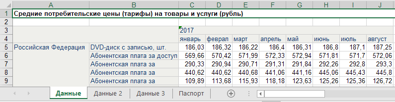
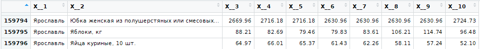

# Подготовка

```{r Подключение пакетов, message=FALSE, warning=FALSE}
# Load packages
if (!require(tidyverse)) install.packages("tidyverse")
library(tidyverse)
library(readxl)
library(stringr)
library(lubridate)
```

Мы поместили большие файлы данных в отдельный репозиторий. Если файла данных нет в папке с данным Rmd-документом, то попытаемся его скачать и распаковать.

```{r Загрузка и чтение файла данных, message=FALSE, warning=FALSE}

data_url <- 'http://rawgit.com/postlogist/big_datasets/master/fedstat_prices/prices.zip'

# Скачиваем данные из репозитория, если файла нет на компьютере
if (!file.exists('prices_2017.xlsx')) {
  
  # Если архива на локальном компьютере нет - скачиваем
  if (!file.exists('prices.zip')) {
  download.file(data_url,
                destfile = 'prices.zip',
                mode = 'wb')
  }

 # Извлекаем файлы данных из архива
 unzip('prices.zip')

}

```


# Введение

[Единая межведомственная информационно-статистическая система (ЕМИСС)](https://fedstat.ru) - это государственный информационный ресурс, содержащий официальную статистику. Эта система содержит большое количество статистических показателей в разрезе единиц административно-территориального деления РФ. Сервис позволяет выгружать эти данные в формате Excel, однако использует устаревший формат файлов, который не позволяет сохранять на листе более 65 тысяч строк, поэтому крупные статистические таблицы разбиваются на несколько листов. Кроме того, данные невозможно выгрузить в хорошо упорядоченном виде, поэтому анализ их затруднен. В этом блокноте мы покажем, как можно автоматически обработать скачанные с портала данные в excel-формате и привести их к пригодному для дальнейшей работы виду.


# Формат данных

Данные с портала можно сохранить в виде Excel-файла. Сайт позволяет при помощи фильтров выбрать диапазон дат для выгрузки показателей, однако приходится загружать данные порциями, т.к. из-за большого объема данных процесс выгрузки зависает. 

Файл потребуется открыть в Excel и пересохранить в формате `xlsx`, т.к. работа с большими `xls` файлами вызывает проблемы.

В качестве примера мы выгрузили данные по потребительским ценам товаров и услуг в разрезе субъектов федерации по месяцам, получив несколько файлов: `prices_2013.xlsx` ... `prices_2017.xlsx`. В каждом файле содержатся данные за один год.



Данные в файле организованы в виде сводной таблицы (по столбцам - месяцы, по строкам - субъекты федерации и наименования товаров/услуг). Таблица разбита на несколько листов (Данные, Данные 2...) из-за ограничения на поддержку не более 65 тысяч строк на листе в старых версиях Excel. Заголовки таблицы (год, месяц) повторяются на каждом листе. Последний лист - паспорт набора данных. 

Формат данных относительно удобный: данные занимают одинаковый диапазон на всех листах, используется порядковая нумерация листов. Сложность представляют объединенные ячейки в строках и столбцах, а также необходимость склеивания нескольких таблиц в одну.

На основе анализа структуры данных, зададим несколько параметров:

```{r Настройка параметров}
ws_prefix <- 'Данные' # префикс имени листа с данными
file_prefix <- 'prices_' # префикс имени файла
nskip <- 4 # сколько строк в начале таблицы пропустить
```


# Загрузка данных за 2017 год c одного листа


Попробуем загрузить данные из файла за 2017 год. Для удобства отрежем несколько первых строк, оставив только данные, и сделаем заголовки столбцов таблицы самостоятельно.

```{r Загрузка данных только за 2017 год}
pr2017 <- read_excel('prices_2017.xlsx', 
                     skip = nskip,
                     col_names = FALSE)
head(pr2017)

```

Отличный результат: значения в объединенных ячейках автоматически размножились. Остается только переименовать столбцы.

```{r Переименование столбцов}
colnames(pr2017) <- 
  c('subject', 'item', c(1:(ncol(pr2017) - 2)))

head(pr2017)

```

Приведем данные к хорошо упорядоченной структуре, развернув месяцы в строки. Добавим столбец с годом и датой

```{r Преобразование к длинному формату}
pr2017_tall <- pr2017 %>%
  gather(key='month', value = 'price', 
         -subject, -item,
         convert = TRUE) %>%
  mutate(year = 2017) %>%
  mutate(date = make_date(year = year,
                          month = month)) %>%
  select(date, year, month, everything())

head(pr2017_tall)

```

Success!


# Загрузка данных за 2017 год со всех листов данных

Теперь сделаем, чтобы данные загружались со всех листов книги и объединялись в одну таблицу.

## Как получить имена листов
Чтобы определить, какие листы с данными есть в книге, воспользуемся функцией `excel_sheets()`:

```{r Какие листы есть в книге}
sheets <- excel_sheets('prices_2017.xlsx')
sheets
```

Необходимо оставить только те листы, в которых есть префикс `Данные`, воспользуемся функцией `stringr::str_detect()`. 

```{r Только листы с данными}
sheets_filtered <- 
  sheets[str_detect(sheets, str_c('^', ws_prefix))]

sheets_filtered
```

*Замечание:* для поиска строки мы используем регулярное выражение вида: `^Данные`, которое обозначает, что искомое слово должно быть в начале строки. Более подробно об использовании регулярных выражений можно почитать в главе [Strings](http://r4ds.had.co.nz/strings.html) книги R for Data Science.


## Как загрузить все листы

Теперь, получив список листов (в виде вектора), необходимо загрузить данные с них. Для этого можно написать цикл, или воспользоваться специальными функциями для обработки списков, как описано в главе [Iteration](http://r4ds.had.co.nz/iteration.html#the-map-functions) книги R for Data Science.

Мы воспользуемся функцией `purrr:map_df()`, которая применяет заданную функцию ко всем элементам списка/вектора и объединяет результаты в одну таблицу.


```{r Чтение всех листов из списка}
d <- sheets_filtered %>%
  map_df(~ read_excel(path = 'prices_2017.xlsx',
                      sheet = .x,
                      skip = nskip,
                      col_names = FALSE))

head(d)
```

Полученная таблица содержит данные со всех листов. Остается только выполнить для нее те же операции по преобразованию формата, которые мы выполняли отдельно для первого листа данных.




# Автоматизация загрузки данных из нескольких книг

В заключение мы покажем, как автоматически считать данные из нескольких файлов, выгруженных с сайта `fedstat.ru`. Наш код будет обрабатывать все файлы, имена которых удовлетворяют шаблону: `price_*.xlsx`. Чтобы реализовать это, потребуется решить три задачи:  
  1) получить список файлов, удовлетворяющих шаблону,  
  2) написать функцию, которая считывает и преобразует данные из файла с указанным именем,  
  3) применить функцию к списку файлов.
  

## Как получить список файлов

Файлы данных должны удовлетворять шаблону: `prices_` + год + `.xlsx` и находиться в том же каталоге, что и данный документ R Markdown. При необходимости, вы можете реализовать выбор каталога с файлами при помощи функций `file.choose()` и `setwd()`.

```{r Получение списка файлов}
files <- dir(pattern = str_c(file_prefix, '.*', '\\.xlsx'))
files
```


## Функция для чтения и подготовки данных

Чтобы автоматизировать расчет, надо написать функцию, которая принимает в качестве аргумента имя файла, считывает из него данные, преобразует их к нужному формату, и возвращает таблицу данных. Мы уже реализовали все эти шаги, осталось только объединить их в функцию. 

Для простоты мы будем предполагать, что год, за который приведены данные, содержится в названии файла. Зададим значения по умолчанию для числа пропускаемых в начале строк и префикса листа данных.


```{r Функция для чтения данных из указанного файла}

read_emiss <- function(filename, nskip = 4, ws_prefix = 'Данные') {
  
  # Какие листы с данными есть в книге?
  sheets <- excel_sheets(filename)
  sheets_filtered <- 
    sheets[str_detect(sheets, str_c('^', ws_prefix))]
  
  # Загружаем данные со всех листов в таблицу
  dtemp <- sheets_filtered %>%
    map_df(~ read_excel(path = filename,
                        sheet = .x,
                        skip = nskip,
                        col_names = FALSE))

  # Меняем имена столбцов
  colnames(dtemp) <- 
    c('subject', 'item', c(1:(ncol(dtemp) - 2)))

  # Какой год указан в имени файла?
  d_year <- str_extract(filename, '\\d+') %>% as.integer()

  # Преобразуем данные к длинному формату и добавляем год и дату
  dtemp_tall <- dtemp %>%
  gather(key='month', value = 'price', 
         -subject, -item,
         convert = TRUE) %>%
  mutate(year = d_year) %>%
  mutate(date = make_date(year = d_year,
                          month = month)) %>%
  select(date, year, month, everything())

  # Возвращаем полученную таблицу
  return(dtemp_tall)

}

```

Пробуем функцию в работе:

```{r Проба функции}
read_emiss('prices_2017.xlsx') %>% head()
read_emiss('prices_2016.xlsx') %>% head()
```

## Применяем функцию к списку файлов

Применим функцию для чтения данных к списку файлов, используя `purrr:map_df()`.

```{r Загрузка данных из всех файлов}

prices_all <- 
  files %>%
  map_df(~ read_emiss(filename = .x))

head(prices_all)
```

## Использование данных

Для проверки построим график средних цен для Москвы в сравнении со средними ценами в остальных регионах.

```{r}
compare_prices <- 
  prices_all %>%
  mutate(region = 
           ifelse(str_detect(subject, 'Москва'),
                  'Москва', 'Остальные')) %>%
  group_by(date, region) %>%
  summarise(avg_price = mean(price, na.rm = TRUE)) %>%
  ungroup()

head(compare_prices)

ggplot(compare_prices, 
       aes(x = date, y = avg_price, color = region)) +
  geom_line() +
  labs(title = 'Динамика средних цен на все',
       y = 'Средняя цена товаров и услуг, руб.',
       x = NULL,
       color = 'Регион',
       caption = 'Источник: ЕМИСС, fedstat.ru')
```


