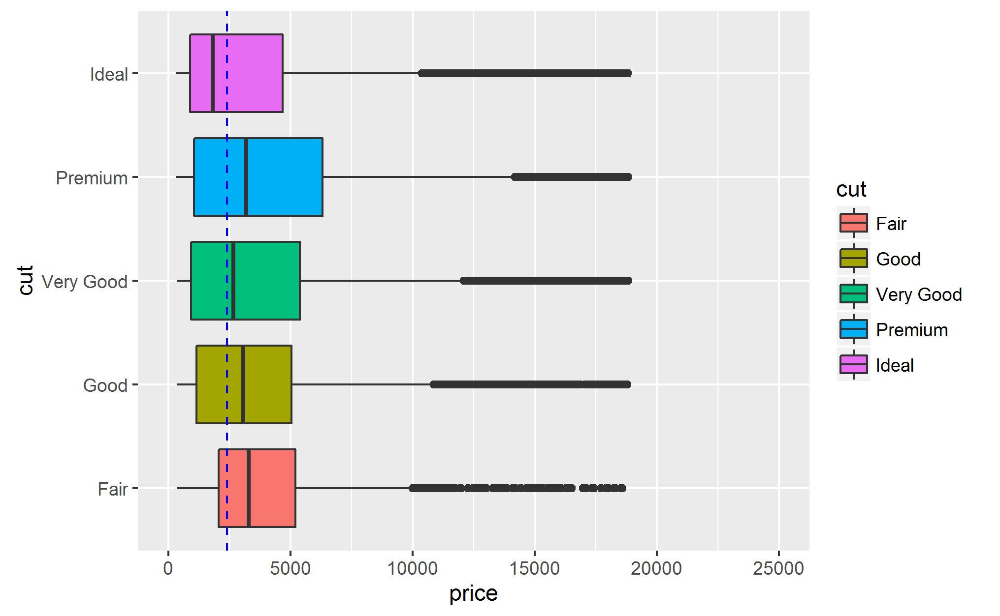

# Introduction

This file introduces basic concepts of plotting using the ggplot2 package, which implements grammar of graphics. This is a coherent system for describing and building graphs in R. This is the the second part of the tutorial, which covers the remaining 3 parts of the grammar - statistical transformations, position adjustments and coordinate systems.

Code chunks below can be executed by clicking the *Run* button within the chunk or by placing your cursor inside it and pressing *Ctrl+Shift+Enter*. 

```{r Load Libraries, message=FALSE, warning=FALSE}
library(tidyverse)
library(scales) # percent axis label format
library(forcats) # factor manipulation
library(nycflights13) # data for the mapping example
```

You will continiue to work with two built-in datasets - `mpg` and `diamonds`.

```{r Load data}

# Fuel efficiency dataset:
data(mpg)

# Diamonds dataset:
data(diamonds)

# Airports dataset:
data(airports)
```

# A graphing template (reminder)

To create a graph, you are combining one or more *layers*. Each layer is formed by a *geom* (geometric object). The visual properties of geoms (or *aesthetics*) are *mapped* to  variables in a dataset. A *scale* controls how the values of a variable are mapped to the levels of an aesthetic. Finally, the graph can be decomposed into several panels based on the values of a categorical variable. This process is known as *faceting*.  The template for plotting is therefore:

```r
ggplot(data = <DATA>) +
  <GEOM_FUNCTION>(mapping = aes(<MAPPINGS>)) +
  ... +
  <SCALE_FUNCTION> +
  <FACET_FUCTION>
```

```{r Example plot with 2 layers and faceting}
ggplot(data = diamonds) + 
  geom_point(mapping = aes(x = carat, y = price, 
                           color = color),
             alpha = 0.2) +
  geom_smooth(mapping = aes(x = carat, y = price), 
              method = 'lm', se = FALSE) +
  scale_color_brewer(palette = 'Accent') + 
  scale_y_log10() + 
  scale_x_log10(breaks = seq(0, 3, by = 0.5)) + 
  facet_wrap(~ cut, ncol = 2)
```


A cheat sheet for geoms and their aesthetics is [available](http://r4ds.had.co.nz/images/visualization-geoms-3.png).


# Default mappings and local overrides

The template we've been using so far is quite wordy. You can significantly reduce the effort by moving the mappings common to all the layers into the default mappings, provided in the `ggplot()` function call. Mappings, that are unique to specific levels can be provided in the geom functions as needed.

```{r Example plot with default mappings}
ggplot(data = mpg, mapping = aes(x = displ, y = hwy)) + 
  geom_point(mapping = aes(color = class)) +
  geom_smooth(se = FALSE)
```

In this example the default mapping is provided in the ggplot() function call. This mapping will be shared by all layers by default. We can add more mappings or replace some of them on a per-layer basis. In this case, the point layer uses an additional mapping for color aesthetic.

Not only mappings, but also the data can be overriden in a geom function for a particular layer. Let's highlight the cars manufactured by Dodge, for example:

```{r Example for overriding data in a specific layer}
ggplot(data = mpg, mapping = aes(x = displ, y = hwy)) + 
  geom_point(data = filter(mpg, manufacturer == 'dodge'), 
             color = 'white', size = 5) +
  geom_point(mapping = aes(color = class)) +
  geom_smooth(se = FALSE)
```


Here we are providing a separate dataset, containing only cars manufactured by Dodge to the `geom_point()` function in the first layer. Two next layers use the default dataset, provided in the `ggplot()` call.


# Statistical transformations

Let's take a look at a bar chart. This plot type is widely used to visualize a distribution of a discrete variable, or to compare groups based on some descriptive statistics.

```{r Bar chart for distribution of diamond cuts}
ggplot(data = diamonds) +
  geom_bar(mapping = aes(x = cut))
```


```{r Names in the  diamonds dataset}
names(diamonds)
```


As you can see, the x-axis is using a variable from the `diamonds` dataset. But the `count` variable isn't there. In contrast to scatterplots, which use raw data, bar plot first splits a dataset based on the values of a variable associated with the x aesthetic. Then it applies a *statistical transformation* function to get counts for each group. The short name for a statistical transformation in ggplot2 package is *stat*.


Other geoms also require statistical transformations:

 - *bar charts*, *histogtams*, *frequency polygons* bin the data first and then plot bin counts

 - *smoothers* fit a model to the data and then plot predictions from the model
 
 - *box plots* calculate the quartiles and then plot the quartiles as a box


Each geom in ggplot2 is associated with a *default stat*, which is automatically called to prepare values for a plot. If a geom requires raw data, the *identity transformation* is applied. The `stat_identity()` function is applied to data, but it leaves the input data intact. This is the case for the `geom_point()`, for example.


You can learn which stat a geom uses and what variables it computes in the geom's help page. For example, the `geom_histogram()` uses the `stat_count()` transformation and computes 2 variables - `count`, `prop`. See `?geom_bar` to see the description.


# Overriding default transformation and mappings

## Changing the default mapping 

You might want to override the default mapping from transformed variables to aesthetics. For example, a mapping in a bar plot can be changed to display proportions rather than count. The computed variable's name is surrounded by dots to distinguish it from the variables in the original data:


```{r Bar plot for diamond }

ggplot(data = diamonds) +
  geom_bar(mapping = aes(x = cut, y = ..prop.., group = 1))

# We need group = 1 here to use all data to compute proportions for each group. Otherwise, the proportions are calculated for each category independently, and thus are all equal to 1.
```

## Changing the default stat function

A second case when you might want to change the default behaviour of a geom is to replace the default stat function. 

For example, you may want to plot the group averages instead of counts. In this case, you'll need to change the stat function to `mean`.

```{r Plotting group averages}
ggplot(data = mpg, mapping = aes(x = class, y = hwy)) +
  geom_bar(stat = 'summary', fun.y = 'mean')

```

*Note:* Refer to the `?stat_summary` help page to see, what arguments are available.

In many cases you'd like to prepare the data for a plot yourself. For example, we could improve the previous plot by ordering the bars according to their height. One way of accomplishing this is preparing the dataset containing the aggregated values in a descending order. This can be easily done using the `dplyr` package. 

In this example we use raw data to control height of the bars instead of counts. To achieve this, the default stat (count) is replaced with the identity transformation.


```{r Plotting pre-computed averages}
# Compute average mileage for each car class
class_mpg <- mpg %>% 
  group_by(class) %>% 
  summarise(avg_hwy = mean(hwy)) %>%
  arrange(desc(avg_hwy))

# Display the average mileage
class_mpg

# Plot the average mileage
ggplot(data = class_mpg, 
       mapping = aes(x = fct_inorder(class), y = avg_hwy)) +
  
  geom_bar(stat = "identity") +
  
  labs(title = "Average fuel efficiency for car classes",
       x = NULL, y = "Miles per gallon")

```


Package ggplot2 provides many stats. A cheat sheet for stats is available [here](http://r4ds.had.co.nz/images/visualization-stats.png).

You'll find helpful the built-in documentation for a stat, e.g. by running: `?stat_summary`.

## Adding a stat function directly as a layer

Each geom has a default stat function, and each stat has a default geom. The stat can be added as a layer. We can recreate the average mileage plot, this time adding the summary statistic directly.

```{r Adding a layer using a stat function}

ggplot(data = mpg, 
       mapping = aes(x = fct_reorder(class, hwy, fun = mean, .desc = TRUE), 
                     y = hwy)) +
  
  stat_summary(fun.y = 'mean', geom = 'bar') +
  
  labs(title = "Average fuel efficiency for car classes",
       x = NULL, y = "Miles per gallon")
  

```

**Note** in this example we are using the `fct_reorder()` function to arrange the car classes in a descending order on average mileage.


## Exercise

Compare the median prices for all diamond cut types using a bar plot. The median can be computed using the `median()` function.

```{r Plotting the median price by cut group}
ggplot(data = diamonds, 
       mapping = aes(x = ___, 
                     y = ___)) +
  stat_summary(____, geom = ___)
```

Why do you think the median price for `Ideal` diamonds is the lowest?

**Hint**: Plot the median diamond weight for each group.


# Position adjustments

## Position adjustments for bar charts

Bar charts are commonly used to display the interaction between two or more categorical variables. You can plot interactions by mapping these variables to different aesthetics. For example, you can plot the counts for each combination of `cut` and `clarity` variables:

```{r Interaction between cut and clarity - stacked bars}

ggplot(data = diamonds, 
       mapping = aes(x = clarity, fill = cut)) +
  geom_bar()

```

By default, the bars are automatically **stacked**. Each colored rectangle is a combination of different cut types for a given clarity grade. Other options can be selected by the position adjustment using the `position = ` argument.

 - `postition = identity` will prevent the stacking of bars. 

```{r Interaction between cut and clarity - identity}

ggplot(data = diamonds, mapping = aes(x = clarity, color = cut)) +
  
  geom_bar(position = 'identity', 
           fill = NA) # disable fill to make the overlapped bars visible

```

The identity position adjustment isn't so useful for bars, since it overlaps them.  It's more useful for 2-dimensional geoms (such as points), where it's the default.

 - `position = fill` works like stacking, but it normalizes each set of stacked bars to the same height. This makes it easier to compare proportions across groups.

```{r Interaction between cut and clarity - position fill}

ggplot(data = diamonds, 
       mapping = aes(x = clarity, fill = cut)) +
  
  geom_bar(position = 'fill') +
  
  scale_y_continuous(labels = percent) # adjust the axis label format to percent

```

*Note:* diamonds with `IF` (internally flawless) clarity rating have the best quality. 
See the charts on [diamond clarity](http://www.lumeradiamonds.com/diamond-education/diamond-clarity) and [cut](http://www.gemnation.com/base?processor=getPage&pageName=cut) grades.

- `position = dodge` places bars directly beside one another. This makes it easier to compare individual values.

```{r Interaction between cut and clarity - position dodge}
ggplot(data = diamonds) +
  geom_bar(mapping = aes(x = clarity, fill = cut),
           position = 'dodge')
```


## Position adjustments for scatterplots

The other type of adjustment is useful for scatterplots. Sometimes you can't see how much data is plotted due to *overplotting*. This is when the points are exactly on top of each other (usually due to low precision of data or  rounding). 


```{r Displpacement vs mileage with overplotting}

ggplot(data = mpg) +
  geom_point(mapping = aes(x = displ, y = hwy))

```

You can make the overlapped points visible by applying transparency.

```{r Displpacement vs mileage with transparency}

ggplot(data = mpg) +
  geom_point(mapping = aes(x = displ, y = hwy), 
             alpha = 0.2)

```


You can avoid overplotting by introducing a small amount of random noise to point's positions. This is done by using the `position = jitter` adjustment.

```{r Displpacement vs mileage with jitter}

ggplot(data = mpg) +
  
  geom_point(mapping = aes(x = displ, y = hwy), 
             color = 'lightskyblue',
             position = 'jitter') + 
  
  geom_point(mapping = aes(x = displ, y = hwy), alpha = 0.2)

```

You can see much more points now. To simplify jittering operation, ggplot2 includes a shortcut for `geom_point(position = 'jitter')` - `geom_jitter()`

```{r Displpacement vs mileage with geom_jitter}

ggplot(data = mpg) +
  geom_jitter(mapping = aes(x = displ, y = hwy))

```


More information about a position adjustment is available in the help pages:
`?position_dodge`, `?position_fill`, `?position_identity`, `?position_jitter`, `?position_stack`.

# Coordinate systems

Coordinate systems control how data are plotted. They map objects' positions to the screen coordinates. 


## Flipping coordinates

The `coord_flip()` function switches x and y axes. This is useful if you want the categories on a box or a bar plot on the y axis to improve readability.

```{r Flipping axes for a box plot}

# Default behavior - overlapped labels
ggplot(data = mpg, mapping = aes(x = manufacturer, y = hwy)) +
  geom_boxplot()

# Flipping coordinates to improve label readability
ggplot(data = mpg, mapping = aes(x = manufacturer, y = hwy)) +
  geom_boxplot() +
  coord_flip()
```

## Setting axis limits

The second case when tweaking a coordinate system is necessary is setting limits for an axis. The `coord_cartesian()` and `coord_flip()` coordinate functions have `xlim` and `ylim` arguments to control the axis range.

```{r Setting axis limits}
# Default behavior
ggplot(data = mpg, mapping = aes(x = cty, y = hwy)) +
  geom_point()

# Zooming-in on a range
ggplot(data = mpg, mapping = aes(x = cty, y = hwy)) +
  geom_point() + 
  coord_cartesian(xlim = c(15, 25), ylim = c(20, 30))
```

**Note**: Using the `coord_cartesian(xlim=...)` method for limiting the axis range has effect of zooming in the plot. No data points are changed, the points outside the `xlim/ylim` windows are just not displayed.

This is different to using the scale for limiting the axis range. In the latter case the data outside the specified range is removed completely.


```{r Limiting the axis range - coord vs scale}
# compute the coefficients for the trend line
coef_hwy <- coef(lm(hwy ~ cty, data = mpg))

# Using scale to limit the axis range
ggplot(data = mpg, mapping = aes(x = cty, y = hwy)) +
  geom_point() + 
  geom_smooth(mapping = aes(color = 'Trend for plotted data'),
              method = 'lm', se = FALSE) +
  geom_abline(intercept = coef_hwy[1], slope = coef_hwy[2]) +
  scale_x_continuous(limits = c(10, 20)) +
  labs(title = 'Limiting the axis range using the scale',
       color = NULL)


# Using coordinate system to limit the axis range
ggplot(data = mpg, mapping = aes(x = cty, y = hwy)) +
  geom_point() + 
  geom_smooth(mapping = aes(color = 'Trend for plotted data'),
              method = 'lm', se = FALSE) +
  geom_abline(intercept = coef_hwy[1], slope = coef_hwy[2]) +
  coord_cartesian(xlim = c(10, 20)) +
  labs(title = 'Limiting the axis range using the coordinate system',
       color = NULL)

```

**Note:** How would you decide which method of limiting the axis range to use?

If the objective is to just zoom in into a part of a plot - use `coord_...()`.

If you wish to set the limits on the data themselves - use `scale_...()`. This might be desirable for removing the outliers.


## Plotting geographical data

```{r Playing with map projections}

# No projection
ggplot(data = airports, 
       mapping = aes(x = lon, y = lat, 
                     color = factor(tz))) +
  geom_point() + 
  labs(color = "UTC offset")

# Quick map
ggplot(data = airports, 
       mapping = aes(x = lon, y = lat, 
                     color = factor(tz))) +
  geom_point() +
  labs(color = "UTC offset") +
  coord_quickmap()

```


You can learn about the available coordinate systems in the [R4DS](http://r4ds.had.co.nz/data-visualisation.html#coordinate-systems) book. A cheat sheet for coordinate systems is available [here](http://r4ds.had.co.nz/images/visualization-coordinate-systems.png).


# Exercise - putting it all together

Compare distribution of diamond prices for each clarity class. Try to recreate the plot shown below.




**Note**: shift-click the link to open the larger picture in the associated program. If the link doesn't work, try setting the working directory in Rstudio: `Session/Set Working Directory/To Source File Location`.

The dashed line is the median price for all diamonds. Note the range for the `price` axis.

To construct this plot, think on the following questions:

 1. Which variables are plotted?
 2. Which geoms are used?
 3. Which aesthetics are mapped?
 4. Are there any scale or coordinate transformations?

```{r Exercise - boxplots for diamond prices}
# Your code here

```

# Wrap-up: the layered grammar of graphics

In this tutorial, you've learned the most important parts of the grammar of graphics - a formal system for building plots. This approach can be used to compose *any* plot as a combination of a *dataset*, a *geom*, a set of *mappings*, a *stat*, a *scale*, a *coordinate system* and a *faceting schema*: 

```r
ggplot(data = <DATA>) +
  <GEOM_FUNCTION>(mapping = aes(<MAPPINGS>,
                  stat = <STAT>,
                  position = <POSITION>)
  ) +
  <SCALE_FUNCTION> +
  <COORDINATE_FUNCTION> +
  <FACET_FUCTION>
```

There are sensible defaults, so you rarely need to include all the parts and can usually proceed just with the bare minimum of a dataset, a geom and a set of mappings.

To review how grammar of graphics works, consider how a basic plot is constructed starting with a dataset.

First, the *dataset* is loaded and a *statistical transformation* is applied. This transformation is required to compute the information about data you want to plot (e.g. frequencies).


Next, you choose a *geometric object* to represent each observation in the transformed data. You can then *map the aesthetic properties* of the geoms to variables in the data. The values of each variable is mapped to the levels of an aesthetic. A *scale* function is used to control the details of how mapping is done.


You can select a coordinate system to place the geoms into. By default, a cartesian coorinate system is selected.


At this point, the plot is complete. But you could further adjust the positions of the geoms within the coordinate system (a position adjustment) or split the plot into subplots (faceting). You could also add more layers to the plot by adding more geoms. Each layer can use a separate set of mappings, and even a separate dataset.

# Next steps for learning visualization

To create clear and good looking plots, you'll also need to learn some functions for plot labelling, annotation and theming. A good introduction to them is available in the [Graphics for communication](http://r4ds.had.co.nz/graphics-for-communication.html) chapter of the [R4DS] book.

You can find an awesome cheat sheet for [data visualization in ggpplot2](https://www.rstudio.com/wp-content/uploads/2015/12/ggplot2-cheatsheet-2.0.pdf) on the RStudio website. And they have [more cheatsheets](https://www.rstudio.com/resources/cheatsheets/).
