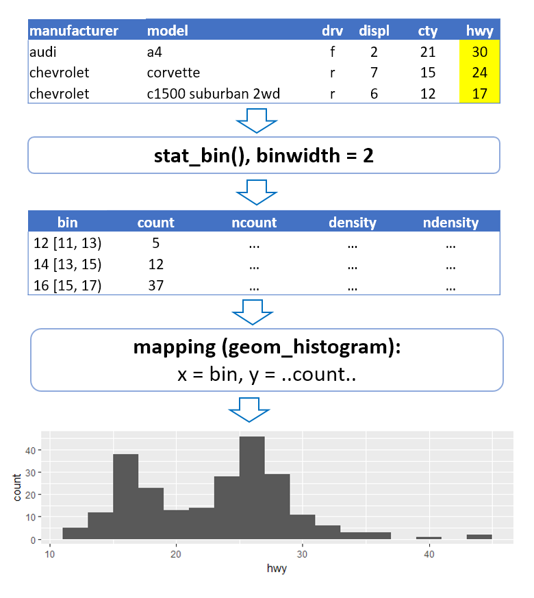
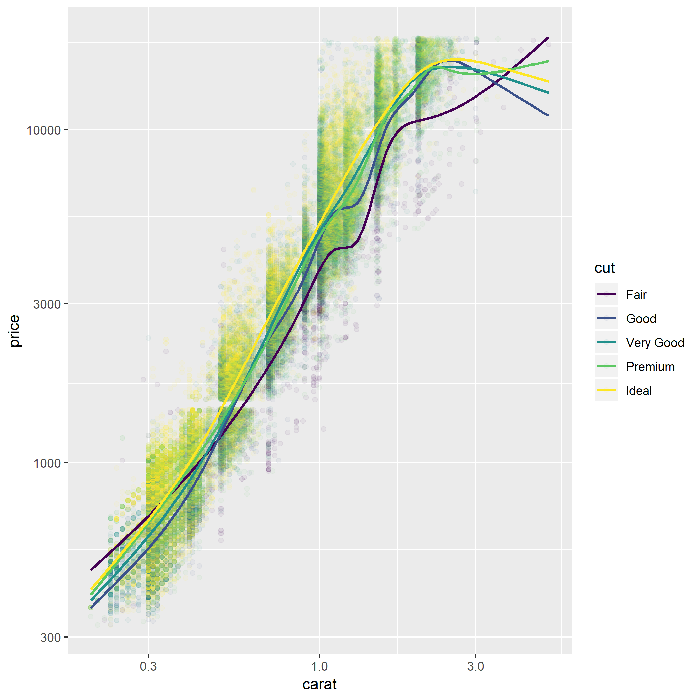

```{r Подключение пакетов, warning=FALSE, message=FALSE}
library(tidyverse)
library(forcats) # работа с факторами
library(scales) # процентный формат для осей на графике
```


# Введение

Это вторая часть блокнота по пакету визуализации `ggplot2`. Данный пакет реализует концепцию **грамматики графики**, которая позволяет получить любую визуализацию на основе данных при помощи нескольких простых действий. 

В [первой части](ggplot_part_1.Rmd) мы рассмотрели базовые элементы грамматики:  

  - геометрические объекты (**geom**),  
  - визуальные характеристики этих объектов - эстетики (**aesthetics**),  
  - связывание (**mapping**) данных и эстетик. 
  
Также мы рассмотрели статистические функции (**stat**), которые часто требуются для предварительной обработки данных. Например, при построении гистограммы нужна группировка данных на интервалы и подсчет частот.
  


Детали отображения данных на визуальные характеристики настраиваются при помощи шкал (**scales**). Например, шкалы позволяют задать соответствие цветов и категорий в данных, установить нужный порядок категорий, применить нелинейное преобразование, чтобы сделать зависимость более явной, избавиться от выбросов, ограничив диапазон выводимых данных...

Шкалы помещают данные в некоторую **систему координат**. Чтобы показать результат на экране, применяются функции для работы с координатными системами (**coord**). Обычно это происходит автоматически, но вы можете вмешаться в процесс - например, поменять местами оси координат, чтобы сделать подписи на графике более читаемыми, или увеличить интересующую вас часть графика.

Также мы рассмотрели еще один способ для оценки влияния категориальной переменной - разделение на панели (**faceting**).


Шаблон кода для построения графиков выглядит так:

```
ggplot(data = <DATA>) +
  <GEOM_FUNCTION>(mapping = aes(<MAPPINGS>)) +
  <SCALE_FUNCTION> +
  <FACET_FUCTION> +
  <COORD_FUNCTION>

```
Практический пример:

```{r Пример графика с разделением на панели и настройкой шкал}
data(mpg)
head(mpg)

ggplot(data = mpg) + 
  geom_point(mapping = aes(x = displ, y = hwy, color = class)) +
  scale_color_brewer(palette = 'Accent') + 
  scale_y_sqrt() +
  facet_wrap(~drv, scales = 'free_x') +
  labs(title = 'Зависимость топливной эффективности от объема двигателя')

```


В этой части будет рассмотрена работа со слоями, а также вопросы визуализации категориальных данных.


# Слои

**Слои** (**layers**) позволяют комбинировать на одной визуализации различные представления данных.  Например, тренды, опорные линии, метки наблюдений и аннотации могут быть добавлены на одну визуализацию как отдельные слои.

Чтобы добавить новые слои, вы можете включить в код для построения графика любое количество функций `geom_...()` или `stat_...()`:


```
ggplot(data = <DATA>) +
  <GEOM_FUNCTION>(mapping = aes(<MAPPINGS>)) +
  <GEOM_FUNCTION>(mapping = aes(<MAPPINGS>)) +
  <STAT_FUNCTION>(mapping = aes(<MAPPINGS>)) +
  ...
  
```

Каждый слой может иметь свой набор соответствий между столбцами таблицы данных и эстетиками. При этом, если какие-то соответствия - одни и те же для нескольких слоев, то удобно вынести их из определения слоя в вызов функции `ggplot()`. В этом случае придется задавать соответствие только один раз.


## Пример: добавление линии тренда на график

Построим визуалиазацию зависимости топливной эффективности от размера двигателя для машин с разным типом привода.

```{r Пример графика с трендом}

ggplot(data = mpg, 
       mapping = aes(x = displ, y = hwy)) + # общие для всех слоев связи
  geom_point(mapping = aes(color = drv)) + # x и y уже заданы, добавляем цвет
  geom_smooth(method = 'lm', se = FALSE) # x и y уже заданы

```

Здесь данные заданы в `ggplot()`, поэтому они используются всеми слоями. Две связи - для эстетик `x` и `y` - также заданы сразу для всех слоев, поэтому в `geom_point()` добавляется только связь для цвета, а в `geom_smooth()` вообще не требуется задавать никаких связей.


## Упражнение: добавление трендов для подгрупп

Используя набор данных `diamonds`:

```{r Загрузка данных diamonds}
data(diamonds)
head(diamonds)
```

Напишите код, в точности воспроизводящий следующий график:



**Совет:** вы можете открыть график в новом окне, кликнув по ссылке на него с нажатой клавшией `Shift`. Если RStudio жалуется на отсутствующий файл, - выполните команду меню: `Session/Set Working Directory/To Source File Location`, чтобы установить в качестве рабочей директории папку, в которой находится данный блокнот.


```{r Упражнение - тренды для подгрупп}
# Раскомментируйте и допишите код:

#ggplot(data = diamonds, ...) +
#  geom_point(...) +
#  geom_smooth(...)

```

**Подсказки:**

  - По умолчанию `geom_smooth()` будет строить нелинейные тренды, такие же как на этом графике.
  
  - Чтобы тренд строился на всем диапазоне оси x, используйте аргумент `fullrange = TRUE` для `geom_smooth()`.


## Exercise: adding trend lines for subgroups

Attach the  `diamonds` dataset:

```{r Attaching the diamonds dataset}
data(diamonds)
head(diamonds)
```

Write code to recreate the following plot:


**Tip** you can enlarge the picture by **Shift-clicking** its link. If RStudio complains about a missing file - select `Session/Set Working Directory/To Source File Location` command in the menu. This will set the current directory to the one which contains the source file.


```{r Exercise on adding trends for subgroups}
# Uncomment and complete the following code

#ggplot(data = diamonds, ...) +
#  geom_point(...) +
#  geom_smooth(...)

```

**Tips**

  - By default, `geom_smooth()` will add non-linear trends, same as in this plot
  
  - To extend the trend line to the entire x axis range, use `fullrange = TRUE` argument when calling `geom_smooth()` function.


## Пример: выделение элементов на графике

В `ggplot2`, к сожалению, нет возможности интерактивно исследовать данные на визуализации, но можно понять, где находятся наблюдения с интересующими свойствами при помощи аннотаций. В качестве примера, выделим на графике все автомобили марки 'dodge':

```{r Пример аннотирования графиков при помощи слоев}
ggplot(data = mpg, 
       mapping = aes(x = displ, y = hwy)) + 
  
  geom_point(data = 
               filter(mpg, manufacturer == 'dodge'), 
             color = 'white', size = 5) +
  
  geom_point(mapping = aes(color = class)) +
  
  geom_smooth(se = FALSE)
```

**Примечания:**  
  - связи по умолчанию задаются в `ggplot()`, поэтому в последующих слоях не требуется связывать с данными эстетики `x` и `y`;  
  - самый первый слой на графике использует свой, отдельный набор данных - таблицу, в которой отфильтрованы данные только по автомобилям `dodge`;  
  - остальные слои используют данные, заданные в `ggplot()`;  
  - порядок слоев важен, иначе более крупные точки закрывали бы более мелкие.

С другими видами аннотаций можно познакомиться в главе про оформление графиков книги [R for Data Science](http://r4ds.had.co.nz/graphics-for-communication.html#annotations).


## Пример: добавление опорных линий

На визуализациях полезно добавлять **опорные линии**. Например, таким образом можно показать, где находится центр распределения. Для добавления опорных линий используются функции `geom_hline()` и `geom_vline()`.

```{r Пример опорной линии}
ggplot(data = mpg) + 
  geom_histogram(mapping = aes(x = hwy), 
                 binwidth = 2)  +
  
  geom_vline(mapping = 
               aes(xintercept = median(hwy),
                   color = 'Медианный пробег'),
             show.legend = TRUE) +
  
  labs(color = NULL)

```


**Примечания:**  
  - положение линии задается эстетикой `xintercept`;  
  - желательно использовать для нее связывание, а не определение, т.к. внутри функции `aes()` у вас есть доступ к именам столбцов в таблице данных для графика;  
  - по умолчанию опорные линии не включаются в легенду, здесь мы явно потребовали это сделать.


## Пример: сравнение гистограммы и теоретического распределения

Чтобы проверить, соответствуют ли данные какому-либо теоретическому распределению - например, нормальному или экспоненциальному, - полезно сравнить гистограмму или плотность распределения с кривой теоретического распределения. Как это сделать, - смотрите в блокноте [ggplot_plotting_functions.Rmd](ggplot_plotting_functions.Rmd).


# Корректировка положения объектов (position adjustment)

## Проблема наложения данных (overplotting)

Часто встречается ситуация, когда данные в таблице приводятся с ограниченной точностью. Например, при указании возраста его обычно округляют до года. В нашем примере про автомобили округлены пробег на галлоне и объем двигателя.

Из-за дискретности значений, визуализация не позволяет правильно оценить, где сконцентрированы данные. Точки накладываются и закрывают друг друга. Один из способов борьбы с наложением (**overplotting**) - использование прозрачности.


```{r Пример наложения данных}
# Исходный график с наложением
ggplot(data = mpg) +
  geom_point(mapping = aes(x = displ, y = hwy))

# Прозрачность делает точки видимыми
ggplot(data = mpg) +
  geom_point(mapping = aes(x = displ, y = hwy), 
             alpha = 0.2)

```


## Добавление шума к данным (jitter)

Существует и другой способ борьбы с наложением данных - можно сделать совпадающие точки видимыми, если добавить к данным небольшой случайный шум (jitter). Это можно сделать прямо в процессе визуализации, поскольку `ggplot2` позволяет вносить изменения в расположение объекта (**position adjustments**).

```{r График с добавлением шума}

ggplot(data = mpg,
       mapping = aes(x = displ, y = hwy)) +
  
  geom_point(position = 'jitter',
             color = 'lightskyblue') +

  geom_point(alpha = 0.2)
  
```


Поскольку добавление шума с целью сделать данные видимыми - распространенный прием, в `ggplot2` для удобства сделана отдельная функция - `geom_jitter()`: 


```{r Displpacement vs mileage with geom_jitter}

ggplot(data = mpg,
       mapping = aes(x = displ, y = hwy)) +
  
  geom_jitter(color = 'lightskyblue') +

  geom_point(alpha = 0.2)

```


Корректировка положения полезна и для других типов геомов. С применением этой функции для столбиковых диаграмм вы познакомитесь в следующем разделе.


## Столбиковые диаграммы для визуализации категориальных данных

Столбиковые диаграммы используются для визуализации распределений категориальных данных. Например, мы можем исследовать частоту упоминания различных типов автомобилей в данных о топливной эффективности:

```{r Одномерное распределение категориальной переменной}

ggplot(data = mpg) +
  geom_bar(mapping = aes(x = class))

```


### Условные распределения категориальных переменных (`position = 'stack'`)

Этот же прием мы можем использовать и для анализа связей между двумя категориальными переменными. Столбики можно использовать, чтобы визуализировать условное распределение одной категориальной переменной в зависимости от значения другой категориальной переменной. Сравним, например, количество автомобилей с разным типом привода в зависимости от класса автомобиля.


```{r Условное распределение категориальной переменной}

ggplot(data = mpg) +
  geom_bar(mapping = aes(x = class, fill = drv))

```

Здесь мы можем видеть, что все 2-местные автомобили - заднеприводные, все пикапы и большинство "паркетников" (SUV) - полноприводные, а автомобили других классов, в основном, имеют передний привод. 

Наблюдая на графике различие в распределении машин по типу привода внутри каждого класса, можно сделать вывод о том, что между этими двумя характеристики автомобилей есть зависимость.

Заметим, что: 

> переменная, которую мы рассматриваем как зависимую, обычно визуализируется при  помощи цвета, а переменная-фактор - как категории по оси `x`.

Иногда роли переменных взаимозаменяемы, однако при этом меняется интерпретация результата. Предыдущий график отвечал на вопрос: *"Какая доля пикапов имеет полный привод?"* А этот - на вопрос: *"Какая доля полноприводных машин - пикапы?"*


```{r Условное распределение категориальной переменной - другие роли}

ggplot(data = mpg) +
  geom_bar(mapping = aes(x = drv, fill = class))

```


Стоит помнить о том, что человеку сложно различать большое количество цветов, поэтому при выборе эстетики для связывания с данными 

> переменную с большим количеством категорий лучше связать с эстетикой `x`. 

Или подумайте о том, как объединить группы, чтобы уменьшить их количество (см. раздел про операции с факторами). 

### Нормировка частот (`position = 'fill'`)

Анализ распределения на предыдущей визуализации затруднен, поскольку количество автомобилей разных классов в выборке различается. Мы можем облегчить сравнение распределений путем перехода к относительным величинам - долям внутри каждой категории по оси x. Это легко сделать, используя корректировку положения. Достаточно добавить в описании геома `position = 'fill'`.

```{r Условное распределение категориальной переменной - доли}

ggplot(data = mpg) +
  geom_bar(mapping = aes(x = class, fill = drv),
           position = 'fill') +
  scale_y_continuous(labels = scales::percent) # процентный формат для оси

```


Заметим, что по умолчанию столбиковые диаграммы используют `position = 'stack'` (см. предыдущий пример) - цветные столбики ставятся друг на друга. 

Для столбиковых диаграмм существует и еще один вариант корректировки положения: `position = 'dodge'`, при котором цветные столбики помещаются другом рядом с другом. Этот режим удобно использовать для визуализации числовых характеристик групп.

### Упражнение: зависимость качества огранки бриллианта и прозрачности

Используя визуализацию набора данных `diamonds`, ответьте на вопрос: связаны ли качество огранки бриллианта (`cut`) и прозрачность (`clarity`)? 

Какой вариант связывания переменных с эстетиками, на ваш взгляд, более информативен?

```{r Упражнение - связь двух категориальных переменных}
#ggplot(data = diamonds) +
  #geom_bar(...)
```


### Exercise: relationship between diamond's cut and clarity

Create a visualization answering the question, if the diamond's `cut` and `clarity` are related. 

Try a few options for mapping variables to aesthetics. Which one is the most useful?

```{r Exercise - exploring relationship for categorical variables}
#ggplot(data = diamonds) +
  #geom_bar(...)
```


### Столбиковые диаграммы для визуализации числовых характеристик групп

Для сравнения групп можно использовать и количественные показатели. В этом случае высота столбика для подгруппы будет определяться не количеством наблюдений в ней, а некоторой числовой характеристикой распределения.

Например, мы можем проверить, совпадают ли центры распределений количественного показателя в подгруппах, сравнив средние или медианы. Также можно сравнивать стандартные отклонения или межквартильные размахи, чтобы сравнить "ширину" распределений в подгруппах. 

Необходимые числовые характеристики можно получить прямо в процессе построения графика, изменив статистическую функцию для геома:

```{r Средняя топливная эффективность для групп}
ggplot(data = mpg, mapping = aes(x = drv, y = hwy)) +
  geom_bar(stat = 'summary', fun.y = 'mean')

```


Вспомним, что статистические функции в `ggplot2` имеют связанные геомы, а также могут добавляться как слои на график. Предыдущую визуализацию можно получить, используя статистическую функцию напрямую:

```{r Средняя топливная эффективность для групп - через статистику}
ggplot(data = mpg, mapping = aes(x = drv, y = hwy)) +
  stat_summary(fun.y = 'mean', geom = 'bar')
```


### Сравнение числовых характеристик в подгруппах (`position = 'dodge'`)

Используя рассмотренные ранее техники, мы можем изучать и более сложные зависимости - например, связь между двумя категориальными и одной непрерывной переменной. В качестве примера, сравним, изменилась ли с течением времени топливная эффективность для машин c разным типом привода.

```{r Сравнение числовых характеристик для подгрупп}
ggplot(data = mpg, 
       mapping = aes(x = drv, 
                     fill = factor(year), 
                     y = hwy)) +
  stat_summary(fun.y = 'mean', geom = 'bar', 
               position = 'dodge')
```

**Замечание** по умолчанию, переменные числовых типов считаются количественными, поэтому в этом примере потребовалось явным образом указать, что годы выпуска должны рассматриваться как категории, создав факторную переменную при помощи `factor()`. В противном случае мы не получили бы нужного результата.

Заметим также, что вместо столбиков для решения подобной задачи можно использовать и ящичные диграммы, которые дают более полную характеристику распределения:

```{r Сравнение числовых характеристик для подгрупп - ящики}
ggplot(data = mpg, 
       mapping = aes(x = drv, 
                     fill = factor(year), 
                     y = hwy)) +
  geom_boxplot()
```

Интересно, что эта визуализация показывает несколько другую картину: прогресс для полноприводных и переднеприводных машин оказался более существенным, а в категории заднеприводных автомобилей - практически отсутствует. Рост средней эффективности в этой группе обеспечивается за счет "сжатия" распределения благодаря прекращению выпуска машин с низкой эффективностью.


# Управление порядком категорий при помощи факторных переменных

## Факторы

**Фактор** (**factor**) - это еще один тип данных в R, который используется для хранения категориальных данных. Главным преимуществом факторов является возможность задавать требуемый порядок сортировки категорий.

Обычные текстовые переменные всегда сортируются по алфавиту:

```{r Список дней недели}
days <- c('We', 'Tu', 'Th', 'Mo', 'Su', 'Sa', 'Fri')
sort(days)
```

Однако мы можем создать факторную переменную с правильным порядком категорий. Порядок категорий, или **уровней фактора** можно задать при помощи аргумента `levels =`.

```{r Факторная переменная для дней недели}
days_factor <- 
  factor(days, 
         levels = c('Mo', 'Tu', 'We', 'Th',
                    'Fri', 'Sa', 'Su'))
sort(days_factor)
```

С помощью функции `str()` можно убедиться, что факторы в R реализованы в виде целочисленных переменных, в которых каждому уровню соответствует некоторый числовой код:

```{r Как реализованы факторы}
str(days_factor)
```

## Факторы и порядок категорий на графике

С точки зрения визуализации данных факторы важны, поскольку они позволяют задать нужный порядок категорий на графиках.

Например, если мы хотим, чтобы типы привода всегда располагались в порядке: `f`, `r`, `4`, то можно сделать эту переменную факторной:

```{r Сортировка категорий при помощи факторной переменной}

mpg <- mutate(mpg,
              drv_factor = 
                factor(drv, levels = c('f', 'r', '4')))

ggplot(data = mpg) +
  geom_bar(mapping = aes(x = "", fill = drv_factor),
           position = 'fill') +
  scale_y_continuous(labels = scales::percent)

ggplot(data = mpg) +
  stat_summary(mapping = aes(x = drv_factor, y = hwy),
               fun.y = 'mean', geom = 'bar')

```


**Замечание** Если нужно задать определенный порядок категорий разово, то можно это сделать прямо внутри функции `aes()`, не создавая новую факторную переменную в таблице данных.


## Сортировка уровней фактора

При сравнении категорий удобно, когда они расположены по возрастанию или убыванию отображаемого на графике показателя. Для сортировки уровней фактора удобно использовать функции пакета `forcats`:

  - `fct_infreq()` - сортировка по убыванию частоты,  
  - `fct_reorder()` - сортировка по заданному показателю,  
  - `fct_rev()` - сортировка в обратном порядке.
  
  
  
### Пример: упорядочение категорий по частоте упоминания - `fct_infreq()`

Получим рейтинг 'популярности' автопроизводителей по количеству автомобилей в наборе данных `mpg`:

```{r Упорядочение категорий по частоте}
ggplot(data = mpg, 
       mapping = aes(x = fct_infreq(manufacturer))) +
  geom_bar() +
  coord_flip()
```

При необходимости, мы можем поменять порядок категорий на обратный:

```{r Упорядочение категорий по частоте - обратный порядок}
ggplot(data = mpg, 
       mapping = 
         aes(x = fct_rev(fct_infreq(manufacturer)))) +
  geom_bar() +
  coord_flip()
```


### Пример: упорядочение категорий по числовому показателю - `fct_reorder()`

Упорядочить уровни фактора по числовому показателю можно при помощи функции `fct_reorder()`. Требуется указать, в какой переменной находится этот показатель, и агрегирующую функцию.

Составим рейтинг классов автомобилей по топливной эффективности:

```{r Упорядочение категорий по числовому показателю}
ggplot(data = mpg, 
       mapping = 
         aes(x = fct_reorder(class, hwy, 
                             fun = mean, 
                             .desc = TRUE), 
             y = hwy)) +
  
  stat_summary(fun.y = 'mean', geom = 'bar') +
  labs(x = 'class')
  
```


### Упражнение: зависимость медианной цены бриллианта от качества огранки

Используя набор данных `diamonds`, постройте визуализацию медианной цены бриллианта за карат в зависимости от качества огранки (`cut`). Категории должны быть упорядочены по убыванию медианной цены за карат.


```{r Упражнение - сортировка категорий по числовому показателю}

# Напишите здесь свой код


```


### Exercise: relationship between median diamond price and cut

Using the `diamonds` dataset, visualize the relationship between median price per carat and `cut`. The categories must be ordered by decreasing median price per carat.


```{r Exercise - ordering categories by a quantitative measure}

# Write your code here


```


### Полезные операции с факторами

Здесь мы рассмотрели лишь несколько операций с факторами, необходимые для упорядочения категорий на графиках. Однако часто требуется решить и другие задачи:

  - переместить несколько уровней фактора в начало списка - `fct_relevel()`,   
  - перекодировать уровни фактора - `fct_recode()`,
  - объединить несколько уровней фактора в одну группу - `fct_collapse()`,
  - избавиться от малочисленных уровней, объединив их в группу - `fct_lump()`.
  
Примеры смотрите в главе [Factors](http://r4ds.had.co.nz/factors.html) книги R for Data Science, или в документации на соответствующие функции.


************


# Приложение. Подготовка данных для визуализации вручную

Пакет `ggplot2` позволяет вычислять необходимые для визуализации статистики прямо в процессе построения графика. Но в некоторых случаях может быть сложно добиться нужного результата. Тогда, возможно, более простым спобом будет подготовка данных к визуализации "вручную".
Для этого удобно использовать функции из пакета `dplyr`, который будет подробно рассмотрен в блокноте по трансформации данных. 

Здесь же отметим важный с точки зрения визуализации момент: если данные были подготовлены для визуализации заранее, то, как правило, требуется отключить обработку их статистчиескими функциями, выбрав `stat = 'identity'`.

Мы уже строили рейтинг топливной эффективности различных классов машин. Теперь получим этот же график, подготовив для него данные заранее:


```{r Визуализация предобработанных данных}

# Готовим таблицу данных для рейтинга с помощью dplyr:
class_mpg <- mpg %>% 
  group_by(class) %>%
  summarise(avg_hwy = mean(hwy)) %>% 
  arrange(desc(avg_hwy))

# Таблица данных для рейтинга
class_mpg

# Визуализируем таблицу
ggplot(data = class_mpg, 
       mapping = 
         aes(x = fct_inorder(class), # уровни фактора - в порядке появления в таблице 
             y = avg_hwy)) +
  
  geom_bar(stat = "identity") 

```

