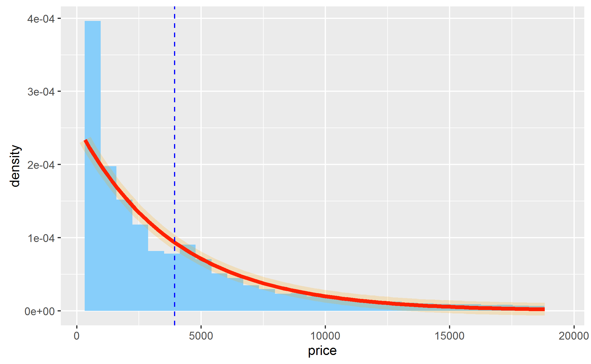

```{r Загрузка библиотек, message=FALSE, warning=FALSE}
library(tidyverse)
```

# Построение графиков функций

Каждое статистическое преобразование в ggplot2 ассоциировано с геомом по умолчанию. Благодаря этому вы можете добавлять статистические показатели непосредственно на график, как слои. 

В данном примере мы покажем, как построить график произвольной функции с помощью `stat_function()`.

Построим графики двух функций в диапазоне $(-\pi, \pi)$:


```{r Построение графиков произвольных функций}
ggplot(data = tibble(x = c(-pi, pi)), mapping = aes(x)) +
  stat_function(fun = sin, 
                aes(color = 'sin(x)')) +
  stat_function(fun = function(x) { 0.2 * (x + 1)^2 - 1}, 
                aes(color = 'парабола')) +
  labs(color = "Название функции")
```

**Примечание**: обратите внимание на то, что мы связали эстетику цвета (color) с названиями функций. Эти названия отображаются на легенде графика, благодаря чему мы можем видеть, какая линия соответствует каждой функции. 

# Накладывание распределений вероятности

Вы можете наложить график функции поверх данных. Например, наложим функцию плотности нормального распределения поверх гистограммы пробега на галлоне топлива в городе, чтобы проверить, соответствует ли она данным.

В R есть встроенная функция `dnorm()`, которая рассчитывает вероятность для функции плотности нормального распределения в конкретной точке. Параметры функции `dnorm()` - среднее и стандартное отклонение.

```{r Накладывание функции плотности распределения вероятности}
# Рассчитаем параметры нормального распределения и сохраним их в списке
params <- list(mean = mean(mpg$cty), 
               sd = sd(mpg$cty))


# Построим графики данных и функции плотности распределения
ggplot(data = mpg, mapping = aes(x = cty)) +
  geom_histogram(mapping = aes(y = ..density..), bins = 10) +
  stat_function(fun = dnorm, args = params, xlim = c(0, 40), 
                color = 'red', size = 1.5)


```

**Примечание:** вы можете получить список доступных функций распределения, запустив команду `?distributions`.

## Задание - построение графика распределения цен на бриллианты

Постройте гистограмму цен на бриллианты на основе набора данных `diamonds`. Попробуйте воспроизвести следующий график:





**Примечание**: удерживая клавишу `Shift`, кликните левой кнопкой мыши по ссылке на рисунок, чтобы открыть его для просмотра в ассоциированной программе. Если ссылка на работает, попробуйте установить рабочую директорию в Rstudio: `Session/Set Working Directory/To Source File Location`.

**Советы** 

 - Список названий цветов, доступных в R, можно найти [здесь](http://www.sthda.com/english/wiki/colors-in-r) или просмотреть с помощью функции `colors()`.

 - Функция плотности распределения вероятности для данного распределения - экспоненциальная: 
 
 
 $$ f(x) = \lambda e^{-\lambda x}, $$
 где $\lambda$ - это *интенсивность* (*rate*). Вы можете оценить параметр интенсивности на основе исходных данных с помощью формулы:
$$ \lambda = 1 / \bar{x} $$


Вы можете задать собственную функцию, используя два аргумента: x и интенсивность (rate), - или использовать встроенную функцию плотности экспоненциального распределения `dexp()`. Подробнее о функции смотрите в справке `?dexp`.

Вертикальная линия соответствует средней цене. О том, как ее добавить, смотрите в справочной информации `?geom_vline`.


```{r Упражнение на построение графика распределения цен на бриллианты}
# Напишите свой код здесь

# Рассчитайте параметры экспоненциального распределения
# params <- list(rate = ____ )

# Постройте графики данных и функции плотности распределения
# ggplot(data = ___, 
#       mapping = ___) +
#  _______(mapping = aes(y = _____ ), bins = _____) +
#  stat_function(fun = _____, args = params, 
#                color = 'red', size = 1.5) + 
#  ______ +
#  ______

```
