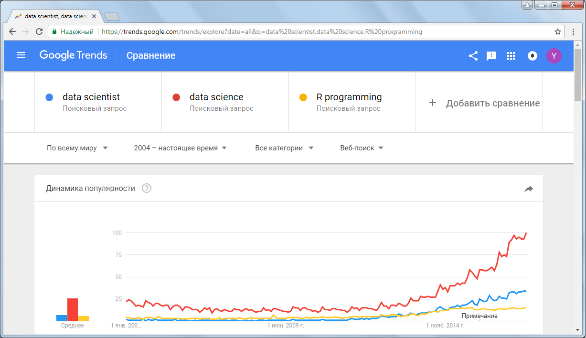

```{r setup, include=FALSE}
knitr::opts_chunk$set(echo = TRUE)
```

## Введение

Сервис [Google Trends](http://www.google.com/trends) позволяет легко отслеживать и сравнивать изменения популярности различных поисковых запросов. Это дает возможность измерить динамику таких трудноизмеряемых показателей, как уровень интереса пользователей Интернет к той или иной теме, популярность брендов и др.
Например, можно отобразить на графике динамику популярности запросов "data scientist", "data science" и "R programming":

<https://trends.google.com/trends/explore?date=all&q=data%20scientist,data%20science,R%20programming>


``

Сервис *Google Trends* также позволяет выгружать данные с сайта в формате csv для дальнейшего анализа. Однако в R есть возможность выгрузки данных с сайта google непосредственно в R. Для этого удобно воспользоваться пакетом `gtrendsR`, который можно загрузить с помощью следующего кода (убрав #):

```{r Загрузка пакета gtrendsR}

# devtools::install_github('PMassicotte/gtrendsR')

```

Более подробно о пакете `gtrendsR` можно прочитать на сайте разработчика <http://github.com/PMassicotte/gtrendsR>.
После установки необходимых пакетов на компьютер для работы с функциями пакетов нужно их подключить:

```{r Подключение библиотек, message=FALSE, warning=FALSE}
library(gtrendsR) # пакет для работы с Google Trends
library(forcats) # пакет для работы с факторами
library(tidyverse) # набор пакетов для преобразования и визуализации данных
library(stringr) # пакет для работы со строками
```

## Загрузка данных с сайта Google Trends
Для загрузки данных используется функция `gtrends()`, основным параметром которой является `keyword` - вектор ключевых слов, по которым осуществляются запросы. Другие параметры: `geo` - вектор регионов, которые включаются в запрос, `time`- временной период, `gprop` - google продукты, для которых будет выполнен запрос ("web", "news", "images", "froogle", "youtube"). Более подробно о функции можно почесть в справочной системе R, набрав в строке ввода `?gtrends`. Например, для получения динамики популярности запросов "data scientist", "data science" и "R programming" за весь доступный период (с 2004 года) напишем следующий код:

```{r Загрузка данных}
dtrend <- gtrends(c("data scientist", "data science", "R programming"), time = "today+5-y")

```

После выполнения кода в `dtrend` будут содержаться данные типа `list` следующей структуры:

```{r Структура данных}
str(dtrend)
```

## Анализ и интерпретация данных
Первый элемент списка `dtrend$interest_over_time` содержит динамику популярности каждого ключевого слова за период с 2004 года по настроящее время. В столбце `hit` содержится не абсолютное количество запросов по данному ключевому слову, а относительное, которое высчитывается по специальному алгоритму в зависимости от популярности запросов в другие периоды времени и по другим ключевым словам.

```{r Динамика популярности каждого ключевого слова}

interest_over_time <- dtrend$interest_over_time
head(interest_over_time, 10)
ggplot(data=interest_over_time) + 
  geom_line(mapping = aes(x=date, y=hits, color=keyword), size=1) +
  labs(title="Динамика популярности data scientist, data science и R programming")

```

Как можно наблюдать на графике, популярность "data scientist", "data science" и "R programming" растет стремительно, особенно в последние 5 лет.

Второй элемент списка `dtrend$interest_by_region` содержит распределение популярности ключевых слов по регионам. Найдем 10-ку лидеров по популярности каждого из ключевых слов:

```{r Регионы-лидеры по популярности}
interest_by_region <- dtrend$interest_by_region

plot_top10_regions <- function(x){
top10_regions <- interest_by_region %>% 
                      filter(keyword==x) %>% 
                      group_by(location) %>%
                      summarise(hits=sum(hits)) %>%
                      arrange(desc(hits)) %>%
                      head(10)# поиск 10 регионов с наивысшей популярностью запроса

top10_regions <- top10_regions %>% 
  mutate(location = fct_inorder(location)) # преобразования столбца location в фактор, чтобы на графике порядок отображения регионов был не в алфавитном порядке, а в соответствии с убывающими значениями hits
ggplot(top10_regions) + 
  geom_bar(aes(x=location, y=hits, fill=location), stat="identity", show.legend = FALSE) + 
  coord_flip() +
  labs(title=str_c("10-ка регионов-лидеров по популярности ", x))
}
plot_top10_regions("data scientist")
plot_top10_regions("data science")
plot_top10_regions("R programming")

```

Как можно увидеть из графиков, абсолютными лидерами по популярности "data scientist", "data science" и "R programming" оказались Сингапур и Индия. В 10-ке преобладают страны Азии и Африки. Удивительно?

В других элементах списка `dtrend` содержатся данные о популярности запросов по данным ключевым словам в ряде административных округов и городов, а также информация о сопутствующих запросах. Например, популярные запросы, которые вводят вместе с ключевым словом "data scientist":

```{r Популярные запросы data scientist}
head(dtrend$related_queries %>% filter(keyword=="data scientist") %>% select(subject, value), 10)
```

Популярные запросы, которые вводят вместе с ключевым словом "data science":

```{r Популярные запросы data science}
head(dtrend$related_queries %>% filter(keyword=="data science") %>% select(subject, value), 10)
```

Популярные запросы, которые вводят вместе с ключевым словом "R programming":

```{r Популярные запросы R programming}
head(dtrend$related_queries %>% filter(keyword=="R programming") %>% select(subject, value), 10)
```

Изначально мы получили тренды популярности запросов по всему миру, однако есть возможность сравнить тренды в разных странах. Например, мы можем сравнить тренды популярности запроса "data scientist" в России и США:

```{r Тренды популярности data scientist в России и США}
dtrend_ru <- gtrends(c("data scientist"), geo=c("RU","US"), time="all")
ggplot(dtrend_ru[[1]]) + 
  geom_line(mapping = aes(x = date, y = hits, color = geo), size = 1) +
  labs(title = "Динамика популярности data scientist в России и США")
```

Как можно увидеть из графика, в России рост популярности "data scientist" гораздо ниже, чем в США, однако тенденция к росту прослеживается отчетливо.